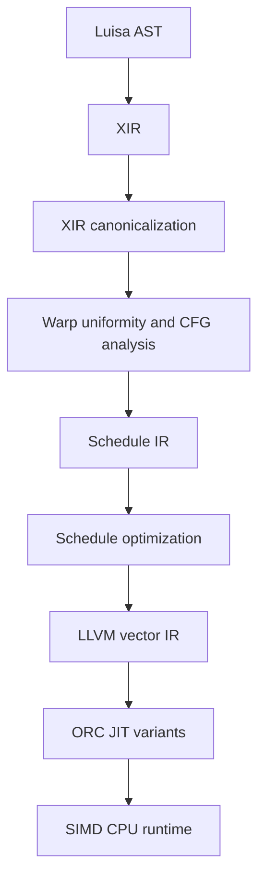

# SIMD CPU backend design

Status: Phase 2 fixed-vector compute checkpoint. XIR-to-Schedule lowering,
the dependency-light cohort semantic model, the independent-thread LLVM
packet dispatcher, dispatch builtins, aggregate SoA values, and direct Buffer
gather/scatter are implemented behind `LUISA_COMPUTE_ENABLE_SIMD`.

Baseline: `LuisaGroup/LuisaCompute@next`, commit
`74cde8c2acca8ef3d8061a0536c5dfaccba46670` (2026-08-11).

## 1. Goal

Add a production-quality, LLVM-JITed CPU backend that executes LuisaCompute's
SPMD kernels in SIMD packets. A packet is also the backend's logical warp:

| Compilation mode | Logical warp size | Typical native target |
| --- | ---: | --- |
| scalar | 1 | portable scalar |
| SIMD4 | 4 | SSE2, NEON, or a wider ISA used at four lanes |
| SIMD8 | 8 | AVX2 or a wider ISA used at eight lanes |
| SIMD16 | 16 | AVX-512 |

The first supported widths are 1, 4, 8, and 16. The IR must not bake in that
set: Luisa's warp mask is 128 bits, and later implementations may use compound
warps or scalable vectors.

The backend is not an ISPC source generator. It consumes optimized XIR,
introduces an explicit scheduling IR, and lowers that IR directly to LLVM IR.
The scheduling IR owns varying control flow, reconvergence, packet masks, and
warp collective semantics. LLVM owns instruction selection and target
multiversioning.

### 1.1 LLVM ownership boundary

For a specialization width `W`, every varying scalar is represented directly
as an LLVM fixed vector `<W x T>` and every execution mask as `<W x i1>`.
Varying aggregates use structure of arrays, so `varying<float3, 8>` is three
`<8 x float>` values. Warp- and cohort-uniform expressions may remain scalar;
cohort-uniform state is widened when it crosses a scheduler suspension.

The backend emits only target-independent LLVM operations, including vector
arithmetic, `shufflevector`, `llvm.vector.reduce.*`, and masked memory. It must
not contain x86 `_mm*`, AVX/AVX-512, Arm NEON, or other target-ISA SIMD
intrinsics. The LLVM target machine receives the host triple, CPU, and feature
set and exclusively owns legalization, instruction selection, register
allocation, and machine scheduling. A scalar C++ implementation of warp
collectives exists under unit tests only as a semantic oracle.

## 2. Why this is a separate backend

The current `fallback` backend is a useful semantic and runtime reference, but
it is structurally scalar:

- it compiles `AST -> XIR -> LLVM` and invokes one scalar kernel per block;
- `WARP_LANE_ID` and `WARP_SIZE` lower to 0 and 1;
- shader creation rejects every allowed warp size other than 1;
- warp-level `ThreadGroupOp`s are not implemented;
- block synchronization suspends scalar LLVM coroutines.

Trying to incrementally turn every fallback LLVM value into a vector would mix
three independent changes in one 4,000-line code generator: value
vectorization, divergent CFG scheduling, and resource ABI changes. It would
also make the stable scalar oracle harder to trust.

The SIMD backend will therefore be a distinct module named `simd`. It should
reuse CPU runtime facilities with `fallback` after those facilities are
factored into a neutral `backends/cpu` layer. The two code generators remain
separate until the SIMD backend reaches semantic parity.

## 3. Pipeline



The XIR handoff is unstructured, reducible CFG in the first milestone. XIR
structured constructs are destructured before Schedule IR construction.
Schedule IR eventually supports arbitrary CFG, but irreducible CFG is rejected
with a precise diagnostic until its convergence rules are implemented.

The intended initial XIR pipeline is:

1. inline callables needed by the first codegen milestone;
2. lower autodiff and ray-query structured operations when applicable;
3. DCE, local store forwarding, local load elimination, and mem2reg;
4. destructure structured CFG and lower break/continue;
5. simplify CFG and clean PHIs;
6. run warp-uniformity, divergence, loop, dominance, and post-dominance
   analyses;
7. build and verify Schedule IR.

Early returns are deliberately retained. Per-lane termination is a feature of
the scheduler and should not be expanded into artificial control flow.

## 4. Execution model

### 4.1 Terminology

- **lane**: one logical Luisa invocation inside a warp;
- **warp**: `W` lanes that share warp-intrinsic scope and lane numbering;
- **cohort**: the subset of one warp currently executing the same dynamic
  Schedule IR point;
- **packet**: the physical SIMD representation used to execute a cohort;
- **continuation**: a Schedule IR program counter plus its dynamic convergence
  token;
- **epoch**: the dynamic instance of a loop or convergence point.

A warp is semantic. A packet is an implementation choice. They are identical
for the first 1/4/8/16-wide implementation, but Schedule IR keeps the terms
separate so a logical warp can later span multiple physical registers.

### 4.2 Dynamic cohort scheduling

The backend does not represent a whole varying function with one nested lane
mask stack. Each live lane has an abstract continuation. The runtime scheduler
groups lanes with the same compatible continuation into a cohort, executes a
vector basic block for that cohort, and distributes the resulting lane masks
to successor continuations.

Conceptually:

```text
ready(entry, initial_mask, root_token)
while any continuation is ready:
    c = choose_ready_cohort()
    execute_vector_block(c.pc, c.mask)
    enqueue successor cohorts
```

This permits lanes to make independent progress through loops, nested branches,
switches, and early returns. It also permits opportunistic reconvergence: masks
that arrive at a compatible continuation are merged before that block is
issued.

Hardware predicates are still used to execute a cohort. Avoiding predicates is
neither possible nor desirable on modern SIMD ISAs. The distinction from a
traditional SPMD mask stack is that a predicate is a property of one scheduled
cohort, not the complete control state of the warp.

### 4.3 Hybrid lowering

A per-basic-block dispatcher is too expensive for coherent code. Schedule IR
therefore records one of three execution strategies per region:

1. **uniform**: emit ordinary scalar control flow around vector values;
2. **predicated**: if-convert a small, speculation-safe diamond;
3. **cohort**: materialize continuations and dynamically schedule a divergent
   region.

The first prototype may conservatively use cohort scheduling for all varying
branches. The optimizer then introduces uniform and predicated regions without
changing semantics. Values live across cohort suspension points are spilled to
warp-state slots; block-local temporaries remain LLVM SSA values.

### 4.4 Scheduler policy

Semantics must not depend on which ready cohort is selected. The initial policy
is deterministic and favors:

1. a cohort that can complete a pending convergence;
2. the largest active mask;
3. the current loop epoch;
4. stable Schedule IR block order.

Later policies may use branch probabilities, cache locality, or sparse-cohort
scalarization. Tests use a second adversarial policy to detect accidental
schedule dependence.

## 5. Convergence and dynamic instances

Grouping lanes by static basic-block ID alone is incorrect. Two lanes can reach
the same block in different loop iterations, and a warp collective must not
accidentally combine those dynamic instances.

Schedule IR assigns every divergent construct a convergence plan derived from
dominance, post-dominance, and natural-loop analysis. A continuation carries a
token identifying:

- its parent convergence scope;
- the divergent construct and successor path that produced it;
- loop epochs for enclosing loops;
- the static continuation point.

Sibling paths may merge only at their planned reconvergence point and only
when their parent token and loop epochs are compatible. A loop back-edge
advances that loop's epoch. Lanes in different iterations therefore remain
separate even if they temporarily have the same static program counter.

The token implementation is not required to be a per-lane heap object. For
structured/reducible CFG it can normally be represented by a small stack of
compile-time token IDs and runtime epoch counters. Schedule IR makes the
contract explicit so codegen may specialize it.

Lanes that return or are discarded are removed from the expected mask of every
enclosing convergence point. Reconvergence therefore cannot deadlock waiting
for a terminated lane.

## 6. Warp intrinsic semantics

Existing Luisa warp operations are defined over the lanes active at the call
site. Schedule IR makes this implicit set an explicit `participant_mask`
operand. For a normal collective it is the current cohort mask.

The following rules are the backend contract:

- `warp_lane_id()` is the lane's physical position in `[0, W)`;
- `warp_size()` is the compile-time logical width `W`;
- reductions, votes, prefix operations, and first-active queries use only the
  participant mask;
- prefix operations are ordered by physical lane ID, not compacted cohort
  position;
- results are defined only for participating lanes;
- `warp_read_lane(v, i)` is undefined if lane `i` is outside the warp or does
  not participate in that dynamic collective;
- debug builds may trap on an invalid shuffle source;
- `warp_read_first_active_lane` is valid when the participant mask is nonzero;
- `warp_active_bit_mask` fills Luisa's `uint4` from low to high lane IDs and
  zeros bits at and above `W`;
- aggregate operations are component-wise and preserve the complete bit
  representation of 8/16/32/64-bit scalars, vectors, and matrices.

The first implementation supports the existing implicit-active-set API. A
future explicit synchronization-mask API can be added at the DSL/XIR layer,
but it is not required to make this backend correct.

Collectives carry the current scheduler `active_mask` as an explicit
`participant_mask` value and are Schedule IR suspension points. All lanes in one compatible
dynamic instance that have reached the collective are combined. Separate path
instances and separate loop epochs are never combined. This is deterministic
and prevents cross-iteration mixing while retaining sparse active-mask
behavior such as lanes `{0, 1, 6}`.

## 7. Block synchronization and shared memory

One block can contain multiple logical warps. The runtime has two launch modes:

- **independent-warp launch** when the kernel uses neither shared memory nor a
  block barrier;
- **cooperative-block launch** when it does.

In cooperative-block launch, each warp executor is resumable. A
`SYNCHRONIZE_BLOCK` instruction yields the current warp phase. The block
scheduler resumes the next phase only after every non-terminated invocation in
the block has arrived. Shared memory is allocated once per block.

Potentially non-uniform barrier reachability is diagnosed. The initial backend
rejects a barrier that is not proven uniformly reachable by all live threads in
the block, matching the practical safety requirement of GPU backends.

## 8. Schedule IR

Schedule IR is initially backend-private under `backends/simd/schedule`. It can
be promoted to a public Luisa IR only after the representation survives the
first complete backend. Keeping it private avoids committing to an unstable
ABI while still enforcing a clean XIR/codegen boundary.

### 8.1 Value classes

Every value has a Luisa data type and an execution class:

- `warp_uniform<T>`: one value is stable across all lanes and all dynamic
  cohorts of the warp (for example a kernel value argument or `warp_size`);
- `cohort_uniform<T>`: one scalar value is sufficient while the current
  dynamic cohort executes, but sibling paths or loop epochs may have different
  values (for example `warp_active_sum` in divergent control flow);
- `varying<T, W>`: one logical value per lane;
- `mask<W>`: a lane predicate;
- `token`: scheduler-only convergence state;
- `address<space, class>`: a typed address with uniform or varying provenance.

Aggregates use structure-of-arrays register layout. For example,
`varying<float3, 8>` is three `<8 x float>` values, not `<8 x {float,float,float}>`.
Memory layout remains the existing Luisa scalar ABI.

Uniformity is warp-relative. The existing XIR `UniformityAnalysis` proves
workgroup uniformity for SPIR-V descriptor indexing and is not reused as-is.
The SIMD backend adds an interprocedural `WarpUniformityAnalysis` with
conservative fallback to varying.

`cohort_uniform` is an expression representation, not permission to use one
global warp-state slot. If such a value survives a scheduler suspension, its
spill is lane-wise (or equivalently keyed by the complete dynamic token).
Only `warp_uniform` may be stored once for the whole warp. This distinction is
required for collectives whose result is uniform among current participants
but differs between divergent paths or loop epochs.

### 8.2 Control operations

The minimum control vocabulary is:

- `entry initial_mask`;
- `branch edge`, where an edge carries its target, zero or more
  inner-to-outer convergence arrivals, an optional loop-epoch transition, and
  PHI state assignments;
- `split condition, true_target, false_target`;
- `switch value, targets...`;
- `join convergence_id, target`;
- `loop_back loop_id, target`;
- `kill mask` for return/discard;
- `collective collective_id, participant_mask, op, operands...`;
- `block_barrier barrier_id`;
- `unreachable`.

PHIs lower to masked edge copies into destination warp-state slots. This
avoids trying to express a value with different incoming predecessors as one
LLVM PHI when cohorts arrive at different times.

### 8.3 Region metadata

Each region records:

- entry and exits;
- parent region;
- reconvergence block, if any;
- enclosing loop IDs;
- live-in/live-out varying values;
- side effects and speculation safety;
- collective and barrier presence;
- estimated instruction cost and branch probability;
- chosen execution strategy.

### 8.4 Verification

The verifier rejects:

- invalid or unterminated CFG;
- missing PHI edge assignments;
- uses not dominated within a non-suspending region and not present in the
  region's live-in state;
- incompatible convergence-token merges;
- collective result use outside its participant mask without a dominating
  definition;
- loop back-edges without epoch transitions;
- unsupported irreducible convergence;
- non-uniform block barriers;
- a requested warp width outside the supported target set.

A stable text printer is required before LLVM code generation so tests can
fixture Schedule IR independently of machine code.

### 8.5 Compiler scalability contract

Schedule IR is intended for generated kernels whose CFG and SSA graphs may be
much larger than hand-written code. Compile-time complexity is therefore a
correctness constraint, not a late performance polish. Let `B`, `E`, `I`, and
`U` be reachable blocks, CFG edges, instructions, and operand uses; `C` the
number of convergence gates; `A` the number of PHI edge assignments; `J` the
number of emitted convergence arrivals; `R` the number of required
incoming-edge/state-slot obligations (including missing assignments in an
invalid fixture); and `M` the loop-membership output already materialized by
XIR's natural-loop analysis.

The Phase 1 implementation has the following budget:

| Operation | Time | Additional space |
| --- | --- | --- |
| CFG indexing | expected `O(B + E)` | `O(B + E)` |
| warp uniformity | `O(I + U)` worklist propagation | `O(I + U)` |
| reducibility check after natural-loop discovery | expected `O(B + E)` | `O(B + E)` |
| loop-parent projection | `O(M)` plus deterministic exit sorting | `O(M)` |
| convergence-parent construction | `O(B + C)` dominator-tree walk | `O(B + C)` |
| convergence edge annotation | `O(B + E + C + J)` dominator-tree event walk | `O(B + C + J)` |
| PHI edge lowering | expected `O(E + A)` | `O(E + A)` |
| Schedule IR verification | `O(B + E + I + U + A + J + R)` | linear in IR plus diagnostics |

`discover_natural_loops` is an existing XIR analysis and is counted separately;
the SIMD pass consumes its materialized membership once and must not add a
second pairwise loop scan. Any measured natural-loop bottleneck should be fixed
in that shared analysis rather than hidden by a backend cache.

The implementation must not use whole-function fixed-point rescans, scan all
convergence regions for every edge, scan all values for every PHI edge, or walk
every possible loop pair. Hash tables are reserved from known counts where it
materially reduces rehashing. Deterministic output may add sorting only over
the items actually emitted.

Scalability fixtures include a 4,096-block Schedule IR chain with one state
assignment per edge and a deep convergence-parent chain. Larger generated-CFG
benchmarks and pass-level counters are required before Phase 2 is considered
complete; wall-clock thresholds remain benchmark gates rather than brittle
unit-test assertions.

## 9. Vector memory and resource lowering

The register representation is SoA; resource storage retains Luisa's current
ABI. Lowering selects among:

- contiguous vector load/store;
- strided load/store when the target supports it profitably;
- LLVM masked gather/scatter;
- active-lane scalarization for unsupported types or operations.

Masked-off lanes must never issue an invalid load. Implementations may not
emulate a masked load with an unconditional load followed by `select` unless
the address is independently proven safe.

Initial resource support order:

1. uniforms and buffers;
2. atomics and byte-address buffers;
3. textures and bindless arrays, scalarized per active lane first;
4. shared memory and block barriers;
5. acceleration structures and ray queries.

Conflicting non-atomic stores from different active lanes remain unordered,
as on GPU backends. Atomics execute once per active lane and preserve the
declared atomic semantics; they may initially scalarize.

Embree remains the CPU ray-tracing implementation. Correctness can start with
per-active-lane scalar Embree calls. Packet traversal (`rtcIntersect4/8/16` and
occlusion counterparts) is a later optimization and must preserve inactive
lane and ray-query callback semantics.

## 10. LLVM lowering and target selection

Schedule IR is parameterized by symbolic width `W`; LLVM modules are fixed-width
specializations. The first target matrix is:

| Architecture | Widths | Typical LLVM legalization |
| --- | --- | --- |
| x86-64 | 1, 4 | baseline/SSE2 |
| x86-64 | 8 | AVX2 when available; compound narrower vectors otherwise |
| x86-64 | 16 | AVX-512 when available; compound narrower vectors otherwise |
| AArch64 | 1, 4 | baseline/NEON |
| AArch64 | 8, 16 | compound NEON packets initially; SVE later |

The device exposes an auto-selected native width through
`compute_warp_size()`. A backend-specific `DeviceConfigExt` can force width 1,
4, 8, or 16 for tests and reproducibility. Kernel `set_warp_size(W)` must match
the selected device width in the first version. Multi-width shader variants in
one device are deferred.

The JIT cache key includes:

- Schedule IR ABI version;
- logical warp width;
- target triple, CPU, and feature string;
- LLVM version;
- fast-math/debug options;
- builtin/resource ABI hash;
- XIR and scheduling-pipeline options.

LLVM lowering uses fixed vector types, `llvm.masked.*`, vector reductions,
shuffle vectors, and target-independent intrinsics. Backend code never inserts
target-ISA intrinsics. If a target legalizes a canonical vector idiom poorly,
the remedy is to improve the target-independent IR or LLVM's lowering—not to
encode an x86 or Arm instruction in Schedule IR codegen.

## 11. Runtime factoring

The intended source layout is:

```text
src/backends/
  cpu/                  # shared runtime, resources, queues, Embree wrappers
  fallback/             # scalar XIR -> LLVM codegen
  simd/
    schedule/           # Schedule IR, analyses, verifier, printer
    llvm/               # Schedule IR -> LLVM
    runtime/            # SIMD device/shader integration
```

Factoring happens incrementally. Files move from `fallback` only when both
backends consume the same tested implementation. The first Schedule IR tests
must not depend on LLVM or Embree, which keeps control-flow work buildable in a
small configuration.

Launch order follows Luisa's flattened block-thread convention. Within a
block, lane ID is `linear_thread_id % W`; partial tail warps receive an initial
mask. This preserves multidimensional warp-lane tests.

## 12. Diagnostics and observability

The backend will support independent dumps for:

- canonical XIR;
- Schedule IR before and after scheduling optimization;
- LLVM IR;
- target assembly;
- runtime cohort traces for one selected block/warp.

A cohort trace records continuation ID, token/epoch, active mask, selected
successor masks, and collective/barrier events. Trace mode is deterministic and
is part of the correctness strategy for difficult CFG failures.

Debug mode additionally checks:

- invalid shuffle source lanes;
- use of a value in lanes where it is undefined;
- convergence-token mismatches;
- stalled barriers and collectives;
- scheduler completion with no live lanes left behind.

## 13. Correctness tests

### 13.1 Schedule IR unit tests

Run without LLVM or a runtime backend at widths 1, 4, and 8:

- uniform and varying diamond CFG;
- nested branch/switch reconvergence;
- PHIs with sparse predecessor masks;
- different per-lane loop trip counts;
- break, continue, and early return;
- partial tail warp;
- irreducible CFG rejection;
- loop epoch separation for the same static collective;
- deterministic results under two scheduler policies.

### 13.2 Warp intrinsic tests

Reuse and extend the existing runtime tests:

- multidimensional `warp_lane_id`;
- sparse active reductions over lanes `{0, 1, 6}`;
- sparse prefix sum/product;
- ballot/active mask and first-active queries;
- scalar, vector, half, 16-bit, 64-bit, and matrix lane reads;
- collectives inside nested divergent branches;
- collectives in loops with lane-dependent trip counts;
- width-specific runs for warp1, warp4, and warp8.

### 13.3 Backend differential tests

- SIMD1 versus `fallback` for scalar semantics;
- SIMD4/SIMD8 versus a host reference for warp semantics;
- the same kernel across all available widths where it does not explicitly
  require one width;
- buffer, texture, atomic, shared-memory, and ray-query parity as those features
  land.

### 13.4 Performance gates

Correctness lands before performance gates. Once vector codegen is complete,
track:

- coherent arithmetic and memory throughput;
- divergent branch/loop throughput at several active-lane densities;
- gather/scatter and compacted sparse cohorts;
- JIT time and object-cache hit time;
- representative LuisaRender kernels;
- emitted vector instruction counts and scalarization remarks.

Assembly checks should diagnose regressions but should not assert one brittle
instruction spelling across LLVM versions.

## 14. Delivery plan

### Phase 0: semantic model and design

Deliverables:

- this design contract;
- a small, dependency-light cohort scheduler model;
- tests for split, merge, loop epoch, early return, and sparse masks.

Exit criteria:

- width 1/4/8 model tests pass under depth-first and largest-cohort policies;
- no cross-iteration collective merging;
- design review resolves all semantics needed by Phase 1.

### Phase 1: Schedule IR

Deliverables:

- Schedule IR data model, builder, verifier, and text printer;
- XIR CFG and warp-uniformity analysis;
- XIR-to-Schedule-IR lowering for arithmetic, control flow, PHIs, calls that can
  be inlined, and warp operations;
- IR fixture tests.

Exit criteria:

- representative DSL kernels lower deterministically;
- all verifier-negative fixtures fail with actionable messages;
- widths do not change the structural IR apart from explicit specialization.

### Phase 2: LLVM core and backend shell

Deliverables:

- `simd` device module and forced-width configuration;
- LLVM lowering for scalar/vector arithmetic, casts, control flow, uniforms,
  buffer reads/writes, and core warp collectives;
- ORC JIT and width/ISA-aware cache key;
- end-to-end warp1/4/8 tests.

Exit criteria:

- SIMD1 matches fallback on the selected core suite;
- existing warp lane, prefix, sparse collective, and shuffle tests pass at
  supported widths;
- AVX2 builds contain real vector arithmetic for coherent SIMD8 kernels.

### Phase 3: CPU runtime parity

Deliverables:

- shared CPU queue/resource layer factored from fallback;
- callables, bindless, textures, atomics, shared memory, block barriers,
  printing, assertions, and coroutine interaction;
- cooperative block scheduler.

Exit criteria:

- the non-ray-tracing fallback runtime suite passes on SIMD1 and the applicable
  subset passes on SIMD4/8;
- barrier diagnostics reject divergent deadlocks;
- fallback behavior is unchanged.

### Phase 4: ray tracing

Deliverables:

- acceleration structure and ray-query parity through scalarized Embree calls;
- packet traversal optimization where valid;
- ray-query callbacks integrated with cohort scheduling.

Exit criteria:

- fallback ray-query and motion tests pass;
- inactive lanes never mutate Embree query state;
- packet and scalar traversal agree.

### Phase 5: optimization and production hardening

Deliverables:

- region strategy cost model;
- sparse-cohort scalarization/compression;
- gather/scatter and memory-coalescing improvements;
- AArch64 tuning and SVE investigation;
- CI matrix, benchmarks, documentation, and package/export integration.

Exit criteria:

- no known semantic gaps in supported compute features;
- stable cache ABI and device configuration;
- performance is competitive with scalar fallback and ISPC-style baselines on
  coherent workloads, with documented divergence tradeoffs.

## 15. Initial implementation slice

The first code change after this document is intentionally small:

1. add a dependency-light `LaneMask` and cohort scheduler model under
   `backends/simd/schedule`;
2. model continuations as `(pc, token, epoch)` and make scheduling policy
   injectable;
3. test split/reconverge, independent loop progress, early lane termination,
   partial warps, and collective instance separation at W=1/4/8;
4. add CMake integration that does not require LLVM or Embree;
5. only then introduce the full Schedule IR value/instruction model.

This slice validates the risky control-flow semantics before they become
entangled with LLVM vector code generation or CPU resource code.

## 16. Deferred decisions

The following do not block the first two phases:

- whether logical warps larger than one native vector should be exposed;
- whether SVE uses a scalable Schedule IR specialization or fixed logical
  widths over scalable predicates;
- whether sparse cohorts should compact lanes or switch to a scalar microloop;
- whether multiple warp widths coexist in one device;
- whether Schedule IR becomes a public, reusable Luisa library;
- whether safe cross-warp packet fusion is worthwhile for kernels without warp
  operations.

They must be decided from measured codegen and benchmark data rather than from
the initial abstraction alone.

## 17. Current implementation status

Phase 0, Phase 1, and the first Phase 2 compiler checkpoint were implemented
on 2026-08-11. The repository now contains:

- a 1--128 lane mask type with tail and sparse-mask support;
- a dependency-light cohort scheduler with explicit continuation, convergence
  gates, loop epochs, lane termination, and two deterministic policies;
- a backend-private Schedule IR skeleton with typed IDs,
  warp-uniform/cohort-uniform/varying/mask value classes, edge-local PHI state
  assignments, lossless parameter/constant/special-register source metadata,
  explicit collective masks,
  control terminators, convergence/loop tables, a linear indexed verifier, and
  a stable text printer;
- a non-mutating XIR-to-Schedule-IR projection for destructured reducible CFGs,
  arithmetic/resources, PHIs, natural-loop epoch transitions, post-dominator
  convergence, and warp collectives;
- an `O(I + U)` dependency-worklist warp-uniformity analysis and indexed CFG,
  loop, convergence, and PHI lowering paths that avoid global pairwise scans;
- a width-specialized LLVM value layout where varying scalars are exactly
  `<W x T>`, masks are `<W x i1>`, and varying aggregates are structure of
  arrays;
- target-independent LLVM lowering for warp reductions, votes, ballot, prefix
  operations, and lane reads; aggregate operations recurse over SoA leaves so
  every low-level operation still consumes exactly one `<W x T>` value;
- an independent-thread packet dispatcher whose per-lane fixed-vector state
  contains the current PC, dynamic convergence token, runnable/live bits, and
  one epoch vector per natural loop;
- bounded dynamic convergence frames (at most `W` for a `W`-lane packet),
  cascading inner-to-outer joins, loop-gate reuse, partial tail masks, and
  masked scalar returns; the old 64-block ready bitmap and its CFG-size limit
  have been removed;
- a host-target compiler facade and O2 ORC JIT boundary that delegates
  legalization, instruction selection, register allocation, and machine
  scheduling to LLVM;
- a four-argument packet launch ABI that derives `thread_id`, `block_id`, and
  `dispatch_id` in fixed vectors and masks both packet tails and non-divisible
  multidimensional dispatch extents;
- recursive Luisa-ABI loading for uniform aggregate values, SoA splatting,
  cohort spill/reload, component-wise integer arithmetic, aggregate
  construction/extraction/insertion/shuffle, and scalar/vector casts;
- direct Buffer descriptors with typed and byte-address queries plus masked
  LLVM gather/scatter for scalar, vector, matrix, array, and structure leaves;
- an AST-to-XIR compiler front door that inlines callables, forwards/eliminates
  local loads, promotes SSA storage, destructures CFG, and compiles a real DSL
  Buffer kernel through ORC;
- a runnable `DeviceInterface` module with host buffers, 2D/3D textures,
  streams, events, direct dispatch, and a public `SIMDDeviceConfigExt` that
  specializes every shader on the device to warp1/4/8/16;
- backend-neutral DSL and XIR block-size validation: packet widths smaller
  than 32 no longer have to masquerade as a GPU warp32 block;
- standalone unit coverage for warp1/4/8/16 control flow and positive/negative
  Schedule IR fixtures, plus XIR projection fixtures for divergent diamonds,
  uniform control, lane-dependent loops, warp collectives, structured-CFG
  diagnostics, and irreducible-CFG diagnostics;
- IR-shape assertions that reject target-specific intrinsic namespaces and ORC
  execution tests for warp1/4/8/16, including a divergent cohort-uniform lane
  read, lane-wise suspension spill, reconvergence, and active sum;
- ORC execution fixtures for lane-dependent loops at warp4/8, nested dynamic
  reconvergence, a 96-block CFG, vector Buffer gather/add/scatter, and a real
  AST `Kernel1D` with a 13-thread non-integral packet tail. Loop membership is
  explicit in Schedule IR so epochs are compared only while a cohort remains
  inside that loop;
- unattended runtime coverage from the repository's existing multidimensional
  lane-ID, warp matmul, sparse reduction/prefix, and aggregate lane-shuffle
  tests, plus one device-level specialization test across warp1/4/8/16.

The next implementation boundary is conformance-gating local and direct-buffer
atomic memory, then adding callables, bindless resources, shared memory, and
block barriers. The current compiler returns precise diagnostics for
unsupported features rather than silently scalarizing them.
