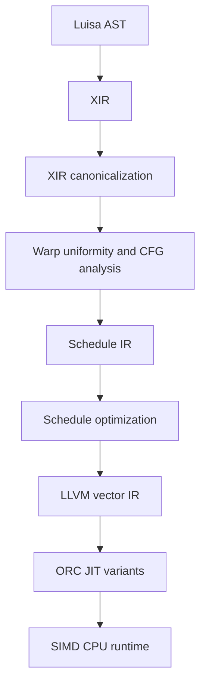

# SIMD CPU backend design

Status: Phase 2 fixed-vector compute checkpoint. XIR-to-Schedule lowering,
the dependency-light cohort semantic model, the scalar-target/vector-mask LLVM
packet scheduler, dispatch builtins, aggregate SoA values, and direct Buffer
gather/scatter plus bindless buffer tables are implemented behind
`LUISA_COMPUTE_ENABLE_SIMD`. The shared LLVM native-math layer now has
independently implemented precise and fast tiers for thirteen f32 operations:
the initial twelve unary operations plus binary `atan2`.

Baseline: `LuisaGroup/LuisaCompute@next`, commit
`d3d7919955ef7f835b8ad26775285748b7862d08` (2026-08-11), tree
`7bd81e18cad2956d12afdb65d5a5d247346db392`.

## 1. Goal

Add a production-quality, LLVM-JITed CPU backend that executes LuisaCompute's
SPMD kernels in SIMD packets. A packet is also the backend's logical warp:

| Compilation mode | Logical warp size | Typical native target |
| --- | ---: | --- |
| scalar | 1 | portable scalar |
| SIMD4 | 4 | SSE2, NEON, or a wider ISA used at four lanes |
| SIMD8 | 8 | AVX2 or a wider ISA used at eight lanes |
| SIMD16 | 16 | AVX-512 |

The first supported widths are 1, 4, 8, and 16. Width is a fixed-vector
specialization, not an ISA promise: on the recorded x86 host W8 uses YMM data
operations plus AVX-512VL masks and W16 uses ZMM, but another target may split
either width into narrower vectors. The IR must not bake in that
set: Luisa's warp mask is 128 bits, and later implementations may use compound
warps or scalable vectors.

The backend is not an ISPC source generator. It consumes optimized XIR,
introduces an explicit scheduling IR, and lowers that IR directly to LLVM IR.
The scheduling IR owns varying control flow, reconvergence, packet masks, and
warp collective semantics. LLVM owns instruction selection and target
multiversioning.

### 1.1 LLVM ownership boundary

For a specialization width `W`, every varying scalar is represented directly
as an LLVM fixed vector `<W x T>` and every execution mask as `<W x i1>`.
Varying aggregates use structure of arrays, so `varying<float3, 8>` is three
`<8 x float>` values. Warp- and cohort-uniform expressions may remain scalar;
cohort-uniform state is widened when it crosses a scheduler suspension.
Kernel value/resource arguments, constants, and warp-uniform launch metadata
use the scalar Luisa ABI and are never eagerly expanded to `<W x T>`. A scalar
is splatted only at a use that semantically requires one lane value per SIMD
element, such as mixed uniform/varying arithmetic or masked lane memory.

The backend emits only target-independent LLVM operations, including vector
arithmetic, `shufflevector`, `llvm.vector.reduce.*`, and masked memory. It must
not contain x86 `_mm*`, AVX/AVX-512, Arm NEON, or other target-ISA SIMD
intrinsics. The LLVM target machine receives the host triple, CPU, and feature
set and exclusively owns legalization, instruction selection, register
allocation, and machine scheduling. A scalar C++ implementation of warp
collectives exists under unit tests only as a semantic oracle.

## 2. Why this is a separate backend

The current `fallback` backend is a useful semantic and runtime reference, but
it is structurally scalar:

- it compiles `AST -> XIR -> LLVM` and invokes one scalar kernel per block;
- `WARP_LANE_ID` and `WARP_SIZE` lower to 0 and 1;
- shader creation rejects every allowed warp size other than 1;
- warp-level `ThreadGroupOp`s are not implemented;
- block synchronization suspends scalar LLVM coroutines.

Trying to incrementally turn every fallback LLVM value into a vector would mix
three independent changes in one 4,000-line code generator: value
vectorization, divergent CFG scheduling, and resource ABI changes. It would
also make the stable scalar oracle harder to trust.

The SIMD backend will therefore be a distinct module named `simd`. It should
reuse CPU runtime facilities with `fallback` after those facilities are
factored into a neutral `backends/cpu` layer. The two code generators remain
separate until the SIMD backend reaches semantic parity.

## 3. Pipeline



The XIR handoff is an unstructured, reducible CFG. XIR structured constructs
are destructured before Schedule IR construction. The current Schedule-to-LLVM
path accepts arbitrary reachable reducible CFG built from unconditional,
conditional, and indexed branches plus return and unreachable terminators,
subject to the separately documented instruction and synchronization feature
set. This includes nested control, natural loops with multiple back-edges and
multiple exits, indexed branches without a post-dominator, and early returns.
Irreducible CFG is rejected with a precise diagnostic until its convergence
rules are implemented.

The small-step semantics, uniformity lattice, inductive invariants, proof
obligations, bounded exhaustive model, and implementation mapping are specified
in [`SIMD_SCHEDULER_FORMAL_MODEL.md`](SIMD_SCHEDULER_FORMAL_MODEL.md).
The instruction, inactive-lane, native device-library, vector-math, and packet
acceleration contracts are specified in
[`SIMD_NATIVE_EXECUTION_CONTRACT.md`](SIMD_NATIVE_EXECUTION_CONTRACT.md).

The intended initial XIR pipeline is:

1. inline callables needed by the first codegen milestone;
2. lower autodiff and ray-query structured operations when applicable;
3. DCE, local store forwarding, local load elimination, and mem2reg;
4. destructure structured CFG and lower break/continue;
5. simplify CFG and clean PHIs;
6. run warp-uniformity, divergence, loop, dominance, and post-dominance
   analyses;
7. build and verify Schedule IR.

The canonical AST-to-XIR path currently spills early returns to one exit while
destructuring. Schedule IR and the direct unstructured-XIR entry still model
per-lane return explicitly, so CFG producers are not required to rely on that
normalization for correctness.

## 4. Execution model

### 4.1 Terminology

- **lane**: one logical Luisa invocation inside a warp;
- **warp**: `W` lanes that share warp-intrinsic scope and lane numbering;
- **cohort**: the subset of one warp currently executing the same dynamic
  Schedule IR point;
- **packet**: the physical SIMD representation used to execute a cohort;
- **continuation**: a Schedule IR program counter plus its dynamic convergence
  token;
- **epoch**: the dynamic instance of a loop or convergence point.

A warp is semantic. A packet is an implementation choice. They are identical
for the first 1/4/8/16-wide implementation, but Schedule IR keeps the terms
separate so a logical warp can later span multiple physical registers.

### 4.2 Dynamic cohort scheduling

Each live lane has an abstract continuation. The runtime groups lanes with the
same compatible continuation into a cohort, executes a vector basic block for
that cohort, and distributes the resulting lane masks to successor
continuations. The abstract model is independent-lane, but the LLVM refinement
does not materialize or scan a `<W x i32>` lane-PC vector. It stores suspended
cohorts as bounded `(target, mask, token)` worklist records and directly
threads the currently executing mask and scalar token through ordinary edges.

Conceptually:

```text
ready(entry, initial_mask, root_token)
while any continuation is ready:
    c = choose_ready_cohort()
    execute_vector_block(c.pc, c.mask)
    enqueue successor cohorts
```

This permits lanes to make independent progress through loops, nested branches,
switches, and early returns. Planned convergence gates merge sibling masks
before a target is issued. At a conditional or indexed branch, the emitter
first tests how many successor masks are nonempty. A coherent branch directly
continues at its sole target without allocating a frame or entering the
dispatcher; only a true partition creates worklist records.

Hardware predicates are still used to execute a cohort. Avoiding predicates is
neither possible nor desirable on modern SIMD ISAs. The distinction from a
traditional SPMD mask stack is that a predicate is a property of one scheduled
cohort, not the complete control state of the warp.

### 4.3 Hybrid lowering

A per-basic-block dispatcher is too expensive for coherent code. Schedule IR
therefore records one of three execution strategies per region:

1. **uniform**: emit ordinary scalar control flow around vector values;
2. **predicated**: if-convert a small, speculation-safe diamond;
3. **cohort**: materialize continuations and dynamically schedule a divergent
   region.

The current lowering implements the uniform and cohort strategies. A varying
conditional or switch also has a dynamic coherent fast path: when all active
lanes select one successor, it behaves like directly threaded masked SIMT
control flow. A genuinely divergent partition lazily allocates its convergence
frame, appends nonempty successor records to the bounded worklist, and returns
to the scalar dispatcher. Values live across cohort suspension points are
spilled to warp-state slots; block-local temporaries remain LLVM SSA values.
Convergence arrival is emitted once at the destination block entry rather than
duplicated on every incoming edge. The executing cohort owns one scalar token,
and each suspended record stores one scalar token; no per-lane token vector is
materialized. Active convergence-frame slots use one scalar `iW` bitset.

The O2 pipeline may otherwise promote every cross-block state slot through the
global dispatcher and create more live vector PHIs than the physical register
file can hold. Codegen therefore counts direct accesses to each state slot. If
at least half of the slots are cold (at most six generated loads/stores,
including initialization), those cold slots use explicit volatile stack
loads/stores so they remain L1-resident, while frequently accessed state stays
eligible for SROA/mem2reg and register residency. The gate is per kernel; it is
not enabled for arithmetic-dense SDF kernels where cold-state pinning regresses
throughput.

### 4.4 Scheduler policy

Semantics must not depend on which ready cohort is selected. The LLVM
implementation uses a deterministic depth-first LIFO worklist, while the
bounded model explores every legal next-cohort choice, including an
adversarial order. Later policies may use branch probabilities, cache locality,
or sparse-cohort scalarization without changing the Schedule semantics.

### 4.5 Width-one scalar specialization

Width one is the degenerate case of the same Schedule semantics: only one lane
can be live, so no two continuations can coexist and no convergence gate can
wait for a sibling cohort. Its LLVM lowering therefore connects Schedule
blocks as an ordinary scalar CFG and applies edge assignments on the selected
edge. An initial dispatch-bounds branch rejects an inactive edge invocation;
otherwise the active mask is the constant one-lane mask used by the shared
instruction and resource lowering.

This path deliberately bypasses lane-PC dispatch, runnable/live masks,
convergence frames, loop epochs, and their state allocas. Instruction values
that cross Schedule blocks retain temporary state slots so LLVM's ordinary
`mem2reg` can reconstruct scalar SSA. The formal scheduler remains the oracle:
the direct CFG is its observationally equivalent single-lane refinement.
W4/W8/W16 retain convergence tokens and bounded frames, but use the
scalar-target/mask worklist and coherent direct threading instead of a
per-lane PC dispatcher. The abstract loop epoch is represented by dynamic
frame/worklist-record identity and Schedule IR loop membership; codegen does
not materialize a `loop.epoch.*` vector.

## 5. Convergence and dynamic instances

Grouping lanes by static basic-block ID alone is incorrect. Two lanes can reach
the same block in different loop iterations, and a warp collective must not
accidentally combine those dynamic instances.

Schedule IR assigns every divergent construct a convergence plan derived from
dominance, post-dominance, and natural-loop analysis. A continuation carries a
token identifying:

- its parent convergence scope;
- the divergent construct and successor path that produced it;
- loop epochs for enclosing loops;
- the static continuation point.

Sibling paths may merge only at their planned reconvergence point and only
when their parent token and loop epochs are compatible. A loop back-edge
advances that loop's epoch. Lanes in different iterations therefore remain
separate even if they temporarily have the same static program counter.

SIMD uses post-dominance over terminating executions. The default XIR analysis
continues to treat reachable cycles as possible infinite virtual exits, but
that conservative definition would erase a natural loop's real exit gate and
let a post-loop collective run once per exiting cohort. For SIMD, back-edges
are not virtual exits when computing rendezvous targets. If a scalar lane does
not terminate at runtime, packet progress is correspondingly not promised.

The destination block and the current dynamic frame, rather than a
dominator-only edge annotation, determine whether an edge is a convergence
arrival. This handles shared blocks with entries from both inside and outside
a divergent scope. Several frames targeting the same block are released
inner-to-outer by following their runtime parent tokens.

The token implementation is not required to be a per-lane heap object. The
current refinement stores one `current.token` for the executing cohort, one
`ready.token.*` per suspended record, and parent tokens in bounded convergence
frames. Dynamic record/frame identity supplies the required epoch separation.
Schedule IR makes the contract explicit so codegen may specialize it.

Lanes that return or are discarded are removed from the expected mask of every
enclosing convergence point. Reconvergence therefore cannot deadlock waiting
for a terminated lane. If this completes a frame, its waiting lanes traverse
the same runtime target-arrival cascade as a normal edge before they become
runnable; this preserves parent gates when nested frames share a merge block.

## 6. Warp intrinsic semantics

Existing Luisa warp operations are defined over the lanes active at the call
site. Schedule IR makes this implicit set an explicit `participant_mask`
operand. For a normal collective it is the current cohort mask.

The following rules are the backend contract:

- `warp_lane_id()` is the lane's physical position in `[0, W)`;
- `warp_size()` is the compile-time logical width `W`;
- reductions, votes, prefix operations, and first-active queries use only the
  participant mask;
- prefix operations are ordered by physical lane ID, not compacted cohort
  position;
- results are defined only for participating lanes;
- `warp_read_lane(v, i)` is undefined if lane `i` is outside the warp or does
  not participate in that dynamic collective;
- debug builds may trap on an invalid shuffle source;
- `warp_read_first_active_lane` is valid when the participant mask is nonzero;
- `warp_active_bit_mask` fills Luisa's `uint4` from low to high lane IDs and
  zeros bits at and above `W`;
- aggregate operations are component-wise and preserve the complete bit
  representation of 8/16/32/64-bit scalars, vectors, and matrices.

The first implementation supports the existing implicit-active-set API. A
future explicit synchronization-mask API can be added at the DSL/XIR layer,
but it is not required to make this backend correct.

Collectives carry the current scheduler `active_mask` as an explicit
`participant_mask` value and are Schedule IR suspension points. All lanes in one compatible
dynamic instance that have reached the collective are combined. Separate path
instances and separate loop epochs are never combined. This is deterministic
and prevents cross-iteration mixing while retaining sparse active-mask
behavior such as lanes `{0, 1, 6}`.

## 7. Block synchronization and shared memory

One block can contain multiple logical warps. The runtime has two launch modes:

- **independent-warp launch** when the kernel uses neither shared memory nor a
  block barrier;
- **cooperative-block launch** when it does.

In cooperative-block launch, each warp executor is resumable. A
`SYNCHRONIZE_BLOCK` instruction yields the current warp phase. The block
scheduler resumes the next phase only after every non-terminated invocation in
the block has arrived. Shared memory is allocated once per block.

Potentially non-uniform barrier reachability is diagnosed. The initial backend
rejects a barrier that is not proven uniformly reachable by all live threads in
the block, matching the practical safety requirement of GPU backends.

## 8. Schedule IR

Schedule IR is initially backend-private under `backends/simd/schedule`. It can
be promoted to a public Luisa IR only after the representation survives the
first complete backend. Keeping it private avoids committing to an unstable
ABI while still enforcing a clean XIR/codegen boundary.

### 8.1 Value classes

Every value has a Luisa data type and an execution class:

- `warp_uniform<T>`: one value is stable across all lanes and all dynamic
  cohorts of the warp (for example a kernel value argument or `warp_size`);
- `cohort_uniform<T>`: one scalar value is sufficient while the current
  dynamic cohort executes, but sibling paths or loop epochs may have different
  values (for example `warp_active_sum` in divergent control flow);
- `varying<T, W>`: one logical value per lane;
- `mask<W>`: a lane predicate;
- `token`: scheduler-only convergence state;
- `address<space, class>`: a typed address with uniform or varying provenance.

Aggregates use structure-of-arrays register layout. For example,
`varying<float3, 8>` is three `<8 x float>` values, not `<8 x {float,float,float}>`.
Memory layout remains the existing Luisa scalar ABI.

Uniformity is warp-relative. The existing XIR `UniformityAnalysis` proves
workgroup uniformity for SPIR-V descriptor indexing and is not reused as-is.
The SIMD backend runs its own intraprocedural `WarpUniformityAnalysis` after
callable inlining, with conservative fallback to varying if an uninlined or
foreign value remains.

The analysis is a monotone dependency worklist over
`warp_uniform < cohort_uniform < varying`. Kernel arguments are seeded as
`warp_uniform`; pure arithmetic/casts/GEPs/resource queries propagate the join
of their operands. A distinct-input PHI remains scalar only when every path
decision reaching it is warp-uniform. Recurrent PHIs are at least
`cohort_uniform`, because their value can change by loop epoch. Any varying
control path downgrades a distinct-input PHI to `varying`. Value propagation is
`O(I + U)` and the accompanying one-way control-path propagation is
`O(B + E)`; neither performs whole-function fixed-point rescans.

`cohort_uniform` is an expression representation, not permission to use one
global warp-state slot. If such a value survives a scheduler suspension, its
spill is lane-wise (or equivalently keyed by the complete dynamic token).
Only `warp_uniform` may be stored once for the whole warp. This distinction is
required for collectives whose result is uniform among current participants
but differs between divergent paths or loop epochs.

### 8.2 Control operations

The minimum control vocabulary is:

- `entry initial_mask`;
- `branch edge`, where an edge carries its target, zero or more
  inner-to-outer convergence arrivals, an optional loop-epoch transition, and
  PHI state assignments;
- `split condition, true_target, false_target`;
- `switch value, targets...`;
- `join convergence_id, target`;
- `loop_back loop_id, target`;
- `kill mask` for return/discard;
- `collective collective_id, participant_mask, op, operands...`;
- `block_barrier barrier_id`;
- `unreachable`.

PHIs lower to masked edge copies into destination warp-state slots. This
avoids trying to express a value with different incoming predecessors as one
LLVM PHI when cohorts arrive at different times.

### 8.3 Region metadata

Each region records:

- entry and exits;
- parent region;
- reconvergence block, if any;
- enclosing loop IDs;
- live-in/live-out varying values;
- side effects and speculation safety;
- collective and barrier presence;
- estimated instruction cost and branch probability;
- chosen execution strategy.

### 8.4 Verification

The verifier rejects:

- invalid or unterminated CFG;
- missing PHI edge assignments;
- uses not dominated within a non-suspending region and not present in the
  region's live-in state;
- incompatible convergence-token merges;
- collective result use outside its participant mask without a dominating
  definition;
- loop back-edges without epoch transitions;
- unsupported irreducible convergence;
- non-uniform block barriers;
- a requested warp width outside the supported target set.

A stable text printer is required before LLVM code generation so tests can
fixture Schedule IR independently of machine code.

### 8.5 Compiler scalability contract

Schedule IR is intended for generated kernels whose CFG and SSA graphs may be
much larger than hand-written code. Compile-time complexity is therefore a
correctness constraint, not a late performance polish. Let `B`, `E`, `I`, and
`U` be reachable blocks, CFG edges, instructions, and operand uses; `C` the
number of convergence gates; `A` the number of PHI edge assignments; `J` the
number of emitted convergence arrivals; `T` the number of return terminators;
`R` the number of required
incoming-edge/state-slot obligations (including missing assignments in an
invalid fixture); and `M` the loop-membership output already materialized by
XIR's natural-loop analysis.

The Phase 1 implementation has the following budget:

| Operation | Time | Additional space |
| --- | --- | --- |
| CFG indexing | expected `O(B + E)` | `O(B + E)` |
| warp uniformity | `O(I + U)` monotone value propagation | `O(I + U)` |
| uniform-control paths | `O(B + E)` one-way downgrade propagation | `O(B + E)` |
| reducibility check after natural-loop discovery | expected `O(B + E)` | `O(B + E)` |
| loop-parent projection | `O(M)` plus deterministic exit sorting | `O(M)` |
| convergence-parent construction | `O(B + C)` dominator-tree walk | `O(B + C)` |
| convergence edge annotation | `O(B + E + C + J)` dominator-tree event walk | `O(B + C + J)` |
| PHI edge lowering | expected `O(E + A)` | `O(E + A)` |
| Schedule IR verification | `O(B + E + I + U + A + J + R)` | linear in IR plus diagnostics |
| LLVM dynamic target-arrival emission | `O(J + T * W)` with bounded runtime cascades | `O(J + T * W)` target-independent IR |

`discover_natural_loops` is an existing XIR analysis and is counted separately;
the SIMD pass consumes its materialized membership once and must not add a
second pairwise loop scan. Any measured natural-loop bottleneck should be fixed
in that shared analysis rather than hidden by a backend cache.

The implementation must not use whole-function fixed-point rescans, scan all
convergence regions for every edge, scan all values for every PHI edge, or walk
every possible loop pair. Hash tables are reserved from known counts where it
materially reduces rehashing. Deterministic output may add sorting only over
the items actually emitted.

Scalability fixtures include a 4,096-block Schedule IR chain with one state
assignment per edge and a deep convergence-parent chain. Larger generated-CFG
benchmarks and pass-level counters are required before Phase 2 is considered
complete; wall-clock thresholds remain benchmark gates rather than brittle
unit-test assertions.

## 9. Vector memory and resource lowering

The register representation is SoA; resource storage retains Luisa's current
ABI. Lowering selects among:

- contiguous vector load/store;
- strided load/store when the target supports it profitably;
- LLVM masked gather/scatter;
- active-lane scalarization for unsupported types or operations.

Masked-off lanes must never issue an invalid load. Implementations may not
emulate a masked load with an unconditional load followed by `select` unless
the address is independently proven safe.

Initial resource support order:

1. uniforms and buffers;
2. atomics and byte-address buffers;
3. textures through one packet callback with SoA coordinates/components and a
   packed active mask; bindless buffer tables remain native fixed-vector
   gathers/scatters;
4. shared memory and block barriers;
5. acceleration structures and ray queries.

Conflicting non-atomic stores from different active lanes remain unordered,
as on GPU backends. Atomics execute once per active lane and preserve the
declared atomic semantics; they may initially scalarize.

Texture storage retains the public row-major Luisa ABI so native handles,
uploads/downloads, external memory, and read/write images need no shadow
layout. The JIT/runtime boundary is instead SIMD-shaped: one callback receives
`x/y/z` coordinate vectors, four component vectors, and the active bits for a
whole W1/W4/W8/W16 packet. The runtime recognizes same-texel broadcast and
fully active contiguous-row cases, and otherwise walks only set bits. This
removes the old per-active-lane indirect branch/call chain without exposing
raw storage to JIT code. Direct JIT AoS gathers and speculative wide
load/deinterleave were measured and rejected because lower instruction counts
did not translate into lower end-to-end latency.

Embree remains the CPU ray-tracing implementation. Width-specialized kernels
must use the matching packet traversal interfaces (`rtcIntersect4/8/16` and
`rtcOccluded4/8/16`) with the scheduler mask wired to Embree's valid-lane mask.
Per-active-lane scalar traversal is allowed only for width 1, a documented
sparse-cohort fallback, or a temporary bring-up fixture; it is not the final
SIMD4/8/16 implementation. Packet traversal must preserve inactive-lane,
instance-stack, motion, and ray-query callback semantics.

The same rule applies to the rest of the device library. Math, bit, packing,
texture helper, transform, and ray utility operations need scalar-uniform and
native `<W x T>` implementations. A hidden loop that calls the scalar builtin
once per active lane is a correctness fallback, not feature completion; every
such fallback must be identified in generated-IR diagnostics and replaced or
justified by a sparse-cohort policy.

## 10. LLVM lowering and target selection

Schedule IR is parameterized by symbolic width `W`; LLVM modules are fixed-width
specializations. The first target matrix is:

| Architecture | Widths | Typical LLVM legalization |
| --- | --- | --- |
| x86-64 | 1, 4 | baseline/SSE2 |
| x86-64 | 8 | AVX2 when available; compound narrower vectors otherwise |
| x86-64 | 16 | AVX-512 when available; compound narrower vectors otherwise |
| AArch64 | 1, 4 | baseline/NEON |
| AArch64 | 8, 16 | compound NEON packets initially; SVE later |

The device exposes an auto-selected native width through
`compute_warp_size()`. A backend-specific `DeviceConfigExt` can force width 1,
4, 8, or 16 for tests and reproducibility. Kernel `set_warp_size(W)` must match
the selected device width in the first version. Multi-width shader variants in
one device are deferred.

Kernel block dimensions are compile-time powers of two for the SIMD backend.
The compiler forwards the declared `{x, y, z}` into Schedule-to-LLVM and lowers
linear-thread decomposition with `and`/`lshr`; a non-power-of-two nonzero
dimension is rejected. A zero dimension is reserved for the generic public
lowering API and keeps the runtime `udiv`/`urem` path. This makes the user's
power-of-two launch assumption an explicit checked contract and removes
integer division from production dispatch-ID construction.

The JIT cache key includes:

- Schedule IR ABI version;
- logical warp width;
- target triple, CPU, and feature string;
- LLVM version;
- fast-math/debug options;
- builtin/resource ABI hash;
- XIR and scheduling-pipeline options.

LLVM lowering uses fixed vector types, `llvm.masked.*`, vector reductions,
shuffle vectors, and target-independent intrinsics. Backend code never inserts
target-ISA intrinsics. If a target legalizes a canonical vector idiom poorly,
the remedy is to improve the target-independent IR or LLVM's lowering—not to
encode an x86 or Arm instruction in Schedule IR codegen.

### 10.1 Native math tiers

`ShaderOption::enable_fast_math` is carried by `SIMDShader` through the SIMD
compiler and Schedule-to-LLVM emitter. A varying f32 math operation selects
the precise or fast fixed-vector provider at its use site. The fallback XIR
code generator uses the same selection for DSL float2/float3/float4. A
warp-uniform value remains scalar and performs one scalar LLVM math operation;
it is not broadcast and recomputed per lane.

The provider facade remains in `backends/common/llvm_native_math.cpp`. The
implementation is split by range reduction, precise trig, precise inverse
trig, precise exp/log, and the corresponding fast responsibilities. This
keeps the ABI and provider selection separate from formulas and keeps the
precise expression order unchanged. Formula provenance, the numerical
envelopes, and special-value behavior are linked from
[`SIMD_NATIVE_EXECUTION_CONTRACT.md`](SIMD_NATIVE_EXECUTION_CONTRACT.md).
`exp2`, `exp10`, `log2`, and `log10` have their own precise/fast symbols and
direct range-reduction bodies rather than scaling an `exp` or `log` call.
Binary `atan2` similarly has a dedicated portable vector body with explicit
quadrant and IEEE special-value repair.

Acceptance checks three layers:

1. numerical execution at W2/W3/W4/W8/W16, including deterministic raw bits,
   domain-focused samples, special values, large reductions, and inactive
   tails;
2. LLVM IR shape, including the absence of lane extraction/insertion loops and
   target-specific intrinsics;
3. optimized assembly, including the absence of varying scalar libm symbols.

`benchmark_llvm_native_math` is an explicit benchmark target rather than a
CTest timing test. It interleaves precise and fast samples for fallback
float2/float3/float4 and SIMD W4/W8/W16 and enforces a 1.05x aggregate
throughput gate per width. On the recorded LLVM 22.1.8 x86-64 audit host, the
median aggregate speedup across three independent-provider runs was
1.317x-1.362x and every individual operation was faster. The benchmark also
prints static instruction counts; instruction count alone is not the
acceptance metric because the common trig path retains a cold large-argument
correctness branch.

## 11. Runtime factoring

The intended source layout is:

```text
src/backends/
  cpu/                  # shared runtime, resources, queues, Embree wrappers
  fallback/             # scalar XIR -> LLVM codegen
  simd/
    schedule/           # Schedule IR, analyses, verifier, printer
    llvm/               # focused Schedule IR -> LLVM lowering units
    runtime/            # SIMD device/shader integration
```

The LLVM directory follows the same thin-interface/separate-runtime principle
as `fallback`, while deliberately avoiding its historical monolithic codegen
translation unit:

```text
llvm_schedule_codegen.{h,cpp}          # public ABI and lowering facade
llvm_schedule_emitter.h                # private emitter state and contracts
llvm_schedule_emitter.cpp              # validation, ABI, values, launch state
llvm_schedule_emitter_arithmetic.cpp   # aggregates, arithmetic, and casts
llvm_schedule_emitter_memory.cpp       # local/resource memory and atomics
llvm_schedule_emitter_bindless.cpp     # bindless descriptor and buffer access
llvm_schedule_emitter_collectives.cpp  # warp collective lowering
llvm_schedule_emitter_control.cpp      # control flow, state, and dispatcher
```

Hand-written LLVM codegen `.cpp` files have a 2,000-line review budget,
enforced when the SIMD CMake target is configured. New functionality must be
placed in the responsible unit or split into another focused unit rather than
growing a monolithic emitter. Public headers expose only stable packet ABI and
entry points; the mutable LLVM builder state remains private to the emitter.

Factoring happens incrementally. Files move from `fallback` only when both
backends consume the same tested implementation. The first Schedule IR tests
must not depend on LLVM or Embree, which keeps control-flow work buildable in a
small configuration.

Launch indexing follows Luisa's flattened block-thread convention. Within a
block, lane ID is `linear_thread_id % W`. The runtime requires the block thread
count to be divisible by `W` and loops over exactly `block_threads / W` full
warps. Dispatch-edge warps receive an initial mask for invocations outside the
exact dispatch size. As in fallback, the AST block-size contract remains
independent of the backend warp width.

Shader dispatches use a device-owned persistent worker pool. The flattened
block range is split into dynamically claimed chunks; all warps belonging to
one block execute sequentially on the worker that claimed that block, while
different blocks may execute in any order and concurrently. A dispatch joins
all of its block jobs before the stream advances to the next command or invokes
command-list callbacks. Multiple dispatch sizes in one command also remain
ordered. `SIMDDeviceConfigExt::worker_count()` selects the pool size: zero uses
host hardware concurrency and one provides a serial diagnostic path.

## 12. Diagnostics and observability

The backend will support independent dumps for:

- canonical XIR;
- Schedule IR before and after scheduling optimization;
- LLVM IR;
- target assembly;
- runtime cohort traces for one selected block/warp.

A cohort trace records continuation ID, token/epoch, active mask, selected
successor masks, and collective/barrier events. Trace mode is deterministic and
is part of the correctness strategy for difficult CFG failures.

Debug mode additionally checks:

- invalid shuffle source lanes;
- use of a value in lanes where it is undefined;
- convergence-token mismatches;
- stalled barriers and collectives;
- scheduler completion with no live lanes left behind.

## 13. Correctness tests

### 13.1 Schedule IR unit tests

Run without LLVM or a runtime backend at widths 1, 4, and 8:

- uniform and varying diamond CFG;
- nested branch/switch reconvergence;
- PHIs with sparse predecessor masks;
- different per-lane loop trip counts;
- break, continue, and early return;
- dispatch-edge partial warp within a complete thread-block warp;
- irreducible CFG rejection;
- loop epoch separation for the same static collective;
- deterministic results under two scheduler policies.

### 13.2 Warp intrinsic tests

Reuse and extend the existing runtime tests:

- multidimensional `warp_lane_id`;
- sparse active reductions over lanes `{0, 1, 6}`;
- sparse prefix sum/product;
- ballot/active mask and first-active queries;
- scalar, vector, half, 16-bit, 64-bit, and matrix lane reads;
- collectives inside nested divergent branches;
- collectives in loops with lane-dependent trip counts;
- width-specific runs for warp1, warp4, and warp8.

### 13.3 Backend differential tests

- SIMD1 versus `fallback` for scalar semantics;
- SIMD4/SIMD8 versus a host reference for warp semantics;
- the same kernel across all available widths where it does not explicitly
  require one width;
- buffer, texture, atomic, shared-memory, and ray-query parity as those features
  land.

### 13.4 Performance gates

Correctness lands before performance gates. Once vector codegen is complete,
track:

- coherent arithmetic and memory throughput;
- divergent branch/loop throughput at several active-lane densities;
- gather/scatter and compacted sparse cohorts;
- JIT time and object-cache hit time;
- representative LuisaRender kernels;
- emitted vector instruction counts and scalarization remarks.

Assembly checks should diagnose regressions but should not assert one brittle
instruction spelling across LLVM versions.

The first end-to-end runtime gate uses the standard non-coroutine
`example_sdf_renderer`, not `coro_sdf_renderer`. On the recorded Ryzen 9
9950X3D / LLVM 22.1.8 Release host at 1280x720 and SPP 4, default SIMD W8 after
parallel block dispatch measured 5.690 samples/s versus 0.242 samples/s for
the prior serial SIMD runtime: a 23.47x throughput increase. The 32-worker
fallback median was 8.823 samples/s, so W8 reaches 64.49% of fallback
throughput and does not yet claim performance parity.

The width sweep on that host measured the original independent-lane-PC cohort
path at 6.308, 4.919, 5.619, and 5.846 samples/s for W1/W4/W8/W16
respectively. Machine inspection confirmed that W8 uses 256-bit YMM data
operations plus AVX-512VL mask registers, while W16 uses 512-bit ZMM data
operations; the poor scaling was therefore not a missing host-feature flag.
SDF ray-march control-state traffic dominated its vector-width benefit.

The direct W1 CFG refinement raised the five-run SPP-4 median from 6.122 to
8.012 samples/s (1.309x) and the three-run SPP-32 median from 6.252 to 8.229
samples/s (1.316x). At SPP 16, `perf stat` measured instructions falling from
775.34 billion to 275.63 billion, branches from 70.31 billion to 9.07 billion,
cycles from 407.77 billion to 318.51 billion, and elapsed time from 2.814 s to
2.098 s. The SPP-4 W1 result reaches 90.81% of the recorded fallback median.

The same old/new W1 A/B over the supported graphics gates measured 1.29x for
`shader_toy` (28.60 to 13.92 billion instructions), 1.037x for
`image_processing`, and 1.020x for `game_of_life`; all paired output PNGs were
byte-identical. An end-to-end width sweep, including process startup and JIT,
then measured the following `perf` `duration_time` means in milliseconds. The
three graphics gates use 11 repetitions and the two additional offline
examples use five:

| Offline example | W1 | W4 | W8 | W16 |
| --- | ---: | ---: | ---: | ---: |
| `image_processing` | 185.9 | 224.2 | 265.9 | 357.0 |
| `shader_toy` | 165.7 | 169.4 | 162.8 | 186.1 |
| `game_of_life` | 78.7 | 86.2 | 102.6 | 131.2 |
| `voxel_raytracer` | 77.6 | 262.2 | 238.9 | 260.7 |
| `nbody_simulation` | 454.9 | 1389.9 | 1116.0 | 1174.6 |

Every width produced the same byte-exact PNG for a given example and passed
its repository reference comparison. W8 narrowly wins only `shader_toy`;
the scalar-CFG W1 path wins the other four, including 3.08x over W8 for
`voxel_raytracer` and 2.45x for `nbody_simulation`. Wider packets reduce some
arithmetic instruction counts, but the independent-PC scheduler state,
divergence, spills, and larger JIT code dominate these baseline workloads.
This is a code-generation optimization target, not evidence for changing the
worker pool.

Replacing the lane-PC scan with a bounded mask worklist, directly threading
ordinary edges, and bypassing frame/worklist allocation for dynamically
coherent varying branches changes that result substantially. The final SDF
SPP-4 sweep measured five-run medians of 8.292, 14.241, 21.146, and 30.024
samples/s for W1/W4/W8/W16 versus fallback at 8.749. The corresponding
fallback-relative speedups are 0.948x, 1.628x, 2.417x, and 3.432x. Relative to
the original per-lane-PC implementation, the four widths are 1.31x, 2.90x,
3.76x, and 5.14x faster. Mean end-to-end instruction counts were 70.60, 50.35,
35.00, and 26.18 billion respectively. Every SIMD width produced the same
SHA-256 output image.

The 256-by-256 warp-reduction matmul audit, repeated 128 times per process,
likewise fell to 0.427/0.349/0.380 seconds and
86.27/55.38/49.75 billion instructions for W4/W8/W16. The original lane-PC
implementation took 1.202/0.774/0.621 seconds. Assembly still contains real
packed multiply/add and gather operations, but the coherent path avoids
executing most of the dispatcher, token, frame, and spill sequence around
them.

A separate portable naive 256-by-256 GEMM, also repeated 128 times, compares
directly with fallback because it uses no warp collective. Fallback reaches
49.71 GFLOP/s; W1/W4/W8/W16 reach 43.86/30.14/30.25/26.92 GFLOP/s, or
0.882x/0.606x/0.609x/0.542x. This is not a tuned BLAS result. Disassembly
shows why generic lowering loses: the portable function grows from a 144-byte
W1 body with no stack frame to 10.9 kB and a 3.1 kB frame at W16; the warp
variant reaches a 6.3 kB W16 frame. LLVM emits real vector arithmetic, but
gathers, long live ranges, and spill/reload traffic consume the benefit.

The final offline graphics sweep includes the packet texture ABI and uses seven
whole-process runs per backend/width in alternating order. Each SIMD entry is
fallback median time divided by SIMD median time; values below one are slower
than fallback:

| Offline example | fallback ms | W1 | W4 | W8 | W16 |
| --- | ---: | ---: | ---: | ---: | ---: |
| `image_processing` | 133.7 | 0.746x | 0.736x | 0.730x | 0.714x |
| `game_of_life` | 65.1 | 0.722x | 0.888x | 0.884x | 0.867x |
| `shader_toy` | 177.0 | 1.092x | 1.231x | 1.215x | 1.065x |
| `voxel_raytracer` | 53.1 | 0.843x | 0.226x | 0.222x | 0.198x |
| `nbody_simulation` | 307.9 | 0.667x | 0.372x | 0.375x | 0.321x |
| geometric mean | -- | 0.802x | 0.584x | 0.579x | 0.530x |

All 20 SIMD width/example combinations pass their gallery references and all
SIMD widths for one example remain byte-identical. `shader_toy` is the one
current graphics workload with a net SIMD win; sparse voxel DDA and
buffer-gather/live-state-heavy n-body remain the strongest counterexamples.
The complete timing, perf-counter, disassembly, and methodology snapshot is in
the generated performance report rather than inferred from width alone.

A temporary, reverted 32-copy steady-state probe separates kernel work from
JIT/PNG/process cost for the two texture questions. W8 image processing rises
from 0.730x whole-process to 0.972x incremental-work speedup; its incremental
task-clock is 4.9% below fallback, but average repeated-run CPU utilization is
17.8 versus fallback's 21.6, leaving short-dispatch/barrier utilization as the
remaining kernel-level gap. Sampling puts fallback texture/backend code at
42.8% of cycles and the packet SIMD backend at 14.2%. Voxel rises only from
0.222x to 0.424x incremental speedup and still consumes 2.48x fallback CPU
work; texture/backend code is only 1.4% of its SIMD samples. Its bottleneck is
the divergent DDA/gather body, not the output texture write.

The next scheduler-state refinement moves convergence arrival to one
destination-side trampoline, replaces the per-lane convergence-token vector
with scalar current/ready tokens, stores active frame slots as an `iW` bitset,
and partitions cold versus hot cross-block state. On the same temporary
32-dispatch W8 voxel probe, the repeated-run median fell from 0.759 s to
0.529 s (1.44x). Instructions fell from 146.39 to 122.26 billion, cycles from
86.35 to 59.33 billion, and L1 data loads from 48.09 to 31.45 billion. The
target/bitset part alone reduced the emitted assembly from 260.1 to 183.1 kB
and the stack frame from 11,520 to 6,464 bytes. Sampling after this change
still points at state spill/reload boundaries; the two varying gathers account
for far below one percent of sampled JIT cycles, so adding lane prefetches is
not the next-order fix for this kernel.

A 15-run, alternating-order non-coroutine SDF rerun after this refinement
measured median throughput of 8.214/15.136/22.598/33.047 samples/s for
W1/W4/W8/W16 against fallback at 8.745. The fallback-relative speedups are
0.939x/1.731x/2.584x/3.779x. The corresponding interquartile throughput
ranges are 8.157--8.263, 15.020--15.221, 22.407--22.782, and
32.651--33.482 samples/s; fallback is 8.694--8.795. Thus the wide-path gains
remain visible under concurrent host load rather than depending on one best
run.

The portable 256-by-256 GEMM, again repeated 128 times per process and measured
in 15 alternating runs, reaches 44.70/30.91/32.89/31.32 GFLOP/s for
W1/W4/W8/W16 versus fallback at 48.47 GFLOP/s. These are
0.922x/0.638x/0.679x/0.646x: still slower than fallback, but W8 and W16 close
the previous 0.609x/0.542x gap. Their median instruction counts fall to 10.20
and 7.32 billion. The result still supports a dedicated packed/tiled
microkernel rather than treating generic gather-based lowering as a BLAS
replacement.

An optimized-IR and final-assembly audit explains the otherwise surprising
fallback result. LLVM horizontally vectorizes the scalar fallback kernel's
inner `K` reduction at vectorization factor 16 and interleave factor 4. The
result contains `<16 x float>` loads, masked gathers, vector FMA, and a final
horizontal reduction, and lowers to AVX-512 `vgatherqps`/`vfmaddps` on the
recorded host. In contrast, the current W8 packet body performs two varying
gathers plus packed multiply/add for each scalar `K` iteration. Thus W1 SIMD
assembly is not evidence about fallback: fallback has acquired a second,
within-invocation SIMD axis from LLVM's loop vectorizer.

The first remedy is narrower than a general axis transpose. When packet lanes
cover consecutive output columns and the static block-X dimension is at least
`W`, power-of-two block geometry proves that a packet cannot cross a row. A
GEMM row operand is then cohort-uniform and should become one scalar load plus
broadcast; the right-hand row and result are lane-consecutive and should use
masked contiguous vector load/store; the accumulator should remain in a
register across the coherent loop. The present value classes conservatively
lose this lane-affine information and therefore select gathers. A permanent
GEMM IR/assembly gate will require broadcast + contiguous load/FMA/store and
reject those gathers for the proven case.

A later, bounded optimization generalizes this into **SIMD axis rotation**.
It treats packet lane and within-invocation value/loop dimensions as explicit
layout axes, chooses one layout per coherent affine region, and inserts a
target-independent `shufflevector` transpose only on profitable region edges.
It is deliberately not an arbitrary runtime lane-identity change: divergent
control, warp collectives, barriers, atomics, and externally visible lane-wise
side effects pin the packet axis. CFG joins must agree on layout, tails retain
their masks, and the cost model includes shuffle count, gather versus
contiguous memory, horizontal reductions, scheduler suspension, and register
pressure. The staged implementation order is lane-affine memory recognition,
coherent-loop accumulator residency and unrolling, fixed rectangular tiles,
then optional lane/value transposes. This preserves a small auditable first
step while leaving room for GEMM-style microtiles rather than relying on LLVM
to rediscover the axis through a scheduler CFG.

The updated graphics matrix uses 31 alternating whole-process runs per
backend/width because other host workloads were active. SIMD groups are
stable (typically 2--5% interquartile spread), but fallback `game_of_life` and
`nbody_simulation` are bimodal with 49% and 28% spread. Their wall-clock
speedups are therefore not quoted as precise point estimates. The stable
comparisons are: image processing remains approximately flat at
0.750x/0.744x/0.749x/0.715x; shader toy rises to
1.104x/1.402x/1.480x/1.425x; and voxel rises to
0.866x/0.331x/0.344x/0.325x for W1/W4/W8/W16. For the noisy n-body case,
stable instruction counts still fall from the prior 72.15/58.91/55.97 billion
to 60.92/46.57/42.36 billion at W4/W8/W16. All 20 SIMD graphics combinations
pass their gallery references and remain byte-identical across widths for one
example.

Software prefetch is not enabled speculatively. LLVM's target-aware loop data
prefetch pass inserted no prefetch into the post-scheduler masked-gather
matmul, and the on/off assembly was identical. Hardware counters show that the
matmul's 18.1% L1 data-load miss rate is almost entirely L2-resident (only
about 0.52% of those misses also miss L2); n-body has about a 0.94% L1 load
miss rate and already records substantial hardware-prefetch traffic. A future
prefetch lowering therefore requires a proven affine lookahead distance and a
separate stable performance gate. It must not scalarize a varying gather into
per-lane prefetch calls.

A separate libdispatch/system-parallel-for experiment changed fallback by
+0.42%, SIMD W1 by -0.34%, and SIMD W16 by -0.05%, so the custom persistent
block pool is retained. Perf sampling attributes about 99% of SDF cycles to
JIT code and below 0.6% to backend/runtime scheduling. Additional example
probes currently fail closed at their documented feature boundaries:
`blackhole` and `wave_equation` require `smoothstep`,
`shader_toy_spacex` requires bindless textures, and `mpm88` requires
`matrix_linalg_mul`; a default-W8 `fire_simulation` probe exceeded the
120-second conformance timeout.

## 14. Delivery plan

### Phase 0: semantic model and design

Deliverables:

- this design contract;
- a small, dependency-light cohort scheduler model;
- tests for split, merge, loop epoch, early return, and sparse masks.

Exit criteria:

- width 1/4/8 model tests pass under depth-first and largest-cohort policies;
- no cross-iteration collective merging;
- design review resolves all semantics needed by Phase 1.

### Phase 1: Schedule IR

Deliverables:

- Schedule IR data model, builder, verifier, and text printer;
- XIR CFG and warp-uniformity analysis;
- XIR-to-Schedule-IR lowering for arithmetic, control flow, PHIs, calls that can
  be inlined, and warp operations;
- IR fixture tests.

Exit criteria:

- representative DSL kernels lower deterministically;
- all verifier-negative fixtures fail with actionable messages;
- widths do not change the structural IR apart from explicit specialization.

### Phase 2: LLVM core and backend shell

Deliverables:

- `simd` device module and forced-width configuration;
- LLVM lowering for scalar/vector arithmetic, casts, control flow, uniforms,
  buffer reads/writes, and core warp collectives;
- ORC JIT and width/ISA-aware cache key;
- end-to-end warp1/4/8 tests.

Exit criteria:

- SIMD1 matches fallback on the selected core suite;
- existing warp lane, prefix, sparse collective, and shuffle tests pass at
  supported widths;
- AVX2 builds contain real vector arithmetic for coherent SIMD8 kernels.

### Phase 3: CPU runtime parity

Deliverables:

- shared CPU queue/resource layer factored from fallback;
- callables, bindless, textures, atomics, shared memory, block barriers,
  printing, assertions, and coroutine interaction;
- cooperative block scheduler.

Exit criteria:

- the non-ray-tracing fallback runtime suite passes on SIMD1 and the applicable
  subset passes on SIMD4/8;
- barrier diagnostics reject divergent deadlocks;
- fallback behavior is unchanged.

### Phase 4: ray tracing

Deliverables:

- acceleration structure and ray-query parity through Embree packet traversal;
- width-1 and explicitly sparse scalar traversal fallback where valid;
- ray-query callbacks integrated with cohort scheduling.

Exit criteria:

- fallback ray-query and motion tests pass;
- inactive lanes never mutate Embree query state;
- packet and scalar traversal agree.

### Phase 5: optimization and production hardening

Deliverables:

- region strategy cost model;
- sparse-cohort scalarization/compression;
- gather/scatter and memory-coalescing improvements;
- AArch64 tuning and SVE investigation;
- CI matrix, benchmarks, documentation, and package/export integration.

Exit criteria:

- no known semantic gaps in supported compute features;
- stable cache ABI and device configuration;
- performance is competitive with scalar fallback and ISPC-style baselines on
  coherent workloads, with documented divergence tradeoffs.

## 15. Initial implementation slice

The first code change after this document is intentionally small:

1. add a dependency-light `LaneMask` and cohort scheduler model under
   `backends/simd/schedule`;
2. model continuations as `(pc, token, epoch)` and make scheduling policy
   injectable;
3. test split/reconverge, independent loop progress, early lane termination,
   partial warps, and collective instance separation at W=1/4/8;
4. add CMake integration that does not require LLVM or Embree;
5. only then introduce the full Schedule IR value/instruction model.

This slice validates the risky control-flow semantics before they become
entangled with LLVM vector code generation or CPU resource code.

## 16. Deferred decisions

The following do not block the first two phases:

- whether logical warps larger than one native vector should be exposed;
- whether SVE uses a scalable Schedule IR specialization or fixed logical
  widths over scalable predicates;
- whether sparse cohorts should compact lanes or switch to a scalar microloop;
- whether multiple warp widths coexist in one device;
- whether Schedule IR becomes a public, reusable Luisa library;
- whether safe cross-warp packet fusion is worthwhile for kernels without warp
  operations.

They must be decided from measured codegen and benchmark data rather than from
the initial abstraction alone.

## 17. Current implementation status

Phase 0, Phase 1, and the first Phase 2 compiler checkpoint were implemented
on 2026-08-11. The repository now contains:

- a 1--128 lane mask type with tail and sparse-mask support;
- a dependency-light cohort scheduler with explicit continuation, convergence
  gates, loop epochs, lane termination, and two deterministic policies;
- a backend-private Schedule IR skeleton with typed IDs,
  warp-uniform/cohort-uniform/varying/mask value classes, edge-local PHI state
  assignments, lossless parameter/constant/special-register source metadata,
  explicit collective masks,
  control terminators, convergence/loop tables, a linear indexed verifier, and
  a stable text printer;
- a non-mutating XIR-to-Schedule-IR projection for arbitrary destructured
  reducible CFGs, arithmetic/resources, PHIs, natural-loop epoch transitions,
  post-dominator convergence, and warp collectives;
- an `O(I + U)` dependency-worklist warp-uniformity analysis and indexed CFG,
  loop, convergence, and PHI lowering paths that avoid global pairwise scans;
- scalar kernel-argument/resource ABI and scalar uniform expression/state
  lowering, with lane splats introduced only at varying use sites;
- a width-specialized LLVM value layout where varying scalars are exactly
  `<W x T>`, masks are `<W x i1>`, and varying aggregates are structure of
  arrays;
- target-independent LLVM lowering for warp reductions, votes, ballot, prefix
  operations, and lane reads; aggregate operations recurse over SoA leaves so
  every low-level operation still consumes exactly one `<W x T>` value;
- a bounded LIFO packet scheduler whose ready records contain one scalar target,
  one vector mask, and one scalar convergence token; ordinary and dynamically
  coherent edges stay in direct LLVM control flow, so no per-lane PC, token, or
  explicit loop-epoch vector is materialized, while conditional and indexed
  partitions retain the same N-way convergence-frame semantics;
- bounded dynamic convergence frames (at most `W` for a `W`-lane packet),
  an `iW` active-frame bitset, destination-side cascading inner-to-outer joins,
  loop-gate reuse, dispatch-edge masks, and masked scalar returns; the old
  64-block ready bitmap and its CFG-size limit have been removed;
- per-kernel cold/hot suspension-state partitioning that keeps frequently
  accessed slots promotable to registers while preventing a cold-slot majority
  from inflating global dispatcher PHIs and physical register spills;
- a host-target compiler facade and O2 ORC JIT boundary that delegates
  legalization, instruction selection, register allocation, and machine
  scheduling to LLVM;
- a four-argument packet launch ABI that derives `thread_id`, `block_id`, and
  `dispatch_id` in fixed vectors and masks lanes outside non-divisible
  multidimensional dispatch extents;
- recursive Luisa-ABI loading for uniform aggregate values, SoA splatting,
  cohort spill/reload, component-wise integer arithmetic, aggregate
  construction/extraction/insertion/shuffle, and scalar/vector casts;
- direct Buffer descriptors with typed and byte-address queries plus masked
  LLVM gather/scatter for scalar, vector, matrix, array, and structure leaves;
- runtime-owned bindless slot tables with offset buffer views, update/remove
  commands, bounds-checked slot lookup, and varying or uniform slot indices;
  typed and byte-addressed bindless reads, writes, sizes, and device-address
  queries lower in a dedicated LLVM translation unit;
- lane-private local storage with Luisa ABI byte layout, masked loads/stores,
  and dynamic vector/array/matrix indexing through divergent control flow;
- monotonic direct-buffer atomics scalarized only at the memory side effect,
  including returned old values, predicated conflicting lanes, and scalar
  leaves selected through nested vector/matrix/array/structure indices;
- an AST-to-XIR compiler front door that inlines callables, forwards/eliminates
  local loads, promotes SSA storage, destructures CFG, and compiles a real DSL
  Buffer kernel through ORC;
- a runnable `DeviceInterface` module with host buffers, 2D/3D textures,
  streams, events, direct dispatch, and a public `SIMDDeviceConfigExt` that
  specializes every shader on the device to warp1/4/8/16 and selects the
  device worker count;
- a W1/W4/W8/W16 texture packet callback ABI with SoA coordinates and
  components, packed active masks, same-texel broadcast detection, contiguous
  row batching, sparse set-bit fallback, and inactive-tail sanitization while
  retaining the public row-major texture storage ABI;
- a device-owned persistent worker pool that dynamically schedules flattened
  block ranges, keeps all warps of one block together, joins before the next
  stream command, and retains a one-worker serial diagnostic mode;
- a checked SIMD static-block contract requiring each nonzero dimension to be
  a power of two; production launch-ID decomposition uses masks and shifts
  rather than integer division, while SIMD still partitions each block into
  independent width-1/4/8/16 packets;
- standalone unit coverage for warp1/4/8/16 control flow and positive/negative
  Schedule IR fixtures, plus XIR projection fixtures for divergent diamonds,
  uniform control, lane-dependent loops, a deterministic family of arbitrary
  forward reducible graphs (all 122 reachable five-block topologies plus 96
  larger generated graphs), warp collectives, structured-CFG diagnostics,
  and irreducible-CFG diagnostics;
- an executable bounded scheduler model that checks 342 active-mask/input
  initial states, all 4,782 legal ready-cohort interleavings, 47,764 transition
  steps, scalar-lane observational equivalence, and lane/gate ownership
  invariants;
- IR-shape assertions that reject target-specific intrinsic namespaces and ORC
  execution tests for warp1/4/8/16, including a divergent cohort-uniform lane
  read, lane-wise suspension spill, reconvergence, and active sum;
- ORC execution fixtures for lane-dependent loops at warp4/8, nested dynamic
  reconvergence, scalar-uniform and varying indexed branches, switch-in-loop
  multiple exits and early returns, multiple natural-loop back-edges, a
  lane-dependent loop-exit collective, a two-exit loop collective, a
  non-dominating shared-entry convergence counterexample, a same-target
  parent/child convergence cascade completed by return, a 96-block CFG,
  vector Buffer gather/add/scatter, and a real AST `Kernel1D` with a 13-thread
  dispatch edge inside a valid 32-thread block. Loop membership is explicit in
  Schedule IR so epochs are compared only while a cohort remains inside that
  loop;
- unattended runtime coverage from the repository's existing multidimensional
  lane-ID, warp matmul, sparse reduction/prefix, and aggregate lane-shuffle
  tests, plus device-level specialization across warp1/4/8/16, persistent-pool
  exactly-once and concurrent-submission checks, local-memory isolation under
  divergence, and conflicting direct-buffer atomics across parallel blocks
  with a partial dispatch tail.

The next implementation boundary is callable conformance and bindless texture
access/sampling, followed by cooperative shared memory and block barriers.
Acceleration structures then use Embree's matching 4/8/16-wide packet APIs,
while the remaining device-library surface gains scalar-uniform and native
`<W x T>` implementations. The current compiler returns precise diagnostics
for unsupported features rather than silently accepting them.
