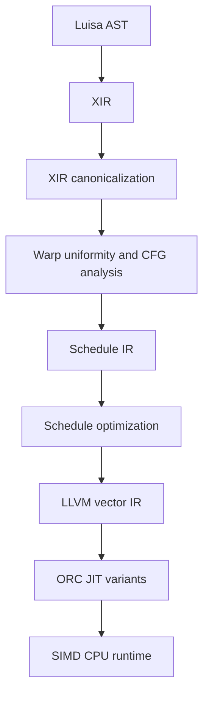

# SIMD CPU backend design

Status: Phase 2 fixed-vector compute checkpoint. XIR-to-Schedule lowering,
the dependency-light cohort semantic model, the scalar-target/vector-mask LLVM
packet scheduler, dispatch builtins, aggregate SoA values, and direct Buffer
gather/scatter plus bindless buffer/texture packet tables are implemented behind
`LUISA_COMPUTE_ENABLE_SIMD`. The shared LLVM native-math layer now has
independently implemented precise and fast tiers for twenty f32 operations:
the initial twelve unary operations, binary `atan2` and `pow`, and six
hyperbolic/inverse-hyperbolic operations. Static, vertex-motion, and
instance-motion triangle traversal now includes both closest/any traces and
stateful query-all/query-any handlers at W1/W2/W4/W8/W16. W16 acceleration
structures containing procedural instances additionally use a measured dense
full-cohort status pack while retaining the sparse inactive-safe path.
Acceleration instance-buffer-only updates now publish metadata and primitive
bindings without mutating the committed Embree scene; a later ordinary build
reconciles the deferred state even after the originating modification command
has been consumed.
The latest scheduler stage removes the redundant ready-record push and
immediate LIFO pop for one child of selected genuinely divergent binary
splits. The child still enters through the shared dispatcher PC route, so the
optimization neither clones the dispatch switch nor bypasses destination-side
convergence arrival. The current scheduler stage additionally coalesces
move-related PHI state slots under an exact per-lane liveness/interference
proof. Logical Schedule values remain distinct, while nonoverlapping versions
reuse one physical fixed-vector slot and their identity copies disappear.
High-pressure W16 schedules then apply the same proof to compatible non-move
state roots. A degree-ranked greedy coloring is retained only when it removes
at least two more physical slots; narrower widths and one-slot opportunities
keep the move-constrained layout.
The latest W16 refinement stores dynamically indexed convergence-frame static
IDs and parent tokens in scalar LLVM arrays. Narrower widths retain the vector
representation because paired measurements found it faster there; the frame
semantics and target-independent IR contract are unchanged.
The current varying-control refinement versions at most one bounded coherent
region at W2/W8. A runtime full-packet guard enters a constant-all-on clone;
partial tails and genuinely mixed control retain the general independent-PC
scheduler. This is the measured local counterpart of ISPC's front-end all-on
specialization, not a target-specific LLVM pass or a whole-function clone.
The newest loop refinement takes a different, bounded approach: one finite,
innermost, side-effect-free varying loop may execute as a single predicated
LLVM mask loop. It keeps one body rather than cloning all-on/mixed versions,
accumulates each dynamic exit mask, and returns to the general scheduler only
once. W16 enables this on an audited native fixed-vector target; W8 additionally
requires at least 24 dispatch workers, while W1/W2/W4 retain the generic loop.
The latest local refinement handles the complementary case where the complete
loop is too large to flatten. It if-converts proven one-sided arithmetic
diamonds inside the innermost loop, dynamically skips an empty expensive arm,
and may fuse a bounded sequence of adjacent diamonds into one LLVM emission
region. This keeps their live values in SSA/registers and removes intermediate
merge-to-dispatch round trips without cloning the loop or weakening the general
independent-PC scheduler.
The newest W8 refinement combines that local machinery with the canonical
cohort-equal counted-loop header. One bounded, pure, innermost loop with
lane-varying early exits may retain a single shrinking continuation mask,
execute each pure exit tail immediately under its disjoint exit mask, and enter
the shared post-loop block once after the original cohort has completely
finished. It neither clones an all-on/mixed loop nor performs a topological
whole-loop batch. The loop's control-driving blocks leave the dispatcher, so
LLVM can keep hot values in SSA/registers while the general scheduler remains
the fail-closed oracle for every other shape.
The newest runtime/codegen refinement batches all packets of one block behind
one exported JIT entry. W2/W4 use one small dynamic call loop. A measured W8
target with a 512-bit fixed-vector register file may inline one packet body into
that loop, while W16 and other statically small W8 batches unroll only the call
shell. The packet body is internal and is never cloned once per packet. W1 and
single-packet blocks retain the ordinary entry. This removes host/JIT boundary
and branch work without changing packet order, block ownership, masks, or the
Schedule scheduler inside a packet.
The current cooperative-block stage extends that boundary to kernels containing
shared allocas or block barriers. One fixed-vector LLVM coroutine represents one
packet, and one exclusive block wrapper drives all packet handles through
statically identified barrier phases. It preserves exact sparse edge masks,
shared pointer provenance, shared atomics, release/acquire visibility, and
W1/W2/W4/W8/W16 inactive-tail behavior. Repeated barriers carry the exact
per-lane epoch of every enclosing natural loop. The packet requires those
epochs to agree before suspension, and the block wrapper compares the complete
`(static site, enclosing epochs)` identity before resuming any packet.

Original SIMD baseline: `LuisaGroup/LuisaCompute@codex/simd-cpu-backend`,
commit `d3d7919955ef7f835b8ad26775285748b7862d08` (2026-08-11), tree
`7bd81e18cad2956d12afdb65d5a5d247346db392`. The current integration also
contains `origin/next` through commit
`4546cd535ff620f78ae80a1dbe573be8b99ba39d`, merged by
`a80e13ddb7423a694185c15d57616da000eec602` without rebasing the SIMD history.

## 1. Goal

Add a production-quality, LLVM-JITed CPU backend that executes LuisaCompute's
SPMD kernels in SIMD packets. A packet is also the backend's logical warp:

| Compilation mode | Logical warp size | Typical native target |
| --- | ---: | --- |
| scalar | 1 | portable scalar |
| SIMD2 | 2 | narrow fixed-vector specialization |
| SIMD4 | 4 | SSE2, NEON, or a wider ISA used at four lanes |
| SIMD8 | 8 | AVX2 or a wider ISA used at eight lanes |
| SIMD16 | 16 | AVX-512 |

The supported widths are 1, 2, 4, 8, and 16. Width is a fixed-vector
specialization, not an ISA promise: on the recorded x86 host W8 uses YMM data
operations plus AVX-512VL masks and W16 uses ZMM, but another target may split
either width into narrower vectors. The IR must not bake in that
set: Luisa's warp mask is 128 bits, and later implementations may use compound
warps or scalable vectors.

The backend is not an ISPC source generator. It consumes optimized XIR,
introduces an explicit scheduling IR, and lowers that IR directly to LLVM IR.
The scheduling IR owns varying control flow, reconvergence, packet masks, and
warp collective semantics. LLVM owns instruction selection and target
multiversioning.

### 1.1 LLVM ownership boundary

For a specialization width `W`, every varying scalar is represented directly
as an LLVM fixed vector `<W x T>` and every execution mask as `<W x i1>`.
Varying aggregates use structure of arrays, so `varying<float3, 8>` is three
`<8 x float>` values. Warp- and cohort-uniform expressions may remain scalar;
cohort-uniform state is widened when it crosses a scheduler suspension.
Kernel value/resource arguments, constants, and warp-uniform launch metadata
use the scalar Luisa ABI and are never eagerly expanded to `<W x T>`. A scalar
is splatted only at a use that semantically requires one lane value per SIMD
element, such as mixed uniform/varying arithmetic or masked lane memory.

The backend emits only target-independent LLVM operations, including vector
arithmetic, `shufflevector`, `llvm.vector.reduce.*`, and masked memory. It must
not contain x86 `_mm*`, AVX/AVX-512, Arm NEON, or other target-ISA SIMD
intrinsics. The LLVM target machine receives the host triple, CPU, and feature
set and exclusively owns legalization, instruction selection, register
allocation, and machine scheduling. A scalar C++ implementation of warp
collectives exists under unit tests only as a semantic oracle.

The Schedule-to-LLVM arithmetic switch is exhaustive for the operand/result
shapes accepted by the XIR verifier. Rotates use target-independent
`llvm.fshl`/`llvm.fshr`; bit count/reverse operations use the corresponding
LLVM intrinsics; and integer-exponent power is one scalar or whole
fixed-vector exponentiation-by-squaring loop rather than a source-level lane
loop. Source-vector reductions fold the two-to-four component axis separately
inside every SIMD lane. Vector/matrix outer product and 2x2/3x3/4x4 transpose,
determinant, and inverse operate directly on the SoA aggregate leaves. Uniform
operands retain the same scalar lowering, while varying partial tails sanitize
the operands of rotate, bit-count, and integer-power operations before they
execute.

## 2. Why this is a separate backend

The current `fallback` backend is a useful semantic and runtime reference, but
it is structurally scalar:

- it compiles `AST -> XIR -> LLVM` and invokes one scalar kernel per block;
- `WARP_LANE_ID` and `WARP_SIZE` lower to 0 and 1;
- shader creation rejects every allowed warp size other than 1;
- warp-level `ThreadGroupOp`s are not implemented;
- block synchronization suspends scalar LLVM coroutines.

Trying to incrementally turn every fallback LLVM value into a vector would mix
three independent changes in one 4,000-line code generator: value
vectorization, divergent CFG scheduling, and resource ABI changes. It would
also make the stable scalar oracle harder to trust.

The SIMD backend will therefore be a distinct module named `simd`. It should
reuse CPU runtime facilities with `fallback` after those facilities are
factored into a neutral `backends/cpu` layer. The two code generators remain
separate until the SIMD backend reaches semantic parity.

## 3. Pipeline



The XIR handoff is an unstructured, reducible CFG. XIR structured constructs
are destructured before Schedule IR construction. The current Schedule-to-LLVM
path accepts arbitrary reachable reducible CFG built from unconditional,
conditional, and indexed branches plus return and unreachable terminators,
subject to the separately documented instruction and synchronization feature
set. This includes nested control, natural loops with multiple back-edges and
multiple exits, indexed branches without a post-dominator, and early returns.
Irreducible CFG is rejected with a precise diagnostic until its convergence
rules are implemented.

The small-step semantics, uniformity lattice, inductive invariants, proof
obligations, bounded exhaustive model, and implementation mapping are specified
in [`SIMD_SCHEDULER_FORMAL_MODEL.md`](SIMD_SCHEDULER_FORMAL_MODEL.md).
The instruction, inactive-lane, native device-library, vector-math, and packet
acceleration contracts are specified in
[`SIMD_NATIVE_EXECUTION_CONTRACT.md`](SIMD_NATIVE_EXECUTION_CONTRACT.md).

The intended initial XIR pipeline is:

1. inline callables needed by the first codegen milestone;
2. lower autodiff and ray-query structured operations when applicable;
3. DCE, local store forwarding, local load elimination, and mem2reg;
4. destructure structured CFG and lower break/continue;
5. simplify CFG and clean PHIs;
6. run warp-uniformity, divergence, loop, dominance, and post-dominance
   analyses;
7. build and verify Schedule IR.

Ray-query representation changes are named by their destination. Fallback,
CUDA, HIP, and coroutine normalization use `lower_ray_query_to_pipeline` to
outline candidate callbacks. SIMD and native SPIR-V use
`lower_ray_query_to_loop` so candidate control remains visible to their CFG
lowering. The optional `reconstruct_ray_query_loop` adapter folds only that
lowering's exact canonical proceed loop back to `RayQueryLoopInst`; it is not
silently inserted into either production route.

Callable inlining is a legalization requirement for this backend, not its
generic cost heuristic. Immediately before the final inline-all pass, the
SIMD front door removes only diagnostic name/location/comment metadata from
ordinary call instructions so a DSL `$outline` source annotation cannot keep
an otherwise legal callable alive. Semantic call/callee metadata is retained
and continues to block inlining with an explicit unsupported-call diagnostic.
The runtime-width regression exercises this boundary at W1/W2/W4/W8/W16, and
the curve graphics gate exercises it through `CurveEvaluator::evaluate`.

The canonical AST-to-XIR path currently spills early returns to one exit while
destructuring. Schedule IR and the direct unstructured-XIR entry still model
per-lane return explicitly, so CFG producers are not required to rely on that
normalization for correctness.

## 4. Execution model

### 4.1 Terminology

- **lane**: one logical Luisa invocation inside a warp;
- **warp**: `W` lanes that share warp-intrinsic scope and lane numbering;
- **cohort**: the subset of one warp currently executing the same dynamic
  Schedule IR point;
- **packet**: the physical SIMD representation used to execute a cohort;
- **continuation**: a Schedule IR program counter plus its dynamic convergence
  token;
- **epoch**: the dynamic instance of a loop or convergence point.

A warp is semantic. A packet is an implementation choice. They are identical
for the current 1/2/4/8/16-wide implementation, but Schedule IR keeps the terms
separate so a logical warp can later span multiple physical registers.

### 4.2 Dynamic cohort scheduling

Each live lane has an abstract continuation. The runtime groups lanes with the
same compatible continuation into a cohort, executes a vector basic block for
that cohort, and distributes the resulting lane masks to successor
continuations. The abstract model is independent-lane, but the LLVM refinement
does not materialize or scan a `<W x i32>` lane-PC vector. It stores suspended
cohorts as bounded `(target, mask, token)` worklist records and directly
threads the currently executing mask and scalar token through ordinary edges.

Conceptually:

```text
ready(entry, initial_mask, root_token)
while any continuation is ready:
    c = choose_ready_cohort()
    execute_vector_block(c.pc, c.mask)
    enqueue successor cohorts
```

This permits lanes to make independent progress through loops, nested branches,
switches, and early returns. Planned convergence gates merge sibling masks
before a target is issued. At a conditional or indexed branch, the emitter
first tests how many successor masks are nonempty. A coherent branch directly
continues at its sole target without allocating a frame or entering the
dispatcher; only a true partition creates worklist records.

Hardware predicates are still used to execute a cohort. Avoiding predicates is
neither possible nor desirable on modern SIMD ISAs. The distinction from a
traditional SPMD mask stack is that a predicate is a property of one scheduled
cohort, not the complete control state of the warp.

### 4.3 Hybrid lowering

A per-basic-block dispatcher is too expensive for coherent code. Schedule IR
therefore records one of three execution strategies per region:

1. **uniform**: emit ordinary scalar control flow around vector values;
2. **predicated**: if-convert a small, speculation-safe diamond;
3. **cohort**: materialize continuations and dynamically schedule a divergent
   region.

The current lowering implements all three strategies for conditional control.
After CFG destructuring, inlining, and local SSA promotion, a varying diamond
is predicated only when both arms contain at most four instructions, at most
six in total, no more than four 32-bit live-out register units, and a weighted
speculation cost no greater than twelve. Every hoisted instruction must be a
total pure cast or an explicitly whitelisted total arithmetic operation.
Bitwise casts are total; static casts are accepted except for floating-point
to signed/unsigned integer conversion, whose untaken result could be LLVM
poison for NaN or an out-of-range value. In particular, integer-to-float
coordinate updates are safe to hoist. Memory/resource access, calls,
division/remainder, shifts, dynamic aggregate indexing, side effects,
metadata-bearing arms, and structured control are rejected by this ordinary
policy. Warp- and cohort-uniform conditions retain scalar control flow. W1
also keeps its direct scalar CFG: one live lane cannot benefit from eliminating
divergence, so speculating both arms would only add work.

Generated selects then undergo a bounded factoring rewrite. Matching one-use
arithmetic producers with exactly one differing operand are transformed from
`select(f(a), f(b), c)` to `f(select(a, b, c))`; matching chains are processed
recursively. A vector condition permits only component-wise operations, while
component-mixing reductions, normalization, matrix operations, and similar
forms stay unchanged. Instruction metadata and multi-use producers are also
fail-closed. This recovers one execution of common math without extending any
domain or evaluating a formerly untaken memory operation.

At W4/W8, a bounded refinement also exposes one or more enclosing diamonds in
an `if/elif` select ladder. The pass records the selects created by the current
if-conversion round, then may remove a single-predecessor block containing only
single-input PHIs and an unannotated branch when at least one PHI is driven by
one of those new selects and the target has a sibling reconvergence edge. Only
Name metadata may move to the unique select owner, and an existing select Name
must match; non-Name metadata, multiple uses, annotated blocks/branches,
pre-existing selects, and ambiguous downstream PHI edges reject the candidate.
The ordinary safety and weighted-cost gates are recomputed before converting
the next enclosing diamond. The process stops after eight conversion rounds
and at most eight forwarding blocks per round. This is not general CFG
canonicalization: measured whole-function `phi_cleanup + simplify_cfg` made
real voxel rendering slower despite reducing the static CFG.
W2 candidate code regressed and W16 was neutral on default-worker real-render
A/B tests, so both retain the single-pass policy. The independent oracle is
`LUISA_SIMD_DISABLE_PREDICATED_IF_REFINEMENT=1`.

The ordinary weighted speculation ceiling remains twelve, including the W4
refinement. W8 alone may use a ceiling of sixteen after the same bounded
forwarding analysis exposes a deeper ladder. This admits the next measured
`float3` material-selection layer at cost fourteen without changing any
safety, metadata, per-arm, total-instruction, or live-out rule. The narrower
oracle `LUISA_SIMD_DISABLE_DEEP_PREDICATED_IF_REFINEMENT=1` retains the W8
forwarding refinement but restores cost twelve. W4 measured slower with this
extra layer, and W1/W2/W16 therefore remain unchanged.

One final W8-only material-ladder refinement is deliberately shape-specific
rather than a global cost increase. It runs only after the cost-sixteen deep
policy and accepts one empty arm opposite exactly three scalar Boolean
equality operations plus three `float3` selects. Both arms must branch to one
merge with exactly one differing `float3` PHI. The ordinary single-
predecessor, metadata, totality, live-out, and speculation-safety checks still
apply; the weighted cost is bounded at nineteen. This removes the next Voxel
material-selection convergence without admitting unrelated four-instruction
diamonds whose costs happen to fall between sixteen and nineteen.
`LUISA_SIMD_DISABLE_WIDE_PREDICATED_IF_REFINEMENT=1` is the independent
same-binary oracle, and `predicated_wide_select_ladder_diamonds` reports its
accepted sites. W1/W2/W4/W16 do not enter this policy.

A separate one-sided update policy covers the measured five- or six-
instruction shape left just beyond those ordinary limits. Exactly one arm must
be empty, both arms must branch directly to the same merge, and at least two
merge PHIs must select different arm values. The live-out budget is six
32-bit register units and the weighted cost budget is fifty-eight. Floating
division carries the same latency weight as component-wise matrix division,
so the measured padded-`float3` update is not admitted through a default-cost
hole. All memory, calls, side effects, poison-forming casts, integer
division/remainder, every remainder operation, and the ordinary unsafe
arithmetic classes still fail closed. Floating-point division alone is
explicitly enabled for this SIMD
policy: fixed-vector LLVM floating division is non-trapping for every bit
pattern, while the generated selects make results from the formerly untaken
arm unobservable. The target-independent XIR pass keeps floating division
disabled by default; the SIMD caller must opt in. This is enabled at
W2/W4/W8/W16 and remains disabled at W1. The independent oracle is
`LUISA_SIMD_DISABLE_WIDENED_PREDICATED_UPDATE=1`, and the runtime optimization
report exposes `predicated_widened_update_diamonds`.

This refinement came from an independent audit of ISPC's costed predication
and all-on paths, not from copied implementation. In the matched analytic path
tracer it converts four inner sphere-hit update diamonds and removes eight
Schedule blocks, four convergence points, and four instruction spills at every
enabled width. Fifteen paired single-worker processes measured stable gains at
all four widths; the exact distributions and assembly deltas are recorded in
[`SIMD_PERFORMANCE_REPORT.md`](SIMD_PERFORMANCE_REPORT.md). Ordinary path
tracing, Voxel, and image-processing kernels currently produce zero widened
updates, so this stage makes no performance claim for those examples.

### W8 ray-query cutout-filter predication

Predicating a complete stateful ray-query loop is not profitable. The query
object is a large per-lane AoS record, and evaluating both handler paths extends
the live range of gathered candidate fields even when the transformation
removes branches. A measured whole-loop prototype reduced static instructions
but increased L1 traffic and regressed W8/W16 cutout throughput. The retained
refinement therefore leaves `proceed`, candidate-kind dispatch, commit,
terminate, query storage, and every memory operation under the ordinary
independent-PC scheduler. It converts only the small pure Boolean filter inside
the already selected surface-candidate handler.

The target-independent XIR if-conversion pass now has an opt-in
`allow_speculative_static_extract` capability. An accepted `EXTRACT` must have
constant nonnegative indices, remain in bounds while walking every array,
vector, matrix, or structure level, and end at exactly the instruction result
type. Dynamic indices and malformed paths remain ineligible. The default is
false, so existing pass callers do not change policy; this proof also does not
make the aggregate producer, a memory access, or a ray-query operation
speculation-safe.

The SIMD caller applies that capability only to an exact ray-query-filter
shape. The varying branch predicate must compare a constant with a direct
static extraction of member zero (`SurfaceHit::inst`) from
`RAY_QUERY_OBJECT_TRIANGLE_CANDIDATE_HIT`. Both plain arms must branch to one
merge. Their nonterminator counts must be the measured inner `(0, 5)` or outer
`(5, 8)` pair; every arm instruction is restricted to a total static
candidate-hit extraction, multiply, comparison, `fract`, or select; at least
one `fract` and exactly one differing Boolean PHI are required. Every candidate
extract must resolve to the same query-hit read. A `prim`, barycentric, or
distance predicate, a dynamic index, a different aggregate root, metadata that
the generic pass cannot preserve, or any call/effect fails closed.

At most three dedicated conversion/refinement rounds are attempted. Only
select/Phi forwarding blocks produced by the immediately preceding round may
be collapsed, under the existing metadata and edge-uniqueness proof. The
generated arithmetic remains target-independent fixed-vector LLVM IR; no
query payload is speculated and no target intrinsic is introduced.
`predicated_ray_query_filter_diamonds` reports accepted sites.
`LUISA_SIMD_DISABLE_RAY_QUERY_FILTER_PREDICATION=1` is the same-binary oracle,
while `LUISA_SIMD_FORCE_RAY_QUERY_FILTER_PREDICATION=1` bypasses only the
production width gate for regression/measurement. Production enables the rule
only at W8: W16 was neutral, and the narrower widths have no demonstrated real-
renderer gain.

The cutout renderer contains two query sites and accepts four diamonds at W8.
The permanent JIT regression independently covers one query site, W1/W2/W4/W8/
W16, a 13-thread inactive tail, forced nonproduction widths, exact disabled-
oracle output, and a `SurfaceHit::prim` near miss. The generic XIR pass also
retains a dynamic-index rejection and a nested bounded-static-extract positive
case. Final throughput, counter, assembly, and all-width gallery evidence is
recorded in [`SIMD_PERFORMANCE_REPORT.md`](SIMD_PERFORMANCE_REPORT.md).

### Innermost-loop local predicated regions

Whole-loop predication is intentionally selective: a large loop with calls,
memory effects, or an unproven trip bound must retain the independent-PC
scheduler. A smaller LLVM-side refinement instead removes scheduler state only
around locally proven diamonds in an innermost natural loop.

The base recognizer accepts a varying conditional with an exact convergence
and two one-to-three-block, single-predecessor arm chains. Both chains and the
merge must remain in the same innermost loop. Exactly one arm is instruction-
empty. An assignment-only diamond is always useful; otherwise the nonempty arm
must contain 4--24 whitelisted pure instructions and at least one `sqrt`,
`rsqrt`, or scalar/vector floating-point division. Comparisons, selects,
`min`/`max`, aggregate construction, and nontrapping arithmetic may accompany
that marker. Calls, memory/resource operations, side effects, integer
division/remainder, dynamic indexing, participant masks, and every structured
terminator reject the candidate. Arm assignments may update only varying or
mask destinations.

A second bounded family accepts instruction-bearing arms on both sides at
W2/W4/W8. The same exact convergence, one-to-three-block chains, innermost-loop
membership, predecessor, and lane-masked-assignment proofs apply. The complete
diamond contains 4--24 audited pure arithmetic or static/bitwise-cast
instructions; it need not contain expensive math because both original mixed
cohorts already execute. Each arm retains its own `any(arm_mask)` guard, so an
arm with an empty dynamic mask is neither speculated nor evaluated. W16 keeps
its existing predicated-loop path: forcing this local form was neutral at
1.008x with a 95%
interval crossing one. `LUISA_SIMD_FORCE_TWO_SIDED_LOCAL_PREDICATION=1`
provides semantic/diagnostic coverage there, and
`LUISA_SIMD_DISABLE_TWO_SIDED_LOCAL_PREDICATION=1` is the same-binary oracle.

Codegen forms `T = A & C` and `F = A & !C`. An instruction-bearing arm first
tests `any(arm_mask)`, so a completely untaken expensive arm performs neither
its range-sensitive math nor its dependent work. An assignment-only arm needs
no scalar guard and becomes masked selects/copies. The outer mask and seed are
restored at the merge. The inlined arm blocks share the root's emission region
for spill analysis, allowing LLVM SSA/register residency across the diamond
instead of materializing an independent scheduler state slot.

One exact nested form is also accepted. One outer arm enters a pure 1--12-
instruction block followed by an assignment-only inner diamond, while the
other arm is empty; both paths close their declared parent/child convergence
points directly. The outer arm still has an `any(mask)` guard. This captures a
common update/select tail without recursively cloning or flattening arbitrary
nested control.

At W4/W8/W16, codegen may fuse as many as four adjacent nonempty local
diamonds. Every transition begins at the previous diamond's exclusive merge,
crosses no foreign convergence or loop back, and follows at most four pure,
single-predecessor bridge blocks containing at most twelve instructions. The
complete fused region is capped at 128 instructions. The transformation emits
each source instruction once and only bypasses the merge-to-dispatch-to-next-
split routing; it is therefore code motion within one proven path, not an
ISPC-style all-on/mixed clone tree. W2 keeps independent local diamonds because
chaining regressed its paired benchmark. W8 alone may absorb one proven nested
tail after the chain; W4/W16 retain a separate nested region after width-
specific ablations found that fusion slightly slower.

After the final local diamond, codegen may also retain a bounded terminal
bridge in the same LLVM emission region. The first block must be the exclusive
target of the diamond's expected convergence; each later block has one
predecessor, is not another convergence target, and stays in the same
innermost loop. At most four blocks and 96 Schedule instructions are absorbed.
Unlike arm predication, this is not speculation: both arms have already
arrived, the original outer cohort and seed lane are restored, and every
terminal instruction executes once under the same mask and in the same order
as the source. The collector stops before another recognized local region;
the last block's ordinary terminator returns to the complete scheduler.

This terminal bridge removes the otherwise mandatory merge-to-dispatch round
trip and lets merge-local values remain LLVM SSA. It clones no block and may
therefore carry the general emitter's local-memory, resource, call, or control
operations without extending their execution domain. W2 is diagnostic-only.
W4 accepts at least 32 terminal instructions, which rejects a stable short-tail
regression while retaining the real renderer's profitable 81-instruction
tail. W8/W16 accept bounded short tails as well. The same-binary oracle is
`LUISA_SIMD_DISABLE_LOCAL_PREDICATED_TERMINAL_BRIDGE=1`; the W2 test-only
override is `LUISA_SIMD_FORCE_LOCAL_PREDICATED_TERMINAL_BRIDGE=1`.

`LUISA_SIMD_DISABLE_LOCAL_PREDICATED_REGIONS=1` restores the complete generic
scheduler path. `LUISA_SIMD_DISABLE_LOCAL_PREDICATED_CHAINING=1`,
`LUISA_SIMD_DISABLE_NESTED_PREDICATED_REGION=1`, and
`LUISA_SIMD_DISABLE_CHAINED_NESTED_TAIL=1` isolate the narrower stages. The
optimization report exposes local diamond/two-sided/assignment/block/
instruction, nested-region, chained-region/transition/block, chained-nested-
tail, and terminal-block/instruction counts.
The exact structural and inactive-tail contract is specified in
[`SIMD_NATIVE_EXECUTION_CONTRACT.md`](SIMD_NATIVE_EXECUTION_CONTRACT.md), and
paired throughput plus final-object evidence is recorded in
[`SIMD_PERFORMANCE_REPORT.md`](SIMD_PERFORMANCE_REPORT.md).

### Structured early-exit innermost loops

The complete predicated-loop batch deliberately rejects large graphs, while
local diamonds alone still return to the dispatcher at each loop block. A
third lowering is selected for one measured middle case: a bounded pure
innermost loop with a canonical cohort-equal header, several lane-varying
early exits, and one common post-loop rendezvous. It emits the original loop
body once as structured LLVM control. It is not a new Schedule semantic and
does not replace the arbitrary reducible-CFG scheduler.

Production selection is W8-only and fail-closed. The loop must have a proven
trip bound in `[1, 16]`, contain 25--64 Schedule blocks and at most 256
instructions, have no child loop, and use the existing
`cohort_uniform_condition` proof on its header comparison. The comparison has
exactly one varying state-slot operand; its other operands are uniform. A
small closure marks only arithmetic/cast values derived from that induction
and uniform operands as cohort-equal for internal whole-cohort decisions.

Every loop instruction and every absorbed exit-tail instruction is a result-
producing pure arithmetic operation or static/bitwise cast with no participant
mask. Integer division, remainder, and shifts are rejected. Resource access,
local memory, writes, atomics, calls, acceleration, collectives, barriers, and
returns therefore keep the complete scheduler path. Floating division remains
nontrapping, and varying static casts receive the executing mask through the
ordinary pre-sanitizing cast emitter before any `fptosi`/`fptoui` is formed.

The Schedule CFG is re-audited rather than trusted implicitly. Every nonheader
loop block must have at least one predecessor and no predecessor outside the
loop. Every declared exit must reach the header's common convergence target
through a disjoint linear tail of at most four blocks and 64 instructions.
The first tail block has exactly one predecessor from this loop; each later
tail block has exactly the previous block as its sole predecessor. Every
inside/exit split converges at the same common target. Internal control is
limited to audited branches, backedges, exit splits, cohort-equal internal
splits, and already proven local predicated regions. A switch, join, external
entry, shared tail, foreign convergence, side effect, or unrecognized fork
rejects the whole candidate before LLVM mutation.

Let `A0` be the incoming cohort and `Ak` the live continuation at one dynamic
iteration. A varying exit split forms `E = Ak & exit_condition` and
`Ak' = Ak & !exit_condition` (with the edges exchanged when required). The
exit edge and its linear tail apply PHI/state assignments under `E`; these
writes commute because every lane leaves the loop once. Only `Ak'` continues.
Backedges store that mask and return to the one structured header. The proven
trip bound guarantees that every lane eventually contributes to an exit, at
which point the common target executes once under `A0`. The current parent
token and declared post-loop convergence remain intact, so lanes parked by an
outer dynamic region retain the ordinary arrival cascade.

Existing one-/two-sided, nested, and chained local predication may remain
inside this structured loop. Their emitter receives a private
`continue_at_merge=false` mode so the structured loop, rather than the global
scheduler, owns the next edge. Control-driving loop blocks and absorbed exit
tails are removed from the dispatcher switch; local arms stay single-copy
predicated regions. No source instruction is cloned, and no independent-PC
state is simulated inside the accepted loop.

`LUISA_SIMD_DISABLE_STRUCTURED_EARLY_EXIT_LOOP=1` is the production
same-binary oracle. `LUISA_SIMD_FORCE_STRUCTURED_EARLY_EXIT_LOOP=1` bypasses
only the W8 and 25-block profitability gates for bounded tests; every semantic
and instruction-safety proof still applies. The latter also lowers the
XIR-to-Schedule cohort-header discovery threshold through an explicit lowering
option, rather than exposing an emitter environment variable inside Schedule
IR. Runtime reporting exposes accepted loop, loop-block, instruction, and
absorbed-tail-block counts.

Permanent execution coverage uses a forced 14-block W8 loop with two early
exit epochs, a two-sided internal diamond, a 13-thread dispatch, and inactive
NaNs before a floating-to-unsigned cast. Candidate, disabled oracle, and scalar
reference bits must match, including the five-lane final packet. Separate
near-miss kernels prove that a varying buffer read and integer division retain
the general scheduler; a Schedule mutation proves that an inside/exit split
with a foreign convergence target is rejected before LLVM emission. The
detailed mask proof and measurements are recorded in the native contract and
performance report.

A remaining varying conditional or switch has a dynamic coherent fast path:
when all active lanes select one successor, it behaves like directly threaded
masked SIMT control flow. A genuinely divergent partition lazily allocates its
convergence frame, appends nonempty successor records to the bounded worklist,
and returns to the scalar dispatcher. Values live across cohort suspension
points are spilled to warp-state slots; block-local temporaries remain LLVM SSA
values.

Scheduled return performs its mandatory `live`/`runnable` removal first. If the
scalar active-frame bitset is then zero, the otherwise unrolled W-frame cleanup
cannot release a cohort or mutate scheduler state, so one scalar branch skips
it. A nonzero bitset keeps the complete early-return cleanup. This avoids
executing up to W zero-mask ready-resume regions on coherent final returns
without weakening the independent-PC model.
`LUISA_SIMD_DISABLE_RETURN_FRAME_GUARD=1` restores the
unconditional scan, and `return_frame_guards` reports guarded return sites.

The coherent path also reuses the incoming active-mask SSA value for its sole
successor. For a conditional, `T = A & C`, `F = A & !C`, a nonempty `A`, and
`!(any(T) && any(F))`, taking the true path proves `T == A` and taking the
false path proves `F == A`. Indexed-switch case masks partition `A`, so the
same proof applies to the unique nonempty case selected by the seed lane. This
identity removes a derived-mask dependency from edge assignments and lets LLVM
retain an all-on or partial-tail mask across runtime-coherent control. Truly
divergent paths still carry their disjoint successor masks unchanged.
`LUISA_SIMD_DISABLE_COHERENT_MASK_REUSE=1` restores the derived masks as a
same-binary oracle, and `LUISA_SIMD_REPORT_OPTIMIZATIONS=1` reports the static
number of eligible coherent successor edges.

### Bounded full-packet coherent-region versioning

The coherent successor identity alone still enters a Schedule block through
the scheduler route and preserves its state representation. W2 and W8 may now
version one eligible successor region per function. After the ordinary
varying split proves that exactly one arm is nonempty, codegen reduces the
incoming physical mask. An all-one result enters a clone with constant
all-ones active mask and lane zero as seed; a partial tail takes the unchanged
scheduler edge. A genuinely divergent split never reaches this guard.

The candidate is deliberately local and fail-closed. It starts at one arm of
a varying conditional, joins that conditional's convergence exactly once,
then follows unconditional edges until the next varying split. The convergence
target must belong to exactly one static convergence point, and loop backs,
foreign joins, repeated blocks, memory/calls/effects, and a terminal
predicated-memory diamond are rejected. The clone contains at most four
Schedule blocks and weighted cost twenty-four. Only one arm is cloned; the
lower-cost arm wins and equal costs prefer the canonical false/miss arm. At
most the first eligible region in Schedule source order is accepted. W8 also
requires at least three blocks to amortize the full-mask test and duplicated
CFG; W2 admits its structurally minimal two-block form. W4 regressed and W16
was inconclusive in paired width ablations, so both retain the oracle path.

This is branch splitting, not speculative if-conversion. No instruction from
the untaken arm executes, no region instruction moves before its controlling
condition, and the full-mask guard proves there is no inactive physical lane
inside the clone. The original region edge assignments and next varying split
are emitted normally. The unique-target proof makes the unallocated coherent
convergence gate an identity; every shape outside that proof uses the general
scheduler. `LUISA_SIMD_DISABLE_ALL_ON_REGION_VERSIONING=1` is the same-binary
oracle. The optimization report exposes `all_on_region_versions`,
`all_on_region_blocks`, and `all_on_region_instructions`.

The retained W8 analytic path-trace clone covers four blocks and eight
instructions and improves fifteen paired single-worker runs by 1.0343x. A
two-block/four-instruction Voxel clone regressed W8 and is now rejected; its
candidate and oracle assembly/object are byte-identical. W2 keeps that Voxel
clone and improves fifteen 32-worker pairs by 1.0185x. Exact distributions,
the rejected broader experiments, and the remaining ISPC gap are recorded in
[`SIMD_PERFORMANCE_REPORT.md`](SIMD_PERFORMANCE_REPORT.md).

For a genuinely divergent binary split, the ordinary LIFO sequence pushes the
true record, pushes the false record, and immediately pops that same false
record before executing it. At W4/W8/W16, when the function has at least 32
Schedule state slots, LLVM emission instead pushes only the true record, keeps
the current convergence token, installs the false mask as `current.mask`, and
branches to the same `scheduler.dispatch.route` used by a normal ready pop.
The route's scalar PC PHI receives the constant false target and feeds the one
shared dispatch switch. Edge assignments have already executed under the two
disjoint masks, destination-side arrival still runs at the selected block, and
the ready stack plus runnable mask are exactly the state left by the eliminated
push/pop pair.

This is a measured policy rather than a semantic restriction. W1/W2 retain the
ordinary path, as do functions below the 32-slot boundary: broad application
made a 19-slot SDF kernel slower despite preserving results. The same-binary
oracle is `LUISA_SIMD_DISABLE_DIRECT_DIVERGENT_CHILD=1`; the diagnostic-only
`LUISA_SIMD_FORCE_DIRECT_DIVERGENT_CHILD=1` exercises low-state fixtures but
does not enable W1/W2. The optimization report exposes
`direct_divergent_children`.

There is also a whole-function coherent refinement. Uniformity propagation
tracks control with the complete `warp_uniform -> cohort_uniform -> varying`
lattice. If Schedule IR contains no convergence point and every conditional or
indexed selector is warp- or cohort-uniform, control can never split the
current cohort. W2/W4/W8/W16 then emit the ordinary vector CFG directly, keep
cohort-uniform cross-block values scalar, and retain only the immutable initial
tail mask for predicated memory and side effects. This is stronger than the
runtime same-successor fast path: the dispatcher, ready worklist, frames, and
suspension spills are absent from the function, so LLVM `mem2reg` can keep hot
loop state in registers. `LUISA_SIMD_DISABLE_COHERENT_DIRECT_CFG=1` provides a
same-binary diagnostic A/B. A truly varying selector remains on the verified
cohort scheduler even when one particular runtime packet happens to choose a
single target.

Convergence arrival is emitted once at the destination block entry rather than
duplicated on every incoming edge. The executing cohort owns one scalar token,
and each suspended record stores one scalar token; no per-lane token vector is
materialized. Active convergence-frame slots use one scalar `iW` bitset. At
W4/W8/W16, the immutable static-convergence-ID-to-target map is emitted as a
private LLVM constant array. Dynamic arrival then becomes one indexed scalar
load instead of forcing LLVM/x86 to spill a whole constant vector before a
dynamic `extractelement`. W1/W2 retain the vector form: it is smaller there,
and a measured W2 array experiment did not pass the throughput gate. Both
forms are target-independent LLVM IR and implement the same checked lookup.

The destination-side cascade first tests the scalar `current.token`. Token
zero is the root scope and cannot name a dynamic frame, so target arrival is
the identity on both the flow mask and scheduler state; codegen returns the
incoming mask without reading or writing any frame arrays. After a completed
frame restores its parent token, the cascade likewise stops immediately when
that parent is zero. A nonzero parent still performs the next checked arrival,
which preserves same-target inner-to-outer release. This removes the common
no-frame traversal and the guaranteed final no-op iteration without weakening
the dynamic target check. `LUISA_SIMD_DISABLE_CONVERGENCE_TOKEN_GUARD=1`
restores the unconditional bounded cascade as a same-binary oracle, while
`convergence_token_guards` reports the number of destination cascades carrying
the refinement.

The two dynamically indexed 32-bit metadata fields of each frame,
`frame.static.id` and `frame.parent.token`, have a width-specific physical
layout. W1/W2/W4/W8 retain `<W x i32>` allocas: loading and updating the whole
small vector is profitable after LLVM promotion. W16 instead uses
`[16 x i32]` and scalar GEP/load/store at the already checked frame index.
This avoids dynamic `extractelement`/`insertelement` lowering and reduces the
live 512-bit state that competed for registers in scheduler-heavy kernels.
`frame.active` remains one scalar `iW` bitset and expected/arrived masks retain
their established representation. The active-frame proof and the existing
zero-token sanitization ensure that array GEPs are formed only with a valid or
sanitized index; the storage choice does not extend the set of legal accesses.

This is a measured code-generation policy, not a semantic width rule.
Scalar arrays regressed the analytic control at W4 and W8 and are therefore
rejected there; they passed independent analytic, Voxel, ordinary path-tracing,
and cutout gates at W16. `LUISA_SIMD_DISABLE_SCALAR_FRAME_METADATA=1` restores
the vector representation as a same-binary oracle, and
`scalar_frame_metadata` reports whether the W16 layout was selected. Statically
coherent direct CFG allocates no frames and reports false.

The first bounded loop-unswitch refinement is implemented before Schedule IR
construction. It accepts one innermost natural loop per function, with at most
48 XIR instructions, one preheader/latch/exit edge, and one internal
conditional whose block dominates the latch. The selector must be defined
outside the loop and classified exactly `varying`; both successors stay inside
the loop. Two loop versions replace that conditional with its true and false
edge, while a new outer varying branch partitions the packet once. A
runtime-coherent packet takes the ordinary direct edge; a divergent packet
creates one split rather than one split per iteration.

A positive constant trip count dispatches directly from the old preheader. An
unknown-trip canonical top-tested loop uses the guarded form: a new entry block
clones only the pure header condition with every header PHI replaced by its
preheader input. Zero-trip lanes take the original exit without evaluating the
invariant selector; entering lanes reach the two-version dispatch. Header exit
PHIs and direct live-outs receive the guard's resolved initial value. The guard
is failure-atomic and may clone only arithmetic needed by the condition or
zero-trip values. `LUISA_SIMD_DISABLE_GUARDED_LOOP_UNSWITCH=1` keeps constant-
trip unswitching while rejecting this dynamic form.

The legality rule remains deliberately narrower than scalar LLVM loop
unswitching. Constant zero/one-trip loops, nested, multi-latch, and multi-exit
loops, `undef`, clock reads, volatile operations, writes, calls, collectives,
and other cohort-sensitive effects are rejected.
Existing exit PHIs acquire the cloned edge, and an explicit exit PHI merges
each otherwise-dominating live-out. Structured CFG is rejected atomically.
A merely cohort-uniform value is not invariant across loop epochs and is not a
candidate. The generic XIR pass exposes cloning and live-out counters; the SIMD
policy and inactive-tail execution have permanent regressions.

The later LLVM stage has a separate bounded predicated-loop refinement. XIR to
Schedule lowering publishes `Loop::max_trip_count` only after proving a finite
upper bound. An otherwise canonical counted header remains an upper bound when
additional early exits exist: the translator re-runs the exact analysis on a
local natural-loop view containing only the header-owned exit, without changing
the general XIR analysis result. The emitted batch includes `N + 1` top-tested
header evaluations for a bound of `N` body iterations, so a lane that reaches
the bound observes its final false condition without a scheduler round trip.

The candidate is fail-closed and deliberately small. It accepts at most one
innermost loop per function, 6--24 Schedule blocks, at most 96 instructions,
and a nonzero bound no larger than 4096. Removing only the annotated backedges
must leave a single-entry acyclic region. Every suppressed join must have been
declared by a split in that region, every escape must name a natural-loop exit,
and no non-header block may have an external predecessor. Results, edge
assignments, indices, and internal state must be `varying` or masks. The body
may contain audited add/subtract/multiply/bitwise/compare/select/min/max and
related nontrapping arithmetic, static/bit casts, and direct nonvolatile typed
buffer reads. Writes, atomics, volatile or bindless/texture accesses, calls,
acceleration queries, collectives, local-pointer operations, division,
remainder, shifts, and nested loops retain the generic scheduler.

Codegen topologically forms a mask for each Schedule block inside one LLVM
loop. It uses one PHI for the next-iteration mask and one accumulated PHI per
exit target; fixed state slots remain ordinary LLVM allocas so `mem2reg` can
reconstruct register PHIs. A batch stops when no lane continues or after the
proven final header check. If all lanes choose one dynamic destination, codegen
routes it directly without creating a frame. If two or more destinations are
nonempty, it recreates the original loop-exit convergence once, queues the
continuation/exit cohorts with that token, and hands them to the unchanged
destination-side cascade. This preserves early exits, distinct exit targets,
outer tokens, and post-loop collectives without simulating an independent PC on
every iteration.

Inactive operands are sanitized before every masked gather and before vector
floating-point-to-integer conversion. The latter rule now applies to ordinary
Schedule blocks as well as this predicated region: selecting a masked result
after `fptosi`/`fptoui` would be too late to contain LLVM poison from an inactive
NaN or out-of-range lane.

Selection is a measured host policy rather than a semantic width rule. LLVM
TTI must report at least 512-bit fixed-vector registers, a legal non-scalarized
masked gather, and W8/W16. W16 wins from one through 32 workers on the recorded
host. W8 is enabled only with at least 24 device dispatch workers: five-pair
crossovers were 0.9666x/0.9938x/0.9762x at 1/8/16 workers and
1.1698x/1.2588x at 24/32. W1/W2/W4 stay on the generic scheduler. The
same-binary oracle is `LUISA_SIMD_DISABLE_PREDICATED_LOOP=1`; the force knob is
diagnostic only. Runtime reports expose target eligibility, worker count,
accepted loop/block/instruction counts, and the header-evaluation batch bound.
The complete counter, assembly, fallback-relative, and rejection evidence is
recorded in `SIMD_PERFORMANCE_REPORT.md`.

Before either Schedule IR or LLVM state-slot construction, the AST compiler
front door promotes eligible local aggregates into independent fields. It runs
the shared XIR SROA pass after ray-query lowering and again after CFG
destructuring/inlining, with `mem2reg` and DCE after each stage. The pass
decomposes one struct/array level at a time, so the two pipeline positions can
expose nested or newly inlined storage without teaching the scheduler a
backend-specific aggregate transform. Vector and matrix allocas are not split
by this policy.

This is the first implemented lane/value-layout conversion: a lane-private
aggregate that would otherwise cross blocks as an AoS alloca becomes disjoint
field allocas, and `mem2reg` can keep the hot varying leaves as SoA LLVM SSA
vectors/registers. The rewrite is fail-closed and failure-atomic. It accepts
only `LOCAL` storage whose complete use chain is loads, stores, or GEPs with a
constant top-level index. A dynamic top-level index, an escaping/unknown use,
or one-index GEP metadata that has no unique replacement rejects the whole
alloca before mutation; dynamic indices below a proven constant member remain
legal. This deliberately does not transpose external memory, ray-query state,
or arbitrary tile axes.

`LUISA_SIMD_DISABLE_AGGREGATE_PROMOTION=1` restores the pre-promotion pipeline
for same-binary measurement. The optimization report exposes both decomposed
aggregate and inserted leaf-allocation counts. A permanent W1/W2/W4/W8/W16
test uses partial field updates across a varying branch, a loop, and a
13-thread inactive tail and compares promoted execution with the disabled
oracle.

Scheduled PHI versions are logical SSA state, not a requirement for distinct
LLVM allocas. Before emitting any block, codegen builds the verified Schedule
CFG and solves backwards liveness per logical lane. An edge with assignments
`D <- S` is a parallel copy, so its transfer is
`uses(edge) union (live_in(target) - defs(edge))`. Candidate source/destination
values must both be PHI state slots with the same nonempty XIR-derived name,
value class, and allocated LLVM type. The name bounds move candidates; a
complete group-interference check is the safety proof. Each destination also
interferes with every other copy's source on that edge, preserving parallel
copy semantics under the emitter's deterministic source order.

After this move-constrained stage, an optional general coloring considers the
remaining physical roots without requiring a common XIR name. It precomputes
and ranks roots by interference degree, then greedily joins a root to the first
noninterfering color whose values have the same value class, Luisa type,
local-lvalue status, and allocated LLVM type. Those properties are storage
compatibility checks; the already computed group-interference relation remains
the safety proof. Production enables this second stage only at W16 with at
least 32 logical state slots, and retains it only if it removes at least two
additional physical slots. Otherwise it restores the complete
move-constrained parent map. W1/W2/W4/W8 therefore keep byte-identical
production storage.

Divergent cohorts can be suspended at different Schedule blocks, but their
physical masks are disjoint. Per-lane liveness therefore permits those cohorts
to reuse different lanes of one fixed-vector alloca without conflating an
active observation. A coalesced source/destination move is an identity and is
not emitted. `LUISA_SIMD_DISABLE_STATE_PHI_COALESCING=1` restores the previous
one-alloca-per-version path and disables both stages.
`LUISA_SIMD_DISABLE_GENERAL_STATE_COLORING=1` retains only move-constrained
coalescing, while `LUISA_SIMD_FORCE_GENERAL_STATE_COLORING=1` bypasses the
width, pressure, and two-slot profitability gates for diagnostics. The
optimization report keeps `state_slots` as the logical count, reports all
eliminated physical allocas as `coalesced_state_slots`, and reports the subset
removed by general coloring as `general_colored_state_slots`. W1 and
statically coherent direct CFG bypass this refinement and remain
byte-identical to the oracle.

The O2 pipeline may otherwise promote every cross-block state slot through the
global dispatcher and create more live vector PHIs than the physical register
file can hold. Codegen therefore counts direct accesses to each distinct
physical state slot. If no PHI slots were coalesced and at least half of the
slots are cold (at most six generated loads/stores, including initialization),
those cold slots use explicit volatile stack loads/stores so they remain
L1-resident, while frequently accessed state stays eligible for SROA/mem2reg
and register residency. Once coalescing has compacted the physical state set,
the set remains promotable: paired analytic and Voxel measurements found that
reapplying volatile pinning was consistently slower. Both policies are per
kernel; arithmetic-dense SDF kernels do not opt into a measured regression.

### 4.4 Scheduler policy

Semantics must not depend on which ready cohort is selected. The LLVM
implementation uses a deterministic depth-first LIFO worklist, while the
bounded model explores every legal next-cohort choice, including an
adversarial order. Later policies may use branch probabilities, cache locality,
or sparse-cohort scalarization without changing the Schedule semantics.

### 4.5 Width-one scalar specialization

Width one is the degenerate case of the same Schedule semantics: only one lane
can be live, so no two continuations can coexist and no convergence gate can
wait for a sibling cohort. Its LLVM lowering therefore connects Schedule
blocks as an ordinary scalar CFG and applies edge assignments on the selected
edge. An initial dispatch-bounds branch rejects an inactive edge invocation;
otherwise the active mask is the constant one-lane mask used by the shared
instruction and resource lowering.

This path deliberately bypasses lane-PC dispatch, runnable/live masks,
convergence frames, loop epochs, and their state allocas. Instruction values
that cross Schedule blocks retain temporary state slots so LLVM's ordinary
`mem2reg` can reconstruct scalar SSA. The formal scheduler remains the oracle:
the direct CFG is its observationally equivalent single-lane refinement.
W2/W4/W8/W16 retain convergence tokens and bounded frames, but use the
scalar-target/mask worklist and coherent direct threading instead of a
per-lane PC dispatcher. The abstract loop epoch is represented by dynamic
frame/worklist-record identity and Schedule IR loop membership; codegen does
not materialize a `loop.epoch.*` vector.

## 5. Convergence and dynamic instances

Grouping lanes by static basic-block ID alone is incorrect. Two lanes can reach
the same block in different loop iterations, and a warp collective must not
accidentally combine those dynamic instances.

Schedule IR assigns every divergent construct a convergence plan derived from
dominance, post-dominance, and natural-loop analysis. A continuation carries a
token identifying:

- its parent convergence scope;
- the divergent construct and successor path that produced it;
- loop epochs for enclosing loops;
- the static continuation point.

Sibling paths may merge only at their planned reconvergence point and only
when their parent token and loop epochs are compatible. A loop back-edge
advances that loop's epoch. Lanes in different iterations therefore remain
separate even if they temporarily have the same static program counter.

SIMD uses post-dominance over terminating executions. The default XIR analysis
continues to treat reachable cycles as possible infinite virtual exits, but
that conservative definition would erase a natural loop's real exit gate and
let a post-loop collective run once per exiting cohort. For SIMD, back-edges
are not virtual exits when computing rendezvous targets. If a scalar lane does
not terminate at runtime, packet progress is correspondingly not promised.

The destination block and the current dynamic frame, rather than a
dominator-only edge annotation, determine whether an edge is a convergence
arrival. This handles shared blocks with entries from both inside and outside
a divergent scope. Several frames targeting the same block are released
inner-to-outer by following their runtime parent tokens.

The token implementation is not required to be a per-lane heap object. The
current refinement stores one `current.token` for the executing cohort, one
`ready.token.*` per suspended record, and parent tokens in bounded convergence
frames. Dynamic record/frame identity supplies the required epoch separation.
Schedule IR makes the contract explicit so codegen may specialize it.

Lanes that return or are discarded are removed from the expected mask of every
enclosing convergence point. Reconvergence therefore cannot deadlock waiting
for a terminated lane. If this completes a frame, its waiting lanes traverse
the same runtime target-arrival cascade as a normal edge before they become
runnable; this preserves parent gates when nested frames share a merge block.

## 6. Warp intrinsic semantics

Existing Luisa warp operations are defined over the lanes active at the call
site. Schedule IR makes this implicit set an explicit `participant_mask`
operand. For a normal collective it is the current cohort mask.

The following rules are the backend contract:

- `warp_lane_id()` is the lane's physical position in `[0, W)`;
- `warp_size()` is the compile-time logical width `W`;
- reductions, votes, prefix operations, and first-active queries use only the
  participant mask;
- prefix operations are ordered by physical lane ID, not compacted cohort
  position;
- results are defined only for participating lanes;
- `warp_read_lane(v, i)` is undefined if lane `i` is outside the warp or does
  not participate in that dynamic collective;
- debug builds may trap on an invalid shuffle source;
- `warp_read_first_active_lane` is valid when the participant mask is nonzero;
- `warp_active_bit_mask` fills Luisa's `uint4` from low to high lane IDs and
  zeros bits at and above `W`;
- aggregate operations are component-wise and preserve the complete bit
  representation of 8/16/32/64-bit scalars, vectors, and matrices.

The first implementation supports the existing implicit-active-set API. A
future explicit synchronization-mask API can be added at the DSL/XIR layer,
but it is not required to make this backend correct.

Collectives carry the current scheduler `active_mask` as an explicit
`participant_mask` value and are Schedule IR suspension points. All lanes in one compatible
dynamic instance that have reached the collective are combined. Separate path
instances and separate loop epochs are never combined. This is deterministic
and prevents cross-iteration mixing while retaining sparse active-mask
behavior such as lanes `{0, 1, 6}`.

## 7. Block synchronization and shared memory

One block can contain multiple logical warps. The runtime has two launch modes:

- **independent-warp launch** when the kernel uses neither shared memory nor a
  block barrier;
- **cooperative-block launch** when it does.

Before scheduling, every `SYNCHRONIZE_BLOCK` is canonicalized as the final
non-terminator of its XIR block. Its ordinary successor becomes an explicit
Schedule `block_barrier` resume edge. Moving the suffix to a new block rebuilds
instruction parents, operand use-lists, and successor PHI labels; DCE after the
move is a permanent integrity oracle.

In cooperative-block launch, each SIMD packet is one LLVM coroutine, not one
coroutine per scalar lane. The block-local wrapper constructs the statically
known packets, lets each run to its next barrier or completion, and resumes the
next phase only when every live packet reports the same static barrier ID.
Wholly inactive edge packets complete without participating. A mixed edge
packet retains the full per-dimension `dispatch_id < dispatch_size` mask;
cooperative code must not inherit the ordinary 1D packet wrapper's tail-mask
elision because that wrapper issues every static packet for rendezvous.

The inner cohort scheduler also checks a barrier dynamically: the current
active mask must equal the packet's live mask, and no runnable or pending
cohort may remain. The outer wrapper traps if complete and live packets are
mixed in one phase, if live packets name different static barriers, or if a
status is invalid. For every natural loop enclosing a barrier, the coroutine
retains one 64-bit epoch per lane and increments only the lanes traversing that
loop's annotated back-edge. Before suspension, all participating lane epochs
for that static site must agree. The wrapper compares the published epoch tuple
exactly, not through a hash or a barrier-occurrence count, so packets that skip
a site and first reach it in a later iteration cannot rendezvous accidentally.
Only epochs of loops enclosing the selected static site participate, which
allows unrelated loops to reconverge before a later barrier. Overflow and any
packet- or lane-level mismatch trap before resume. The stronger acyclic XIR
phase proof remains enabled for functions without a repeated site; cyclic and
mixed functions use the exact dynamic proof. Thus divergent and repeated
barriers fail closed rather than deadlocking a worker or merging iterations.

Shared allocas are laid out once per block with at least 16-byte alignment and
one common base. Loads, stores, GEPs, PHIs, and shared atomics retain shared
provenance; local/shared reference mixing is rejected. The current runtime
limits are 1 MiB of shared storage and 4 MiB of coroutine frames per executing
worker. Both arenas are lazy thread-local allocations reset only after all
packet handles from the preceding block have been destroyed. Barrier release
and resume acquire fences make preceding shared writes visible in the next
phase. Generated objects call allocation hooks indirectly through
`SIMDPacketLaunchConfig` and therefore introduce no backend-private unresolved
symbol.

## 8. Schedule IR

Schedule IR is initially backend-private under `backends/simd/schedule`. It can
be promoted to a public Luisa IR only after the representation survives the
first complete backend. Keeping it private avoids committing to an unstable
ABI while still enforcing a clean XIR/codegen boundary.

### 8.1 Value classes

Every value has a Luisa data type and an execution class:

- `warp_uniform<T>`: one value is stable across all lanes and all dynamic
  cohorts of the warp (for example a kernel value argument or `warp_size`);
- `cohort_uniform<T>`: one scalar value is sufficient while the current
  dynamic cohort executes, but sibling paths or loop epochs may have different
  values (for example `warp_active_sum` in divergent control flow);
- `varying<T, W>`: one logical value per lane;
- `mask<W>`: a lane predicate;
- `token`: scheduler-only convergence state;
- `address<space, class>`: a typed address with uniform or varying provenance.

Aggregates use structure-of-arrays register layout. For example,
`varying<float3, 8>` is three `<8 x float>` values, not `<8 x {float,float,float}>`.
Memory layout remains the existing Luisa scalar ABI.

Uniformity is warp-relative. The existing XIR `UniformityAnalysis` proves
workgroup uniformity for SPIR-V descriptor indexing and is not reused as-is.
The SIMD backend runs its own intraprocedural `WarpUniformityAnalysis` after
callable inlining, with conservative fallback to varying if an uninlined or
foreign value remains.

The analysis is a monotone dependency worklist over
`warp_uniform < cohort_uniform < varying`. Kernel arguments are seeded as
`warp_uniform`; pure arithmetic/casts/GEPs/resource queries propagate the join
of their operands. A distinct-input PHI remains scalar only when every path
decision reaching it is warp-uniform. Recurrent PHIs are at least
`cohort_uniform`, because their value can change by loop epoch. Any varying
control path downgrades a distinct-input PHI to `varying`. Value propagation is
`O(I + U)` and the accompanying one-way control-path propagation is
`O(B + E)`; neither performs whole-function fixed-point rescans.

`cohort_uniform` is an expression representation, not permission to use one
global warp-state slot. If such a value survives a scheduler suspension, its
spill is lane-wise (or equivalently keyed by the complete dynamic token).
Only `warp_uniform` may be stored once for the whole warp. This distinction is
required for collectives whose result is uniform among current participants
but differs between divergent paths or loop epochs.

One instruction operand may additionally carry a use-site-only
`cohort_uniform_operand_index` fact. The first production proof recognizes a
canonical integer induction PHI with one preheader/latch, constant stride,
uniform start, and a use still inside that natural loop. Continuation identity
keeps different epochs separate there, even across a nested varying diamond.
The PHI's global class and state slot remain varying because a loop exit may
later reconverge lanes from different epochs. This distinction was fixed by
the permanent varying-trip-count counterexample: globally scalarizing the PHI
made W2/W4/W8 loop exits return the first exiting lane's value for every lane.

An early-exit canonical counted loop can also carry a terminator-only
`cohort_uniform_condition` proof. Lowering temporarily ignores non-header exit
edges only for bounds recognition, then requires one preheader/latch, constant
stride, uniform start and bound, and the analyzer's direct header comparison.
The condition and induction PHI remain `varying` values with lane-wise state.
At the header, however, the continuation key separates loop epochs, so all
currently active lanes agree on the comparison. LLVM sanitizes inactive bits,
performs one `or.reduce`, and routes the complete incoming mask through one
edge instead of constructing and testing two successor masks. It retains the
original convergence record because lanes that used another exit in earlier
epochs can still rendezvous after the loop.

The production policy accepts this header specialization only for loops with
at least 25 Schedule blocks. Smaller real graphics loops were neutral to
slightly negative in repeated candidate/oracle measurements and retain the
ordinary coherent-mask or predicated-loop path. The diagnostic oracle
`LUISA_SIMD_DISABLE_COHORT_UNIFORM_INDUCTION=1` disables the annotation, while
`cohort_uniform_loop_branches` reports emitted wider-than-W1 sites. W1 already
uses direct scalar CFG lowering and does not need this scheduler refinement.

### 8.2 Control operations

The minimum control vocabulary is:

- `entry initial_mask`;
- `branch edge`, where an edge carries its target, zero or more
  inner-to-outer convergence arrivals, an optional loop-epoch transition, and
  PHI state assignments;
- `split condition, true_target, false_target`;
- `switch value, targets...`;
- `join convergence_id, target`;
- `loop_back loop_id, target`;
- `kill mask` for return/discard;
- `collective collective_id, participant_mask, op, operands...`;
- `block_barrier barrier_id`;
- `unreachable`.

PHIs lower to masked edge copies into destination warp-state slots. This
avoids trying to express a value with different incoming predecessors as one
LLVM PHI when cohorts arrive at different times.

### 8.3 Region metadata

Each region records:

- entry and exits;
- parent region;
- reconvergence block, if any;
- enclosing loop IDs;
- live-in/live-out varying values;
- side effects and speculation safety;
- collective and barrier presence;
- estimated instruction cost and branch probability;
- chosen execution strategy.

### 8.4 Verification

The verifier rejects:

- invalid or unterminated CFG;
- missing PHI edge assignments;
- uses not dominated within a non-suspending region and not present in the
  region's live-in state;
- incompatible convergence-token merges;
- collective result use outside its participant mask without a dominating
  definition;
- loop back-edges without epoch transitions;
- unsupported irreducible convergence;
- non-uniform block barriers;
- a requested warp width outside the supported target set.

A stable text printer is required before LLVM code generation so tests can
fixture Schedule IR independently of machine code.

### 8.5 Compiler scalability contract

Schedule IR is intended for generated kernels whose CFG and SSA graphs may be
much larger than hand-written code. Compile-time complexity is therefore a
correctness constraint, not a late performance polish. Let `B`, `E`, `I`, and
`U` be reachable blocks, CFG edges, instructions, and operand uses; `C` the
number of convergence gates; `A` the number of PHI edge assignments; `J` the
number of emitted convergence arrivals; `T` the number of return terminators;
`R` the number of required
incoming-edge/state-slot obligations (including missing assignments in an
invalid fixture); and `M` the loop-membership output already materialized by
XIR's natural-loop analysis.

The Phase 1 implementation has the following budget:

| Operation | Time | Additional space |
| --- | --- | --- |
| CFG indexing | expected `O(B + E)` | `O(B + E)` |
| warp uniformity | `O(I + U)` monotone value propagation | `O(I + U)` |
| uniform-control paths | `O(B + E)` one-way downgrade propagation | `O(B + E)` |
| reducibility check after natural-loop discovery | expected `O(B + E)` | `O(B + E)` |
| loop-parent projection | `O(M)` plus deterministic exit sorting | `O(M)` |
| convergence-parent construction | `O(B + C)` dominator-tree walk | `O(B + C)` |
| convergence edge annotation | `O(B + E + C + J)` dominator-tree event walk | `O(B + C + J)` |
| PHI edge lowering | expected `O(E + A)` | `O(E + A)` |
| Schedule IR verification | `O(B + E + I + U + A + J + R)` | linear in IR plus diagnostics |
| LLVM dynamic target-arrival emission | `O(J + T * W)` with bounded runtime cascades | `O(J + T * W)` target-independent IR |

`discover_natural_loops` is an existing XIR analysis and is counted separately;
the SIMD pass consumes its materialized membership once and must not add a
second pairwise loop scan. Any measured natural-loop bottleneck should be fixed
in that shared analysis rather than hidden by a backend cache.

The implementation must not use whole-function fixed-point rescans, scan all
convergence regions for every edge, scan all values for every PHI edge, or walk
every possible loop pair. Hash tables are reserved from known counts where it
materially reduces rehashing. Deterministic output may add sorting only over
the items actually emitted.

Scalability fixtures include a 4,096-block Schedule IR chain with one state
assignment per edge and a deep convergence-parent chain. Larger generated-CFG
benchmarks and pass-level counters are required before Phase 2 is considered
complete; wall-clock thresholds remain benchmark gates rather than brittle
unit-test assertions.

## 9. Vector memory and resource lowering

The register representation is SoA; resource storage retains Luisa's current
ABI. Lowering selects among:

- contiguous vector load/store;
- strided load/store when the target supports it profitably;
- LLVM masked gather/scatter;
- active-lane scalarization for unsupported types or operations.

Masked-off lanes must never issue an invalid load. Implementations may not
emulate a masked load with an unconditional load followed by `select` unless
the address is independently proven safe.

Initial resource support order:

1. uniforms and buffers;
2. atomics and byte-address buffers;
3. textures through one packet callback with SoA coordinates/components and a
   packed active mask; bindless buffer tables remain native fixed-vector
   gathers/scatters;
4. shared memory and block barriers;
5. acceleration structures and ray queries.

Conflicting non-atomic stores from different active lanes remain unordered,
as on GPU backends. Atomics execute once per active lane and preserve the
declared atomic semantics; they may initially scalarize.

Texture storage retains the public row-major Luisa ABI so native handles,
uploads/downloads, external memory, and read/write images need no shadow
layout. The JIT/runtime boundary is instead SIMD-shaped: one callback receives
`x/y/z` coordinate vectors, four component vectors, and the active bits for a
whole W1/W2/W4/W8/W16 packet. The runtime recognizes same-texel broadcast and
fully active contiguous-row cases, and otherwise walks only set bits. This
removes the old per-active-lane indirect branch/call chain without exposing
raw storage to JIT code. Direct JIT AoS gathers and speculative wide
load/deinterleave were measured and rejected because lower instruction counts
did not translate into lower end-to-end latency.

Direct sampled textures use a second packet boundary for all 2D/3D level and
gradient variants. It carries the view-relative base mip, explicit sampler
codes, SoA coordinates and optional levels, and returns four SoA components.
The runtime groups divergent sampler codes before entering the fixed-width
sampler. Gradient LOD remains target-independent fixed-vector LLVM IR and uses
the shared precise/fast native `log2`; a uniform derivative computes one
scalar LOD and a uniform sampled result invokes only the first active callback
lane. The sample callback consumes existing tail padding in the 64-byte direct
texture descriptor, preserving every previous field offset and argument-slot
size.

Embree remains the CPU ray-tracing implementation. Width-specialized kernels
must use the matching packet traversal interfaces (`rtcIntersect4/8/16` and
`rtcOccluded4/8/16`) with the scheduler mask wired to Embree's valid-lane mask.
W2 pads its two live lanes into the four-wide API with lanes two and three
invalid; it never invokes two scalar traces. Per-active-lane scalar traversal
is allowed only for width 1, a documented sparse-cohort fallback, or a
temporary bring-up fixture; it is not the final SIMD2/4/8/16 implementation.
Packet traversal must preserve inactive-lane, instance-stack, motion, and
ray-query callback semantics.

The same rule applies to the rest of the device library. Math, bit, packing,
texture helper, transform, and ray utility operations need scalar-uniform and
native `<W x T>` implementations. A hidden loop that calls the scalar builtin
once per active lane is a correctness fallback, not feature completion; every
such fallback must be identified in generated-IR diagnostics and replaced or
justified by a sparse-cohort policy.

## 10. LLVM lowering and target selection

Schedule IR is parameterized by symbolic width `W`; LLVM modules are fixed-width
specializations. The first target matrix is:

| Architecture | Widths | Typical LLVM legalization |
| --- | --- | --- |
| x86-64 | 1, 2, 4 | baseline/SSE2 |
| x86-64 | 8 | AVX2 when available; compound narrower vectors otherwise |
| x86-64 | 16 | AVX-512 when available; compound narrower vectors otherwise |
| AArch64 | 1, 2, 4 | baseline/NEON |
| AArch64 | 8, 16 | compound NEON packets initially; SVE later |

The device exposes an auto-selected native width through
`compute_warp_size()`. A backend-specific `DeviceConfigExt` can force width 1,
2, 4, 8, or 16 for tests and reproducibility. Kernel `set_warp_size(W)` must match
the selected device width in the first version. Multi-width shader variants in
one device are deferred.

Kernel block dimensions are compile-time powers of two for the SIMD backend.
The compiler forwards the declared `{x, y, z}` into Schedule-to-LLVM and lowers
linear-thread decomposition with `and`/`lshr`; a non-power-of-two nonzero
dimension is rejected. A zero dimension is reserved for the generic public
lowering API and keeps the runtime `udiv`/`urem` path. This makes the user's
power-of-two launch assumption an explicit checked contract and removes
integer division from production dispatch-ID construction.

The JIT cache key includes:

- Schedule IR ABI version;
- logical warp width;
- target triple, CPU, and feature string;
- LLVM version;
- fast-math/debug options;
- builtin/resource ABI hash;
- XIR and scheduling-pipeline options.

LLVM lowering uses fixed vector types, `llvm.masked.*`, vector reductions,
shuffle vectors, and target-independent intrinsics. Backend code never inserts
target-ISA intrinsics. If a target legalizes a canonical vector idiom poorly,
the remedy is to improve the target-independent IR or LLVM's lowering—not to
encode an x86 or Arm instruction in Schedule IR codegen.

### 10.1 Native math tiers

`ShaderOption::enable_fast_math` is carried by `SIMDShader` through the SIMD
compiler and Schedule-to-LLVM emitter. A varying f32 math operation selects
the precise or fast fixed-vector provider at its use site. The fallback XIR
code generator uses the same selection for DSL float2/float3/float4. A
warp-uniform value remains scalar and performs one scalar LLVM math operation;
it is not broadcast and recomputed per lane.

The provider facade remains in `backends/common/llvm_native_math.cpp`. The
implementation is split by range reduction, precise trig, precise inverse
trig, precise exp/log, and the corresponding fast responsibilities. This
keeps the ABI and provider selection separate from formulas and keeps the
precise expression order unchanged. Formula provenance, the numerical
envelopes, and special-value behavior are linked from
[`SIMD_NATIVE_EXECUTION_CONTRACT.md`](SIMD_NATIVE_EXECUTION_CONTRACT.md).
`exp2`, `exp10`, `log2`, and `log10` have their own precise/fast symbols and
direct range-reduction bodies rather than scaling an `exp` or `log` call.
Binary `atan2` similarly has a dedicated portable vector body with explicit
quadrant and IEEE special-value repair.
Binary `pow` uses a compensated SLEEF-derived precise magnitude path and a
lower-cost fast log/multiply/exp path, both with explicit negative-base integer
classification and exceptional-value repair. Neither path emits scalar
`powf` calls or per-lane extraction loops.
The six `sinh`/`cosh`/`tanh`/`asinh`/`acosh`/`atanh` bodies share locally
derived stable identities and near-boundary series. An internal
overflow-safe `exp(x) / 2` primitive preserves the finite top end of
`sinh`/`cosh`; inverse domains and every exceptional value are repaired
explicitly. Precise and fast use different series degrees and the selected
precise/fast exp/log primitive. SIMD W1/W2/W4/W8/W16 and fallback
float2/float3/float4 all use these fixed-vector bodies for varying values,
while uniform values remain one scalar operation.

Fast XIR lowering also performs a deliberately narrow, full-domain-safe
canonicalization before SIMD scheduling and fallback codegen. It folds the
IEEE `pow(x, +-0)` and `pow(+1, y)` identities and maps uniform positive radix
constants `pow(+2, y)`/`pow(+10, y)` to the dedicated
`exp2(y)`/`exp10(y)` providers. Precise mode is untouched. Arbitrary
`pow -> exp2(log2())` and exp/log composition rewrites remain disabled until
range analysis can prove domain, special-value, and intermediate-range
equivalence.

Acceptance checks three layers:

1. numerical execution at W2/W3/W4/W8/W16, including deterministic raw bits,
   domain-focused samples, special values, large reductions, and inactive
   tails;
2. LLVM IR shape, including the absence of lane extraction/insertion loops and
   target-specific intrinsics;
3. optimized assembly, including the absence of varying scalar libm symbols.

`benchmark_llvm_native_math` is an explicit benchmark target rather than a
CTest timing test. It interleaves precise and fast samples for fixed-vector
W2/W3/W4/W8/W16 (including fallback float2/float3/float4) and enforces a 1.05x aggregate
throughput gate per width. On the recorded LLVM 22.1.8 x86-64 audit host, the
three-run twenty-operation aggregate speedups were 1.772x--1.783x at W2/W3
and 1.572x--1.592x at W4/W8/W16. Every new hyperbolic row measured
1.397x--1.530x and `pow` measured 2.242x--3.450x over the three runs, with no
scalar libm symbol. The benchmark also prints static
instruction counts; instruction count alone is not the acceptance metric
because the common trig path retains a cold large-argument correctness branch.
The separate radix-canonicalization gate measured 1.827x--1.962x for
`pow(+2, x) -> exp2(x)` and 2.565x--2.731x for
`pow(+10, x) -> exp10(x)` over three runs and every W2/W3/W4/W8/W16 width.

## 11. Runtime factoring

The intended source layout is:

```text
src/backends/
  cpu/                  # shared runtime, resources, queues, Embree wrappers
  fallback/             # scalar XIR -> LLVM codegen
  simd/
    schedule/           # Schedule IR, analyses, verifier, printer
    llvm/               # focused Schedule IR -> LLVM lowering units
    runtime/            # SIMD device/shader integration
```

The LLVM directory follows the same thin-interface/separate-runtime principle
as `fallback`, while deliberately avoiding its historical monolithic codegen
translation unit:

```text
llvm_schedule_codegen.{h,cpp}          # public ABI and lowering facade
llvm_schedule_emitter.h                # private emitter state and contracts
llvm_schedule_emitter.cpp              # validation, ABI, values, launch state
llvm_schedule_emitter_arithmetic.cpp   # aggregates, arithmetic, and casts
llvm_schedule_emitter_memory.cpp       # local/resource memory and atomics
llvm_schedule_emitter_bindless.cpp     # bindless descriptor and buffer access
llvm_schedule_emitter_collectives.cpp  # warp collective lowering
llvm_schedule_emitter_control.cpp      # control flow, state, and dispatcher
```

Hand-written LLVM codegen `.cpp` files have a 2,000-line review budget,
enforced when the SIMD CMake target is configured. New functionality must be
placed in the responsible unit or split into another focused unit rather than
growing a monolithic emitter. Public headers expose only stable packet ABI and
entry points; the mutable LLVM builder state remains private to the emitter.

Factoring happens incrementally. Files move from `fallback` only when both
backends consume the same tested implementation. The first Schedule IR tests
must not depend on LLVM or Embree, which keeps control-flow work buildable in a
small configuration.

Launch indexing follows Luisa's flattened block-thread convention. Within a
block, lane ID is `linear_thread_id % W`. The runtime requires the block thread
count to be divisible by `W` and loops over exactly `block_threads / W` full
warps. Dispatch-edge warps receive an initial mask for invocations outside the
exact dispatch size. As in fallback, the AST block-size contract remains
independent of the backend warp width.

For W2/W4/W8/W16 blocks containing more than one packet, production runtime
compilation replaces that host-side per-packet loop with an exclusive
`packet_batch` JIT entry. Its fourth physical ABI argument is the packet count;
the wrapper advances its block-owned launch configuration by `W` and invokes
the internal packet body in the same increasing order. W2/W4 and batches whose
static packet count is unavailable or exceeds 32 retain a dynamic loop. A W8
host for which TargetTransformInfo reports at least 512 fixed-vector bits and
32 registers in the relevant vector class may inline exactly one body into the
dynamic loop. W16 may use the same target capability only for a measured,
linear-1D, single-Schedule-block body containing 8--32 instructions; mixed CFGs
retain the bounded direct-call shell. The latter gate can be restored with
`LUISA_SIMD_DISABLE_W16_LINEAR_1D_PACKET_INLINE=1`. Global dead-code
elimination removes an internal body after successful inlining. No strategy
introduces a target intrinsic or changes the fixed-vector packet ABI.

A runtime packet wrapper whose static block is `{power_of_two, 1, 1}` and
divisible by `W` computes the exact remaining x extent before entering the
packet body. It emits a constant-width all-on loop followed by at most one
narrowed prefix packet and skips an empty suffix. Consequently the hot packet
body needs neither x/y/z dispatch comparisons nor modulo-style thread-ID
decomposition: its linear packet index is already `thread_id.x`, while y/z are
zero. The wrapper uses 64-bit range arithmetic before forming any active
packet. Standalone packet lowering deliberately retains the general
decomposition because its diagnostic ABI accepts an arbitrary thread origin.
`LUISA_SIMD_DISABLE_LINEAR_1D_PACKET_TAIL_NARROWING=1` and
`LUISA_SIMD_DISABLE_LINEAR_1D_THREAD_ID=1` are independent differential
oracles. Outside this specialization, a statically unit block dimension also
omits its provably redundant dispatch comparison; the corresponding oracle is
`LUISA_SIMD_DISABLE_UNIT_DIMENSION_MASK_ELISION=1`.

`LUISA_SIMD_DISABLE_PACKET_BATCH_ENTRY=1` is the same-binary runtime oracle.
It is sampled before JIT compilation so the oracle exports only the ordinary
single-packet entry; production exports only the batch entry. This exclusivity
prevents runtime selection from retaining a duplicate hot body in the object.
The permanent W8 regression starts from a nonzero base thread, issues three
packets including a dispatch-edge tail, and checks the absence/presence of both
symbols plus exact inactive-lane behavior.

Direct-CFG kernels add one more runtime-only level of batching. A worker may
claim several consecutive flattened blocks, so the compiler can export an
exclusive `packet_batch.blocks` entry whose fourth physical argument is that
block count. `SIMDPacketLaunchConfig` carries the grid extent for this wrapper;
the wrapper advances `block_id` in x-major order, resets `thread_index`, and
invokes the internal block-local packet wrapper with its static packet count.
The ordinary packet body still constructs and applies the exact dispatch-edge
mask, so a range may cross x/y/z grid boundaries and end on partial dispatch
blocks without a new semantic fast path. The runtime calls this entry once per
thread-pool chunk instead of once per block.

This broader wrapper is deliberately restricted to direct LLVM control flow.
A blanket experiment on scheduler-backed kernels regressed the analytic W8
path control by roughly 0.6--0.8%, so those kernels retain the established
block-local packet entry. `LUISA_SIMD_DISABLE_BLOCK_BATCH_ENTRY=1` restores
that entry for direct kernels as a compile-time A/B oracle.

A still narrower 1D refinement can collapse that block loop into one packet
range. It is accepted only for direct control flow with one Schedule block, at
most 32 Schedule instructions, a statically bounded inlined packet body, no
alloca or barrier, no `thread_id`/`block_id`, and no use of `dispatch_id`
except extracting component zero. A runtime guard additionally requires
`dispatch_size.y == dispatch_size.z == 1`; otherwise the ordinary x-major
block loop runs. Packet boundaries remain aligned to the original block width,
the final dispatch suffix is narrowed before execution, and the wrapper
restores the same final block/thread configuration as the generic path.
`LUISA_SIMD_DISABLE_LINEAR_1D_BLOCK_COALESCING=1` is the exact oracle. This
fail-closed proof is why image, Voxel, and other two-dimensional kernels report
zero sites even when their authored block has unit y/z dimensions.

The packet body marks the packed argument record `noalias readonly` and its
launch configuration `noalias nonnull readonly`. Packet/block wrappers inherit
the argument facts and the launch configuration's `noalias nonnull` facts, but
not `readonly`, because they advance packet/block state. Propagating these
facts to the exported wrapper lets LLVM keep descriptor loads outside the
inlined packet loop. The independent
`LUISA_SIMD_DISABLE_PACKET_ABI_ALIAS_ATTRIBUTES=1` oracle removes only those
attributes. Neither optimization asserts that two resources loaded from the
argument record are mutually disjoint.

Shader dispatches use a device-owned persistent worker pool. The flattened
block range is split into dynamically claimed chunks; all warps belonging to
one block execute sequentially on the worker that claimed that block, while
different blocks may execute in any order and concurrently. A dispatch joins
all of its block jobs before the stream advances to the next command or invokes
command-list callbacks. Multiple dispatch sizes in one command also remain
ordered. Direct batched dispatches assign their zero-based command index to
`kernel_id()`.

Indirect dispatch buffers use the shared target-independent source ABI from
`backends/common/indirect_dispatch_layout.h`: one count word followed by seven
words per record (logical size, kernel id, and authored group count). The SIMD
runtime owns and tags this physical allocation; capacity must be positive and
fit the 32-bit record-index ABI, and external memory cannot impersonate the
opaque resource. JIT authoring clamps the count to capacity and collapses the
usual identical cohort writes to the first active lane, ignores out-of-range
record indices, writes a zero group count for any zero block dimension, and
uses masked fixed-vector stores. Inactive indices, block sizes, and logical
sizes are selected to benign values before pointer formation or integer
division.

Because a SIMD stream joins each authoring kernel before advancing, the host
consumer can read the records without an extra fence. It applies the common
offset/maximum-count planner, interprets the authored count relative to the
selected offset exactly like the Vulkan preparation kernel, rejects malformed
backend handles/layouts, skips records with an invalid authored group count,
and launches from the authoritative logical size with the authored
`kernel_id()`. The target shader's own block size determines physical blocks;
the writer's block size is only the portable validity proof. W1/W2/W4/W8/W16
tests cover count clamping, out-of-range writes, a zero block dimension,
partial tails, offset/maximum slicing, and kernel-id propagation.

`SIMDDeviceConfigExt::worker_count()` selects the pool size: zero uses
host hardware concurrency and one provides a serial diagnostic path. When the
extension leaves the count at zero, `LUISA_SIMD_WORKER_COUNT=<positive integer>`
provides a process-wide diagnostic/benchmark override; an explicit nonzero
extension value remains authoritative. This mirrors the warp-width override
and permits fixed-worker, fixed-affinity paired measurements without changing
example sources.

## 12. Diagnostics and observability

The backend supports an optimized target-assembly report and optional dump via
`LUISA_SIMD_REPORT_ASSEMBLY=1` and
`LUISA_SIMD_DUMP_ASSEMBLY_DIR=<directory>`. The report includes static
instruction, vector-instruction, branch, call, stack-reference, recognized x86
stack-allocation, and scalar-math-call counts. A dump consists of a matching
annotated `.s` and exact ORC compiler `.o`. Both use an explicit PIC/small code
model and share instruction/basic-block offsets; the object is the
authoritative pre-JITLink input for disassembly and unresolved-symbol audits.
`LUISA_SIMD_REPORT_JIT_ADDRESS=1` reports the materialized entry address for
correlation with live profiler records. This distinction matters on sampling
profilers: skid-prone cycle samples must not be assigned to a semantic block
using a separately laid-out assembly file. `LUISA_SIMD_REPORT_XIR=1` prints
canonical XIR immediately before and after the scheduling rewrites, while
`LUISA_SIMD_REPORT_SCHEDULE=1` prints the verified Schedule IR immediately
before LLVM lowering. The remaining planned independent dumps are:

- Schedule IR after future scheduling-IR optimization;
- LLVM IR;
- runtime cohort traces for one selected block/warp.

A cohort trace records continuation ID, token/epoch, active mask, selected
successor masks, and collective/barrier events. Trace mode is deterministic and
is part of the correctness strategy for difficult CFG failures.

Debug mode additionally checks:

- invalid shuffle source lanes;
- use of a value in lanes where it is undefined;
- convergence-token mismatches;
- stalled barriers and collectives;
- scheduler completion with no live lanes left behind.

## 13. Correctness tests

### 13.1 Schedule IR unit tests

Run without LLVM or a runtime backend at widths 1, 4, and 8:

- uniform and varying diamond CFG;
- nested branch/switch reconvergence;
- PHIs with sparse predecessor masks;
- different per-lane loop trip counts;
- break, continue, and early return;
- dispatch-edge partial warp within a complete thread-block warp;
- irreducible CFG rejection;
- loop epoch separation for the same static collective;
- deterministic results under two scheduler policies.

### 13.2 Warp intrinsic tests

Reuse and extend the existing runtime tests:

- multidimensional `warp_lane_id`;
- sparse active reductions over lanes `{0, 1, 6}`;
- sparse prefix sum/product;
- ballot/active mask and first-active queries;
- scalar, vector, half, 16-bit, 64-bit, and matrix lane reads;
- collectives inside nested divergent branches;
- collectives in loops with lane-dependent trip counts;
- width-specific runs for warp1, warp4, and warp8.

### 13.3 Backend differential tests

- SIMD1 versus `fallback` for scalar semantics;
- SIMD4/SIMD8 versus a host reference for warp semantics;
- the same kernel across all available widths where it does not explicitly
  require one width;
- buffer, texture, atomic, shared-memory, and ray-query parity as those features
  land.

### 13.4 Performance gates

Correctness lands before performance gates. Once vector codegen is complete,
track:

- coherent arithmetic and memory throughput;
- divergent branch/loop throughput at several active-lane densities;
- gather/scatter and compacted sparse cohorts;
- JIT time and object-cache hit time;
- representative LuisaRender kernels;
- emitted vector instruction counts and scalarization remarks.

Assembly checks should diagnose regressions but should not assert one brittle
instruction spelling across LLVM versions.

The first end-to-end runtime gate uses the standard non-coroutine
`example_sdf_renderer`, not `coro_sdf_renderer`. On the recorded Ryzen 9
9950X3D / LLVM 22.1.8 Release host at 1280x720 and SPP 4, default SIMD W8 after
parallel block dispatch measured 5.690 samples/s versus 0.242 samples/s for
the prior serial SIMD runtime: a 23.47x throughput increase. The 32-worker
fallback median was 8.823 samples/s, so W8 reaches 64.49% of fallback
throughput and does not yet claim performance parity.

The width sweep on that host measured the original independent-lane-PC cohort
path at 6.308, 4.919, 5.619, and 5.846 samples/s for W1/W4/W8/W16
respectively. Machine inspection confirmed that W8 uses 256-bit YMM data
operations plus AVX-512VL mask registers, while W16 uses 512-bit ZMM data
operations; the poor scaling was therefore not a missing host-feature flag.
SDF ray-march control-state traffic dominated its vector-width benefit.

The direct W1 CFG refinement raised the five-run SPP-4 median from 6.122 to
8.012 samples/s (1.309x) and the three-run SPP-32 median from 6.252 to 8.229
samples/s (1.316x). At SPP 16, `perf stat` measured instructions falling from
775.34 billion to 275.63 billion, branches from 70.31 billion to 9.07 billion,
cycles from 407.77 billion to 318.51 billion, and elapsed time from 2.814 s to
2.098 s. The SPP-4 W1 result reaches 90.81% of the recorded fallback median.

The same old/new W1 A/B over the supported graphics gates measured 1.29x for
`shader_toy` (28.60 to 13.92 billion instructions), 1.037x for
`image_processing`, and 1.020x for `game_of_life`; all paired output PNGs were
byte-identical. An end-to-end width sweep, including process startup and JIT,
then measured the following `perf` `duration_time` means in milliseconds. The
three graphics gates use 11 repetitions and the two additional offline
examples use five:

| Offline example | W1 | W4 | W8 | W16 |
| --- | ---: | ---: | ---: | ---: |
| `image_processing` | 185.9 | 224.2 | 265.9 | 357.0 |
| `shader_toy` | 165.7 | 169.4 | 162.8 | 186.1 |
| `game_of_life` | 78.7 | 86.2 | 102.6 | 131.2 |
| `voxel_raytracer` | 77.6 | 262.2 | 238.9 | 260.7 |
| `nbody_simulation` | 454.9 | 1389.9 | 1116.0 | 1174.6 |

Every width produced the same byte-exact PNG for a given example and passed
its repository reference comparison. W8 narrowly wins only `shader_toy`;
the scalar-CFG W1 path wins the other four, including 3.08x over W8 for
`voxel_raytracer` and 2.45x for `nbody_simulation`. Wider packets reduce some
arithmetic instruction counts, but the independent-PC scheduler state,
divergence, spills, and larger JIT code dominate these baseline workloads.
This is a code-generation optimization target, not evidence for changing the
worker pool.

Replacing the lane-PC scan with a bounded mask worklist, directly threading
ordinary edges, and bypassing frame/worklist allocation for dynamically
coherent varying branches changes that result substantially. The final SDF
SPP-4 sweep measured five-run medians of 8.292, 14.241, 21.146, and 30.024
samples/s for W1/W4/W8/W16 versus fallback at 8.749. The corresponding
fallback-relative speedups are 0.948x, 1.628x, 2.417x, and 3.432x. Relative to
the original per-lane-PC implementation, the four widths are 1.31x, 2.90x,
3.76x, and 5.14x faster. Mean end-to-end instruction counts were 70.60, 50.35,
35.00, and 26.18 billion respectively. Every SIMD width produced the same
SHA-256 output image.

The 256-by-256 warp-reduction matmul audit, repeated 128 times per process,
likewise fell to 0.427/0.349/0.380 seconds and
86.27/55.38/49.75 billion instructions for W4/W8/W16. The original lane-PC
implementation took 1.202/0.774/0.621 seconds. Assembly still contains real
packed multiply/add and gather operations, but the coherent path avoids
executing most of the dispatcher, token, frame, and spill sequence around
them.

A separate portable naive 256-by-256 GEMM, also repeated 128 times, compares
directly with fallback because it uses no warp collective. Fallback reaches
49.71 GFLOP/s; W1/W4/W8/W16 reach 43.86/30.14/30.25/26.92 GFLOP/s, or
0.882x/0.606x/0.609x/0.542x. This is not a tuned BLAS result. Disassembly
shows why generic lowering loses: the portable function grows from a 144-byte
W1 body with no stack frame to 10.9 kB and a 3.1 kB frame at W16; the warp
variant reaches a 6.3 kB W16 frame. LLVM emits real vector arithmetic, but
gathers, long live ranges, and spill/reload traffic consume the benefit.

The final offline graphics sweep includes the packet texture ABI and uses seven
whole-process runs per backend/width in alternating order. Each SIMD entry is
fallback median time divided by SIMD median time; values below one are slower
than fallback:

| Offline example | fallback ms | W1 | W4 | W8 | W16 |
| --- | ---: | ---: | ---: | ---: | ---: |
| `image_processing` | 133.7 | 0.746x | 0.736x | 0.730x | 0.714x |
| `game_of_life` | 65.1 | 0.722x | 0.888x | 0.884x | 0.867x |
| `shader_toy` | 177.0 | 1.092x | 1.231x | 1.215x | 1.065x |
| `voxel_raytracer` | 53.1 | 0.843x | 0.226x | 0.222x | 0.198x |
| `nbody_simulation` | 307.9 | 0.667x | 0.372x | 0.375x | 0.321x |
| geometric mean | -- | 0.802x | 0.584x | 0.579x | 0.530x |

All 20 SIMD width/example combinations pass their gallery references and all
SIMD widths for one example remain byte-identical. `shader_toy` is the one
current graphics workload with a net SIMD win; sparse voxel DDA and
buffer-gather/live-state-heavy n-body remain the strongest counterexamples.
The complete timing, perf-counter, disassembly, and methodology snapshot is in
the generated performance report rather than inferred from width alone.

A temporary, reverted 32-copy steady-state probe separates kernel work from
JIT/PNG/process cost for the two texture questions. W8 image processing rises
from 0.730x whole-process to 0.972x incremental-work speedup; its incremental
task-clock is 4.9% below fallback, but average repeated-run CPU utilization is
17.8 versus fallback's 21.6, leaving short-dispatch/barrier utilization as the
remaining kernel-level gap. Sampling puts fallback texture/backend code at
42.8% of cycles and the packet SIMD backend at 14.2%. Voxel rises only from
0.222x to 0.424x incremental speedup and still consumes 2.48x fallback CPU
work; texture/backend code is only 1.4% of its SIMD samples. Its bottleneck is
the divergent DDA/gather body, not the output texture write.

The next scheduler-state refinement moves convergence arrival to one
destination-side trampoline, replaces the per-lane convergence-token vector
with scalar current/ready tokens, stores active frame slots as an `iW` bitset,
and partitions cold versus hot cross-block state. On the same temporary
32-dispatch W8 voxel probe, the repeated-run median fell from 0.759 s to
0.529 s (1.44x). Instructions fell from 146.39 to 122.26 billion, cycles from
86.35 to 59.33 billion, and L1 data loads from 48.09 to 31.45 billion. The
target/bitset part alone reduced the emitted assembly from 260.1 to 183.1 kB
and the stack frame from 11,520 to 6,464 bytes. Sampling after this change
still points at state spill/reload boundaries; the two varying gathers account
for far below one percent of sampled JIT cycles, so adding lane prefetches is
not the next-order fix for this kernel.

An innermost-loop follow-up tested whether the dynamic frame could be removed,
parked in a dedicated mask collector, guarded by a cached target, or hoisted
to the loop entry. Voxel is the decisive counterexample: its loop exit `bb5`
is shared by `c1/c2/c4/c7`, while enclosing `c0` targets `bb8`. A separate
collector duplicates the aggregation already performed by the generic
cascade; moving it before the cascade is not generally valid because arriving
cohorts can carry different inner tokens. Eager frame hoisting was restricted
to a strict single-entry/no-return gate and remained exact in the exercised
regressions, but it loses the runtime-coherent fast path: the frame becomes
live before the header is actually mixed and adds a parent layer to inner
divergence.

Repeated same-binary W8 measurements rejected every tested form. The best
cached/packed target guards were neutral at 0.9959x and 0.9966x throughput;
the branch-split collector retired 7.29% more instructions and ran 4.95% more
cycles despite a smaller static object; eager frame hoisting retired 24.94%
more instructions and ran 36.73% more cycles. The production invariant is
therefore unchanged: declare a frame only on an actually mixed split, reuse a
matching top frame, and perform all same-target arrivals in one cascade. Any
future loop specialization must preserve this lazy behavior and the complete
dynamic token chain. The full variant matrix and confidence intervals are in
the performance report.

A 15-run, alternating-order non-coroutine SDF rerun after this refinement
measured median throughput of 8.214/15.136/22.598/33.047 samples/s for
W1/W4/W8/W16 against fallback at 8.745. The fallback-relative speedups are
0.939x/1.731x/2.584x/3.779x. The corresponding interquartile throughput
ranges are 8.157--8.263, 15.020--15.221, 22.407--22.782, and
32.651--33.482 samples/s; fallback is 8.694--8.795. Thus the wide-path gains
remain visible under concurrent host load rather than depending on one best
run.

The subsequent full-W2 checkpoint uses the same Release build and a separate
15-run alternating-order pair because unrelated host work remained active.
W2 SDF reaches 9.449 samples/s (interquartile range 9.409--9.544) against its
paired fallback at 8.707 (8.663--8.760), a 1.085x throughput gain. W2 executes
1.413x as many instructions as fallback but uses 0.910x cycles and 0.916x
task-clock, so this narrow width is a small coherent-SDF win rather than an
instruction-count win. The portable 256-by-256, 128-dispatch GEMM reaches
23.53 GFLOP/s against paired fallback at 44.11 GFLOP/s, or 0.533x, while
executing 29.82x as many instructions. W2 therefore does not solve the
within-invocation-vectorization problem described below.

The same W2 build passes every offline graphics reference. Whole-process
medians from 15 alternating pairs are:

| Offline example | paired fallback ms | W2 ms | W2 speedup | W2/fallback instructions |
| --- | ---: | ---: | ---: | ---: |
| image processing | 141.29 | 199.98 | 0.707x | 1.703x |
| shader toy | 188.83 | 152.98 | 1.234x | 0.845x |
| voxel raytracer | 55.69 | 187.89 | 0.296x | 4.825x |
| game of life | 158.00 | 85.96 | 1.838x | 1.456x |
| n-body | 421.69 | 887.16 | 0.475x | 2.506x |

The last two fallback wall-time distributions remain bimodal under the host
load, as in the 31-run matrix below, so their point speedups are not stable
claims. Against that independent 31-run fallback baseline, W2 game-of-life
and n-body speedups are 1.375x and 0.413x respectively. The stable conclusions
are that W2 helps coherent shader toy, does not recover image processing, and
is still a poor width for divergent voxel and n-body kernels.

The portable 256-by-256 GEMM, again repeated 128 times per process and measured
in 15 alternating runs, reaches 44.70/30.91/32.89/31.32 GFLOP/s for
W1/W4/W8/W16 versus fallback at 48.47 GFLOP/s. These are
0.922x/0.638x/0.679x/0.646x: still slower than fallback, but W8 and W16 close
the previous 0.609x/0.542x gap. Their median instruction counts fall to 10.20
and 7.32 billion. The result still supports a dedicated packed/tiled
microkernel rather than treating generic gather-based lowering as a BLAS
replacement.

An optimized-IR and final-assembly audit explains the otherwise surprising
fallback result. LLVM horizontally vectorizes the scalar fallback kernel's
inner `K` reduction at vectorization factor 16 and interleave factor 4. The
result contains `<16 x float>` loads, masked gathers, vector FMA, and a final
horizontal reduction, and lowers to AVX-512 `vgatherqps`/`vfmaddps` on the
recorded host. In contrast, the current W8 packet body performs two varying
gathers plus packed multiply/add for each scalar `K` iteration. Thus W1 SIMD
assembly is not evidence about fallback: fallback has acquired a second,
within-invocation SIMD axis from LLVM's loop vectorizer.

The first remedy is narrower than a general axis transpose. When packet lanes
cover consecutive output columns and the static block-X dimension is at least
`W`, power-of-two block geometry proves that a packet cannot cross a row. A
GEMM row operand is then cohort-uniform and becomes one scalar load plus
broadcast; the right-hand row and result are lane-consecutive and use masked
contiguous vector load/store. Schedule IR carries both facts as use-site
provenance without changing the backing value class. A permanent GEMM
IR/assembly gate requires broadcast + contiguous load/FMA/store and rejects
gather/scatter for the proven W4/W8/W16 case. W2 retains gather/scatter after
measurement showed no stable benefit, and W1 is already scalar.

The first bounded **SIMD axis rotation** is now implemented at one direct typed-
buffer boundary. It treats packet lane and the two-to-four components of one
Luisa vector as explicit layout axes. Schedule values remain component-major
SoA; a target-independent `shufflevector` transpose converts a proven
lane-consecutive resource operation to physical AoS order immediately before a
store or after a load. This is the CPU analogue of one tile-compiler layout
edge: it changes value layout without changing source thread identity.

A broader region/loop form remains future work. It would choose one layout per
coherent affine region and retain it across multiple operations. Divergent
control, warp collectives, barriers, atomics, and externally visible lane-wise
side effects pin the packet axis. CFG joins must agree on layout, tails retain
their masks, and the cost model must include shuffle count, gather versus
contiguous memory, horizontal reductions, scheduler suspension, and register
pressure. Predication and proven loop unswitching run first because removing
suspension edges enlarges the coherent regions over which one register layout
can remain resident. The completed resource-boundary rule is the auditable
first step; GEMM-style microtiles must not rely on LLVM to rediscover the axis
through a scheduler CFG.

The completed lane-affine checkpoint uses a real DSL 256-by-256 GEMM with 128
timed dispatches, four warmups, and an independent full CPU result check. Nine
alternating same-binary runs compare the default path with
`LUISA_SIMD_DISABLE_LANE_AFFINE_BUFFER=1`; timing excludes JIT, upload, and
validation. The paired fallback median is 83.16 GFLOP/s:

| Width | Enabled GFLOP/s | Disabled GFLOP/s | enabled/disabled | enabled/fallback |
| ---: | ---: | ---: | ---: | ---: |
| W1 | 61.38 | 61.69 | 0.995x | 0.738x |
| W2 | 30.71 | 30.60 | 1.004x | 0.369x |
| W4 | 60.26 | 49.56 | 1.216x | 0.725x |
| W8 | 101.61 | 66.63 | 1.525x | 1.222x |
| W16 | 156.51 | 77.11 | 2.030x | 1.882x |

W1/W2 differences are measurement noise because the transformation is not
selected. Three-repeat `perf stat` over the complete validated benchmark
confirms a latency rather than retired-instruction mechanism. Enabled versus
disabled cycles are 10.54/12.74 billion at W4, 6.22/9.60 billion at W8, and
3.93/8.40 billion at W16. Aggregate task-clock falls 18.1%, 35.4%, and 51.8%
respectively, while retired instruction counts rise 8.4%, rise 8.0%, and are
flat. Masked contiguous accesses are therefore cheaper than the legalized
gathers even when an instruction-count proxy does not show it.

Real-example applicability was checked rather than inferred from GEMM. W8
`image_processing`, `voxel_raytracer`, `shader_toy`, `game_of_life`, and
`nbody_simulation` all pass their gallery reference; the first four report no
accepted lane-affine buffer access. N-body accepts one contiguous output store
but no read. Nine whole-process runs at every width measure identical on/off
medians at the available 10 ms timer resolution (0.46/0.46 s W1,
0.86/0.86 s W2, 0.60/0.60 s W4, 0.53/0.53 s W8, and 0.57/0.57 s W16).
Non-coroutine SDF likewise reports no accepted access. Thus this checkpoint is
a large coherent-GEMM win but deliberately claims no graphics or SDF gain;
those workloads need different affine recognition, scheduler-state, or layout
work.

The direct-buffer lane/value checkpoint extends that proof only for an exact
top-level vector element with two to four 32-bit non-Boolean components. Its
physical slot count may equal the component count or include the ordinary
fourth padding slot of a three-component vector. The generated wide mask is
the Cartesian product of the logical active mask and the semantic-component
mask, so float3 padding remains unobserved and unmodified. Structures, arrays,
matrices, byte-address/volatile/bindless resources, local memory, and accel or
ray-query state fail closed. W1 is unchanged; W2/W4/W8/W16 use the rotation.

On the analytic path tracer, the accepted operation is its final
`Buffer<float4>` write. Fifteen alternating single-core candidate/oracle
processes per width measured 1.0227x/1.0696x/1.1806x/1.2454x at
W2/W4/W8/W16, with every candidate winning and every process retaining the
same checksum. At W8, four `vscatterqps` become two masked `vmovups` stores plus
generic-shuffle legalization; there are no gather/scatter or scalar-call
symbols in the candidate object. The transform increases some static code and
frame metrics, so selection is justified by the paired dynamic gate rather
than instruction count.

Image processing, Voxel, ordinary Embree path tracing, and non-coroutine SDF
all report zero transposed accesses at W8. Candidate/oracle optimized assembly,
objects, and output PNGs are byte-identical for each of those four examples.
They primarily cross `Image`/texture boundaries, so this direct-buffer result
does not claim a graphics gain. A separate fixed-vector image/tile layout is
still required; public row-major image semantics and partial-edge masks remain
the boundary conditions.

The permanent small-diamond benchmark separates an empty-arm `select_only`
case from a two-level factorable multiply/add case. Each process uses nine
alternating samples of at least 20 ms, and the complete sweep was repeated
three times while unrelated host work remained active. With static
power-of-two block geometry, coherent and balanced factorable cases measured:

| Width | coherent scheduled -> predicated ns | speedup | balanced scheduled -> predicated ns | speedup | final instructions | stack-reference instructions |
| ---: | ---: | ---: | ---: | ---: | ---: | ---: |
| W2 | 15.02 -> 2.14 | 7.03x | 26.82 -> 2.12 | 12.63x | 454 -> 56 | 70 -> 4 |
| W4 | 23.92 -> 1.82 | 13.17x | 36.86 -> 1.83 | 20.11x | 520 -> 46 | 91 -> 4 |
| W8 | 30.81 -> 2.25 | 13.67x | 42.60 -> 2.22 | 19.16x | 676 -> 49 | 133 -> 10 |
| W16 | 56.59 -> 2.66 | 21.26x | 69.76 -> 2.67 | 26.16x | 1063 -> 49 | 213 -> 10 |

All sparse and inactive-tail cases passed, and every observed speedup across
the three runs was between 6.927x and 26.453x. The `select_only` timings are
nearly identical to the arithmetic case, identifying scheduler state rather
than ALU work as the removed cost. A delayed-enable five-run `perf stat` audit
of balanced W8 measured 237.59 -> 12.03 cycles, 774.15 -> 51.00 retired
instructions, and 85.00 -> 7.00 branches per packet. Assembly uses YMM data
registers with AVX-512VL masks for W8 on this host and ZMM for W16; width alone
does not require AVX-512 on a different target.

`benchmark_simd_loop_unswitch` compares the same 32-trip invariant-varying
loop before and after the production policy, including coherent, balanced,
sparse, and inactive-tail masks. Each process uses nine alternating samples of
at least 20 ms and the complete sweep was repeated three times under unrelated
host load. The median-of-run balanced results were:

| Width | scheduled -> unswitched ns | speedup | native instructions | stack-reference instructions |
| ---: | ---: | ---: | ---: | ---: |
| W2 | 680.57 -> 151.14 | 4.50x | 736 -> 699 | 117 -> 90 |
| W4 | 782.28 -> 137.70 | 5.68x | 716 -> 742 | 126 -> 109 |
| W8 | 612.82 -> 154.19 | 3.98x | 846 -> 868 | 177 -> 155 |
| W16 | 667.33 -> 195.79 | 3.41x | 1287 -> 1262 | 273 -> 235 |

The balanced speedup ranges across the three final processes were
4.496--4.508x, 5.677--5.692x, 3.954--3.996x, and 3.402--3.423x for
W2/W4/W8/W16 respectively.

Every scenario passed. A separate two-trip audit still measured 1.43--1.91x
for balanced divergent packets. On W8, three delayed-enable `perf stat` runs
reduced medians from 3,450 to 855 cycles, 11,363 to 2,054 instructions, and
1,429 to 342 branches per call. The optimized function has slightly more
static instructions, so the fourfold runtime gain is specifically reduced
dynamic scheduler-state execution rather than an accidental algebraic
simplification. The W8 stack frame also falls from 672 to 448 bytes.

A post-change real-example sweep used the same Release binaries,
forward/reverse ordering, gallery validation on every graphics run, and nine
repetitions (15 for noisy n-body). SDF used nine internal-throughput samples at
SPP 4; W1/W2/W4/W8/W16 raw float accumulations were identical, and a separate
W8 1024-SPP gallery run passed at 63.13 dB PSNR. The current
fallback-relative speedups are:

| Workload | W1 | W2 | W4 | W8 | W16 |
| --- | ---: | ---: | ---: | ---: | ---: |
| non-coro SDF | 0.936x | 1.075x | 1.697x | 2.541x | 3.754x |
| image processing | 0.748x | 0.727x | 0.739x | 0.736x | 0.712x |
| voxel ray tracer | 0.880x | 0.344x | 0.392x | 0.407x | 0.379x |
| shader toy | 1.083x | 1.179x | 1.352x | 1.432x | 1.389x |
| game of life | 0.726x | 0.781x | 0.869x | 0.862x | 0.863x |
| n-body | 0.689x | 0.366x | 0.490x | 0.549x | 0.506x |

No current real-example shader reaches the conservative loop-unswitch domain:
the optimization report records zero transformed loops for SDF, image
processing, voxel, shader toy, game of life, n-body, fire, and the supported
wave/visual shader prefixes. Consequently this pass contributes no claimed
real-example speedup yet. Nine-run W8 on/off medians differ by only
-0.69%--+0.31% across the five complete graphics examples, consistent with
identical generated code and measurement noise. In contrast, voxel contains
one small predicated diamond; a same-binary predication A/B improves W2/W4/W8/
W16 by 3.9%/4.0%/1.7%/4.0% and is neutral at W1. This distinction is retained
in the report rather than attributing the broader scheduler gains to the new
loop pass.

The updated graphics matrix uses 31 alternating whole-process runs per
backend/width because other host workloads were active. SIMD groups are
stable (typically 2--5% interquartile spread), but fallback `game_of_life` and
`nbody_simulation` are bimodal with 49% and 28% spread. Their wall-clock
speedups are therefore not quoted as precise point estimates. The stable
comparisons are: image processing remains approximately flat at
0.750x/0.744x/0.749x/0.715x; shader toy rises to
1.104x/1.402x/1.480x/1.425x; and voxel rises to
0.866x/0.331x/0.344x/0.325x for W1/W4/W8/W16. For the noisy n-body case,
stable instruction counts still fall from the prior 72.15/58.91/55.97 billion
to 60.92/46.57/42.36 billion at W4/W8/W16. All 20 SIMD graphics combinations
pass their gallery references and remain byte-identical across widths for one
example.

The next memory checkpoint uses the use-site induction proof above for
nonvolatile typed-buffer reads. If all lanes in the executing continuation
address the same element, W1 or W4/W8/W16 now issue one scalar Luisa-value load
and broadcast rather than W equal-address masked-gather lanes. W2 deliberately
keeps the gather for a use-site-only proof: seven alternating n-body pairs
measured the candidate at 0.989x, while W4/W8/W16 measured
1.080x/1.078x/1.099x. W1's statically known lane-zero form measured 1.012x and
is retained; globally uniform scalar indices use the broadcast at every width.
Volatile and byte-address reads are unchanged.

Only `nbody_simulation` contains an accepted read among the six complete
workloads below; SDF, image processing, voxel, shader toy, and game of life
report zero. Nine forward/reverse Release runs per backend/width used gallery
comparison on every graphics invocation. SDF used the internal four-SPP
throughput metric. The current fallback-relative medians are:

| Workload | W1 | W2 | W4 | W8 | W16 |
| --- | ---: | ---: | ---: | ---: | ---: |
| non-coro SDF | 0.935x | 1.086x | 1.727x | 2.597x | 3.762x |
| image processing | 0.753x | 0.729x | 0.742x | 0.738x | 0.716x |
| voxel ray tracer | 0.882x | 0.343x | 0.385x | 0.406x | 0.383x |
| shader toy | 1.082x | 1.167x | 1.341x | 1.406x | 1.364x |
| game of life | 0.744x | 0.794x | 0.869x | 0.859x | 0.906x |
| n-body | 0.677x | 0.360x | 0.513x | 0.586x | 0.541x |

The game-of-life and fallback n-body distributions remain bimodal under the
concurrent host workload, so their exact wall-time ratios are observational
rather than stable cross-machine claims. The transformation-specific n-body
A/B is much tighter. Seven additional W8 `perf stat` pairs measured
541.36 ms enabled versus 588.86 ms disabled (1.088x). Median cycles fell from
22.642 to 21.193 billion (-6.4%) and L1 data loads from 14.378 to
12.697 billion (-11.7%); retired instructions rose only 0.24%, branches were
flat, and L1 misses fell just 0.7%. The saved work is therefore repeated L1-hit
load/gather traffic rather than cache misses or scheduler dispatch. The LLVM
regression rejects masked gathers in the enabled IR, and the host-assembly
audit rejects any remaining gather mnemonic. Every reported graphics run
passed its repository reference.

The next texture checkpoint keeps the public row-major AoS resource layout and
uses the packet callback as a local layout boundary. A fully active fixed-width
2D row span in native `FLOAT4` or `INT4` storage is copied with alignment-safe
`memcpy` and transposed between AoS pixels and the callback's component-major
SoA vectors. Every other shape or storage continues through the generic
active-lane conversion path. The specialization is independently disabled by
`LUISA_SIMD_DISABLE_CONTIGUOUS_TEXTURE_PACKETS=1`; multi-width tests cover both
paths, native float/integer pixels, full packets, and a one-lane tail.

Real `image_processing` and `voxel_raytracer` runs separate repeated shader
throughput from whole-process latency. Each cell below is the median of nine
forward/reverse Release runs on the Ryzen 9 9950X3D / LLVM 22.1.8 host while
unrelated host work remained active. Image processing repeats the complete
four-dispatch blur/Sobel/composite pipeline 32 times per process; voxel repeats
its render dispatch 16 times. One-time image pattern generation is explicitly
synchronized before the timer. Every invocation compares its final PNG with
the repository gallery reference. Values in parentheses are speedups over the
paired fallback median:

| Repeated real pipeline | fallback | W1 | W2 | W4 | W8 | W16 |
| --- | ---: | ---: | ---: | ---: | ---: | ---: |
| image processing ms/iteration | 8.326 (1.000x) | 17.000 (0.490x) | 9.173 (0.908x) | 6.484 (1.284x) | 5.018 (1.659x) | 4.524 (1.840x) |
| voxel ray tracer ms/iteration | 7.656 (1.000x) | 8.320 (0.920x) | 34.068 (0.225x) | 20.903 (0.366x) | 11.822 (0.648x) | 8.242 (0.929x) |

Seven alternating same-binary W8 image pairs isolate the texture change: the
enabled median is 5.013 ms per pipeline iteration versus 8.214 ms with the
specialization disabled, a 1.639x gain, and all fourteen comparisons pass. A
converting `BYTE4` packet prototype was rejected: its unrolled float-to-byte
rounding raised W8 from about 5.15 to 6.61 ms per iteration. Production
therefore specializes only native four-channel storage rather than assuming
that wider conversion is profitable.

The default one-iteration examples tell a different, equally important story.
Nine `perf duration_time` runs include process startup, backend load, JIT,
execution, readback, PNG encoding, and reference comparison:

| Whole process | fallback ms | W1 | W2 | W4 | W8 | W16 |
| --- | ---: | ---: | ---: | ---: | ---: | ---: |
| image processing | 155.596 | 206.172 (0.755x) | 209.550 (0.743x) | 204.779 (0.760x) | 206.442 (0.754x) | 213.647 (0.728x) |
| voxel ray tracer | 62.659 | 72.162 (0.868x) | 184.849 (0.339x) | 164.990 (0.380x) | 158.054 (0.396x) | 166.214 (0.377x) |

Thus the texture layout boundary is a genuine steady-state image-processing
win at W4 and wider, but it does not claim a one-shot application win. Voxel's
output remains converting `BYTE4`, and its varying DDA buffer reads are not a
contiguous texture packet, so this change is deliberately neutral there.

A 128-dispatch voxel `perf stat` audit attributes the remaining gap to dynamic
JIT-kernel work rather than the host parallel loop. W2 retires 1.428 trillion
instructions and consumes 132.0 seconds of aggregate task-clock versus
fallback's 257.0 billion and 26.48 seconds: 5.55x instructions and 4.99x CPU
work. W16 falls to 328.0 billion instructions and 32.00 seconds, but is still
1.28x and 1.21x fallback. Flat sampling places 94.15%/98.03%/94.03% of cycles
inside JIT code for fallback/W2/W16; the SIMD backend/runtime itself accounts
for only 1.49% at W2 and 4.54% at W16. The divergent masked DDA state machine,
not block dispatch or output texture code, is the next optimization target.

The next DDA checkpoint makes the speculation classifier distinguish total
integer-to-float conversion from potentially-poisoning float-to-integer
conversion. This admits the three-instruction Y/Z step diamond in the real
voxel kernel without relaxing the existing four-per-arm, six-total, four-live-
out, cost-twelve limits. The optimization report rises from one to two
predicated diamonds at W2/W4/W8/W16. W1 deliberately remains at zero.

Nine forward/reverse Release runs were repeated while unrelated host work was
active. SDF uses internal SPP-4 throughput; image processing repeats the full
four-dispatch pipeline 32 times; voxel repeats its render dispatch 16 times.
Every image/voxel invocation passed the gallery comparison. Parentheses are
speedup relative to the paired fallback median:

| Repeated real workload | fallback | W1 | W2 | W4 | W8 | W16 |
| --- | ---: | ---: | ---: | ---: | ---: | ---: |
| non-coro SDF samples/s | 8.893 (1.000x) | 8.294 (0.933x) | 9.686 (1.089x) | 15.410 (1.733x) | 23.013 (2.588x) | 33.886 (3.811x) |
| image pipeline ms/iteration | 9.070 (1.000x) | 17.537 (0.517x) | 9.320 (0.973x) | 6.642 (1.366x) | 5.158 (1.758x) | 4.573 (1.983x) |
| voxel render ms/iteration | 6.931 (1.000x) | 8.255 (0.840x) | 24.135 (0.287x) | 16.118 (0.430x) | 9.392 (0.738x) | 6.535 (1.061x) |

Thus the real texture pipeline now scales to almost 2x at W16 once fixed costs
are amortized, and W16 voxel crosses fallback for the first time. Narrow voxel
packets remain a counterexample: W2 still spends too much work advancing
partially occupied DDA cohorts.

The corresponding nine-run whole-process sweep includes backend loading, JIT,
dispatch, synchronization, PNG encoding, and reference comparison. All 270
graphics invocations, including 225 SIMD runs, passed their gallery references:

| Whole-process example | fallback ms | W1 | W2 | W4 | W8 | W16 |
| --- | ---: | ---: | ---: | ---: | ---: | ---: |
| image processing | 151.820 | 0.747x | 0.734x | 0.749x | 0.751x | 0.724x |
| shader toy | 187.805 | 1.071x | 1.154x | 1.320x | 1.409x | 1.362x |
| game of life | 72.399 | 0.804x | 0.882x | 0.969x | 0.973x | 0.958x |
| voxel ray tracer | 62.408 | 0.874x | 0.366x | 0.405x | 0.415x | 0.393x |
| n-body | 321.589 | 0.692x | 0.369x | 0.532x | 0.605x | 0.561x |

The fallback game-of-life and n-body samples remain externally bimodal: their
interquartile ranges are 65.784--87.960 ms and 312.971--365.146 ms. Their
point ratios are observations, not stable claims. Shader toy, image, voxel,
and every SIMD distribution are much tighter. Short whole-process image and
voxel tests remain dominated by JIT/output fixed costs and therefore must not
replace the repeated-pipeline result above.

The hyperbolic-provider checkpoint repeated the real-example gate after
relinking both CPU backends. Image and voxel use nine alternating runs of 32
and 16 complete dispatch pipelines respectively; the other examples use nine
`perf duration_time` whole-process runs. All 270 measured invocations passed
their gallery references. The current medians and speedups over the paired
fallback median are:

| Real workload | fallback | W1 | W2 | W4 | W8 | W16 |
| --- | ---: | ---: | ---: | ---: | ---: | ---: |
| image pipeline ms/iteration | 8.288 | 17.015 (0.487x) | 9.217 (0.899x) | 6.583 (1.259x) | 4.985 (1.663x) | 4.463 (1.857x) |
| voxel render ms/iteration | 7.009 | 8.135 (0.862x) | 24.175 (0.290x) | 16.139 (0.434x) | 9.482 (0.739x) | 6.596 (1.063x) |
| shader toy whole-process ms | 190.963 | 175.897 (1.086x) | 162.574 (1.175x) | 141.497 (1.350x) | 132.781 (1.438x) | 138.397 (1.380x) |
| game of life whole-process ms | 88.404 | 92.498 (0.956x) | 84.852 (1.042x) | 76.667 (1.153x) | 76.197 (1.160x) | 77.302 (1.144x) |
| n-body whole-process ms | 378.994 | 467.907 (0.810x) | 883.064 (0.429x) | 605.948 (0.625x) | 540.270 (0.701x) | 579.614 (0.654x) |

Fallback game of life and n-body remain bimodal under concurrent host work;
their speedup ratios are observations, while image, voxel, shader toy, and all
SIMD distributions have tight interquartile ranges. At this historical
hyperbolic-only checkpoint, `shader_toy_spacex` was the only gallery example
that directly used `tanh(float4)`, but it still failed
closed before shader execution at the pre-existing unsupported bindless-
texture slot boundary. Hyperbolic execution is therefore accepted by the DSL
Schedule and fallback fixed-vector regressions, not falsely claimed as a
successful spacex run.

The post-change validation gate passed the required native-math/runtime-width
set 3/3, the Schedule/XIR/codegen set 3/3, and the combined SIMD/XIR/runtime/
graphics labels 76/76. Full-repository CTest passed 114/115; the sole failure
is the pre-existing, untouched `test_coro_scheduler_base` lazy-dispatch
assertion outside this non-coroutine backend work.

A same-binary nine-run voxel A/B attributes the improvement to scheduler-state
elimination rather than different runtime dispatch. Enabled versus disabled
predication medians are 24.179 versus 33.199 ms at W2, 16.246 versus 20.406 at
W4, 9.456 versus 11.651 at W8, and 6.555 versus 7.983 at W16: speedups of
1.373x/1.256x/1.232x/1.218x. W1 is noise-equivalent at 8.233 versus 8.151 ms
and compiles no predicated diamond.

Three-repeat `perf stat` over 64 render dispatches gives the following mean
process-wide user counters. Ratios are relative to fallback:

| Backend | instructions, B | cycles, B | task-clock, s |
| --- | ---: | ---: | ---: |
| fallback | 129.17 (1.000x) | 69.19 (1.000x) | 13.42 (1.000x) |
| W1 | 170.54 (1.320x) | 83.63 (1.209x) | 16.31 (1.215x) |
| W2 | 588.58 (4.557x) | 246.97 (3.569x) | 48.87 (3.641x) |
| W4 | 323.98 (2.508x) | 166.87 (2.412x) | 32.67 (2.434x) |
| W8 | 196.23 (1.519x) | 96.91 (1.401x) | 19.21 (1.431x) |
| W16 | 132.37 (1.025x) | 67.57 (0.977x) | 13.39 (0.997x) |

Against predication-disabled SIMD, enabled W2/W4/W8/W16 retire
17.7%/19.3%/19.4%/20.0% fewer instructions and consume
27.6%/20.7%/18.0%/17.6% fewer cycles. L1 data loads fall
9.7%/10.2%/11.3%/14.2%. This is removed dynamic Schedule state and spill work,
not a cache-miss or host parallel-loop effect.

An O2-postpass/final-object audit of the real kernel reaches the same
conclusion. Predication reduces W8 from 16,707 to 15,297 function bytes, 3,280
to 2,974 static instructions, a 6,464- to 6,016-byte frame, 864 to 803 stack
references, and 328 to 288 static branches. W16 falls from 19,177 to 17,779
bytes, 3,723 to 3,420 instructions, a 12,160- to 11,392-byte frame, 963 to 902
stack references, and 369 to 329 branches. Gather/scatter counts are unchanged,
so the gain is specifically control-state simplification. The only unresolved
math symbol is one uniform scalar `sincosf`; varying DDA code contains no
scalar-libm lane loop. On this AVX-512 host W8 uses YMM f32 data, AVX-512VL
masks, and ZMM where eight 64-bit gather addresses require 512 bits. W8 remains
a semantic width, not an AVX-512 guarantee; target features choose the final
ISA.

Software prefetch is not enabled speculatively. LLVM's target-aware loop data
prefetch pass inserted no prefetch into the post-scheduler masked-gather
matmul, and the on/off assembly was identical. Hardware counters show that the
matmul's 18.1% L1 data-load miss rate is almost entirely L2-resident (only
about 0.52% of those misses also miss L2); n-body has about a 0.94% L1 load
miss rate and already records substantial hardware-prefetch traffic. A future
prefetch lowering therefore requires a proven affine lookahead distance and a
separate stable performance gate. It must not scalarize a varying gather into
per-lane prefetch calls.

A separate libdispatch/system-parallel-for experiment changed fallback by
+0.42%, SIMD W1 by -0.34%, and SIMD W16 by -0.05%, so the custom persistent
block pool is retained. Perf sampling attributes about 99% of SDF cycles to
JIT code and below 0.6% to backend/runtime scheduling. At that checkpoint,
additional example probes failed closed at their documented feature
boundaries: `blackhole` and `wave_equation` required `smoothstep`,
`shader_toy_spacex` required bindless textures, and `mpm88` required
`matrix_linalg_mul`; the completion checkpoint below resolves those first
three capability boundaries. A default-W8 `fire_simulation` probe still
exceeded the 120-second conformance timeout.

### Bindless-texture and real-example completion checkpoint

The next vertical slice adds packet bindless texture execution rather than a
per-active-lane host API loop. The backend-owned slot table now carries 2D and
3D texture descriptors plus stored samplers. JIT code sanitizes inactive slot,
coordinate, mip, and explicit-sampler operands, materializes component-major
scratch once, and calls the runtime once per packet. The runtime batches lanes
that resolve to the same texture/sampler while preserving per-lane sample LOD;
integer-level reads are additionally grouped by mip. A uniform result narrows
the callback mask to the first active lane, preserving the scalar-uniform contract.
Supported operations are 2D/3D read, size, and sample, with explicit levels,
gradients, minimum-LOD clamping, and either stored or explicit samplers.
At that checkpoint, gradient LOD was derived in target-independent
fixed-vector JIT IR from packed base extents in the then-16-byte texture
descriptor. The later IR-native `BYTE1` checkpoint expands that backend-local
descriptor to 24 bytes. If the slot and both derivatives are uniform, extent
decode, range calculation, `log2`, and an optional uniform minimum-LOD clamp
execute once in scalar SSA even when the coordinates and sampled color vary.
Only the callback ABI receives a splat. Otherwise the varying LOD uses the
shared native fixed-vector `log2`. A uniform sampled result additionally
narrows the callback to its first active lane.

At that checkpoint, the common 2D `BYTE1` stored-sampler runtime path hoisted
the invariant texture view and performed the four bilinear taps directly.
Mirror addressing uses an absolute-value/floor identity instead of the
serialized x87 `fprem` emitted for `std::fmod`. The physical texture ABI
remains row-major; the callback scratch is the local AoS/SoA layout boundary.
Generic matrix-vector,
vector-matrix, and matrix-matrix multiplication for dimensions 2/3/4 plus
`smoothstep` and `reflect` lowering unlock the Spacex, wave, MPM, and visual
shader probes without adding target-specific intrinsics.

The final Release sweep used the Ryzen 9 9950X3D host and LLVM 22.1.8. Every
cell is the median of nine forward/reverse interleaved processes while other
host work remained active; no best-run selection is used. SDF is the non-coro
renderer at SPP 4. Image processing repeats its complete four-dispatch
pipeline 32 times, voxel repeats its render dispatch 16 times, Spacex renders
eight frames after a synchronized upload/update warm boundary, and portable
DSL GEMM performs four warmups plus 128 timed 256-cubed dispatches. Parentheses
are speedups over the paired fallback median:

| Real steady-state workload | fallback | W1 | W2 | W4 | W8 | W16 |
| --- | ---: | ---: | ---: | ---: | ---: | ---: |
| non-coro SDF samples/s | 8.9256 | 8.3377 (0.934x) | 9.6257 (1.078x) | 15.4895 (1.735x) | 23.0289 (2.580x) | 33.8576 (3.793x) |
| image pipeline ms/iteration | 8.523 | 17.372 (0.491x) | 9.177 (0.929x) | 6.609 (1.290x) | 4.976 (1.713x) | 4.326 (1.970x) |
| voxel render ms/iteration | 6.860 | 8.099 (0.847x) | 24.198 (0.284x) | 16.178 (0.424x) | 9.462 (0.725x) | 6.577 (1.043x) |
| Spacex ms/frame | 155.448 | 168.780 (0.921x) | 110.090 (1.412x) | 72.658 (2.139x) | 54.056 (2.876x) | 44.842 (3.467x) |
| portable GEMM GFLOP/s | 80.887 | 61.722 (0.763x) | 30.898 (0.382x) | 60.767 (0.751x) | 101.251 (1.252x) | 157.631 (1.949x) |

Spacex is especially stable: fallback and W1/W2/W4/W8/W16 interquartile
ranges are respectively 155.257--155.850, 168.556--169.467,
110.031--110.361, 72.496--72.997, 53.949--54.080, and
44.762--44.940 ms/frame. GEMM's SIMD distributions are also tight, but the
fallback distribution spans a much wider 68.156--87.910 GFLOP/s IQR under
concurrent load; the fallback-relative GEMM ratios are therefore observational
on this host rather than a cross-machine claim.

The paired whole-process graphics sweep, which includes backend loading, JIT,
execution, synchronization, output, and reference comparison, gives:

| Whole-process example | fallback ms | W1 | W2 | W4 | W8 | W16 |
| --- | ---: | ---: | ---: | ---: | ---: | ---: |
| Spacex | 233.405 | 0.812x | 0.899x | 1.066x | 1.125x | 1.091x |
| shader toy | 186.167 | 1.069x | 1.161x | 1.335x | 1.408x | 1.367x |
| game of life | 70.797 | 0.781x | 0.850x | 0.957x | 0.938x | 0.931x |
| n-body | 324.915 | 0.697x | 0.370x | 0.536x | 0.605x | 0.560x |

Game of life and fallback n-body remain bimodal, so their exact point ratios
are observations. The distinction between whole-process and repeated-dispatch
measurements explains why Spacex W16 is 3.47x in steady state but only 1.09x
for a one-frame process: fixed backend load, JIT, PNG, and comparison work does
not scale with packet width. W1 is not expected to equal fallback because it
uses the SIMD Schedule/ABI, ORC pipeline, packet texture callback, and backend
runtime rather than fallback's independently optimized scalar code.

Correctness gates accompany every performance claim. Spacex passes its gallery
reference at every SIMD width with 70.161 dB RGB PSNR (fallback 87.537 dB).
A fresh W8 1024-SPP non-coro SDF run passes at 63.129 dB. Image and voxel pass
at every width; the deterministic GEMM output is checked against an independent
double-accumulation CPU oracle before timing. `wave_equation` and `mpm88` pass
at W1/W2/W4/W8/W16, `mpm3d` passes at W8, and
`shader_visuals_present` passes every width against a locally generated
fallback reference. The repository `blackhole` reference remains host-
sensitive: fallback itself scores 28.734 dB against a 29.5 dB threshold, so
that probe is not reported as a SIMD regression.

Profiling isolates the texture change. Before replacing the generic mirror
path, W8 Spacex retired 36.40 billion instructions and 18.59 billion cycles;
after the floor reduction and direct `BYTE1` packet path it retires 19.20
billion instructions and 9.28 billion cycles. Over eight steady-state frames,
fallback retires 414.69 billion instructions and consumes 38.99 seconds of
aggregate task-clock, while W8 retires 139.36 billion and consumes 13.54
seconds. The latest W8 cycle profile attributes 66.88% to the fixed-width
texture sampling callback, 2.29% to bindless lane grouping, 1.11% to texture
view resolution, and only 0.02% to the host `parallel_for`. Replacing the
persistent pool with a system parallel-for cannot address the dominant cost.

At that checkpoint the remaining texture bottleneck was the scalar scatter of
four random texel taps inside the packet callback. The next measured layout
step was therefore fixed-vector JIT sampling rather than an immediate tile/
swizzle upload boundary. A general
lane-major/value-major transpose is retained as a layout-selection problem:
switch only across a region large enough to amortize transpose/shuffle cost,
and keep both inactive-mask and aggregate-ABI proofs. Software prefetch remains
off until an affine lookahead distance is proven; the current 128-by-128
`BYTE1` Spacex texture is L1-sized and each tap is consumed immediately.

W8 remains a semantic width, not an AVX-512 guarantee. On this host it uses YMM
for eight f32 values, AVX-512VL masks, and sometimes ZMM for eight 64-bit gather
addresses; target features may lower the same fixed-vector IR differently.
Voxel's W2/W4 regression is instead the dynamic masked DDA state machine: its
instruction count, not the pool or LLVM's basic vector legalization, remains
the limiting factor. Existing speculation-safe if-conversion and bounded loop
unswitching reduce eligible state transitions, while dynamic same-target edges
already stay on direct LLVM control flow. Density-driven cohort compaction and
the region layout conversion above remain measured follow-up work.

### IR-native BYTE1 sampling checkpoint

A fresh W8 profile of Spacex attributed 68.89% of cycles to the generic
`LINEAR_POINT` 2D texture callback. The backend runtime was compiled for the
portable host baseline rather than `-march=native`; its W8/filter instance
contained 4,859 static instructions (22,754 bytes), and the hot mirror path
used scalar SSE coordinate reduction followed by four scalar byte loads per
lane. This was independent of the SIMT scheduler and host pool: the callback
is below a single JIT texture operation, and `parallel_for` remained
negligible.

The common varying uniform-slot 2D `BYTE1`, mip-zero, stored
`LINEAR_POINT`/`MIRROR` operation now versions at the descriptor boundary. A
24-byte backend-local texture descriptor retains the opaque `SIMDTexture`,
publishes a raw mip-zero pointer only for `BYTE1`, and keeps the packed sampler
and three twenty-bit extents. The eligible path performs mirror range
reduction, coordinate conversion, four tap-address calculations,
interpolation, and result masking in target-independent LLVM fixed-vector IR.
All other formats, samplers, levels, gradients, explicit samplers, divergent
slots, and scalar-uniform results take the unchanged grouped callback.
Inactive and non-finite operands are sanitized before float-to-integer
conversion and before every gather.

LLVM scalarizes masked byte gathers on this x86 host. A second bounded version
therefore uses alignment-one 32-bit gathers only when a packet-wide proof shows
that all four tap offsets satisfy `offset <= width * height - 4`; the last
three bytes and textures smaller than four bytes take the narrow path before
any load. The loaded lowest-address byte is selected explicitly, including a
big-endian shift when required. Width-specific A/B retained this form only for
W4 and W8: seven paired rounds measured narrow/wide throughput ratios of
0.9698x/0.9815x/1.0275x/1.1585x/1.0074x at W1/W2/W4/W8/W16, with W16 winning
only 5/7. Thus W1/W2/W16 deliberately keep the narrow gather.

Fifteen alternating W8 processes first measured the IR sampler at 21.955 ms
per frame versus 51.172 ms for the complete callback oracle, a 2.330x gain
with 15/15 wins. A separate fifteen-pair sweep measured the accepted wide
gather at 18.851 ms versus 21.901 ms for narrow direct sampling, another
1.162x with 15/15 wins. Every enabled/oracle image was byte-identical and
passed the gallery reference at 70.185 dB.

The final seven-round production sweep used eight frames per process, rotated
and reversed variant order, and retained one stable image hash per variant:

| Spacex ms/frame | fallback | W1 | W2 | W4 | W8 | W16 |
| --- | ---: | ---: | ---: | ---: | ---: | ---: |
| Production | 162.421 | 125.778 (1.289x) | 64.295 (2.517x) | 34.030 (4.783x) | 18.655 (8.668x) | 11.684 (13.738x) |

Parentheses are geometric means of paired fallback/SIMD ratios; every width
won 7/7 pairs. Three 32-frame `perf stat` repetitions measured W8 direct /
callback / fallback at 130.74/545.79/1,655.94 billion retired instructions,
90.65/247.46/788.80 billion cycles, and 8.19/49.47/176.45 billion branches.
The direct path therefore removes 4.17x callback instructions and 6.04x
callback branches. In a new cycle profile the callback no longer received a
sample, while the host `parallel_for` was 0.07%. The final W8 assembly contains
YMM `vroundps`, mask registers, and native gathers on this machine; these are
LLVM target choices, not an AVX-512 requirement.

`LUISA_SIMD_DISABLE_IR_BYTE1_TEXTURE_SAMPLING=1` restores the callback oracle.
`LUISA_SIMD_DISABLE_WIDE_BYTE1_GATHERS=1` keeps IR sampling but restores byte
gathers. A permanent W1/W2/W4/W8/W16 runtime regression compares the direct
stored sampler against the explicit-sampler callback over mirror-domain,
NaN/Inf, extreme finite inputs, and a 35-thread inactive tail. The ORC
regression checks both direct and callback blocks plus pre-conversion range
sanitization and the masked gather shape.

### Coherent direct-CFG and ISPC comparison checkpoint

The whole-function coherent refinement removes the remaining scheduler from
the exact portable DSL GEMM. On the recorded host, optimized W8 assembly falls
from 753 static instructions, 73 branches, and 145 stack-reference
instructions to 74, 2, and 0. W1/W2/W4/W8/W16 direct bodies contain
80/122/73/74/74 instructions and no stack references. The permanent execution
gate covers every width, an inactive 13-thread tail, a cohort-uniform branch
whose result differs between packets, and the disabled scheduled path.

Seven independent Release processes, with seven timed samples inside each
process and eight explicit SIMD workers, measured portable GEMM medians of
23.332/25.627/115.914/190.521/316.449 GFLOP/s for W1/W2/W4/W8/W16. The paired
fallback process median was 64.895 GFLOP/s, giving
0.360x/0.395x/1.786x/2.936x/4.876x. Fallback varied from 41.594 to
88.326 GFLOP/s while other host work was active, so those fallback-relative
ratios are observations; the SIMD distributions were tight.

An independently authored, same-layout ISPC control was compiled by official
ISPC 1.31.0 with precise arithmetic, FMA disabled, `--cpu=znver5`, and eight
workers. It reaches 93.170/139.472 GFLOP/s for AVX2 i32x4/i32x8 and
92.101/142.812/223.911 GFLOP/s for AVX-512 x4/x8/x16. No ISPC source or
coefficient is incorporated into production; the optional benchmark compiler
is passed explicitly to a standalone benchmark driver and is absent from the
project CMake graph. ISPC is BSD-3-Clause licensed; provenance is
recorded in [`SIMD_PERFORMANCE_REPORT.md`](SIMD_PERFORMANCE_REPORT.md).

The ISPC 1.31.0 compiler itself was also audited at source revision
`c6adb4f86f56` under its BSD-3-Clause license. Its most relevant techniques
are not target intrinsics: varying `if` lowering distinguishes all-on, all-off,
and mixed masks; a small cost model chooses straight-line predication or
`any(mask)` branches that skip empty/heavy arms; gather coalescing combines a
bounded window of compatible reads and stops at possible writes; and constant
prefix masks shrink masked memory operations. These are recorded as design
inputs only. No ISPC implementation is copied into production. The existing
XIR consecutive-buffer-read pass was separately inspected and only fuses
absolute constant byte offsets, so it is not reused as a dynamic typed-buffer
packet gather coalescer.

### W8 deep select-ladder checkpoint

The next W8-only refinement raises the speculation-cost ceiling from twelve
to sixteen after the existing generated-select/Phi forwarding proof. It
converts one additional `float3` material-selection layer in the real Voxel
kernel; every safety and structural gate is unchanged. The independent
same-binary oracle is
`LUISA_SIMD_DISABLE_DEEP_PREDICATED_IF_REFINEMENT=1`.

The W8 Voxel Schedule shrinks from 32 to 29 blocks, 10 to 9 convergence
points, 39 to 38 state slots, and 20 to 19 cold slots. Optimized assembly
falls from 2,724 to 2,557 static instructions, 260 to 237 branches, 718 to 664
stack references, and a 4,480- to 4,224-byte frame. Twenty-eight alternating
128-render pairs measured a 1.00566x candidate/oracle geometric mean with
22/28 wins and a bootstrap 95% interval of [1.00299, 1.00848]; all 56 PNGs
were byte-identical. Five 256-render `perf stat` pairs measured aggregate
task-clock/cycles changes of -0.57%/-0.50%, branches -0.12%, and branch misses
-6.17%, while retired instructions rose 0.43%. This is a deliberate
predication-versus-control trade, not an instruction-count-only claim.

The same temporary policy at W4 measured 0.99502x with 2/14 wins and a 95%
interval of [0.99112, 0.99962], so W4 retains cost twelve. Ordinary and cutout
path tracing, image processing, non-coroutine SDF, Spacex, and game of life
show identical optimization counts under the W8 candidate and oracle. The
permanent `float3` ladder regression covers W2/W4/W8/W16, a 13-element tail,
exact execution equality, width gating, Schedule-state reduction, and final
x86 assembly size.

### W8 six-instruction material-ladder checkpoint

The next measured Voxel layer has one empty arm and, after the prior
refinements, one arm containing three scalar equality tests and three
`float3` selects. A separate W8-only pass accepts exactly that shape at cost
nineteen and one differing `float3` live-out. It does not raise the ordinary
four-instruction cost ceiling. The oracle
`LUISA_SIMD_DISABLE_WIDE_PREDICATED_IF_REFINEMENT=1` retains every earlier
predication stage.

Against that oracle, the Voxel kernel changes from 29 to 26 Schedule blocks,
9 to 8 convergence points, and 38 to 37 state slots. Its optimized object
falls from 2,443 to 2,273 static instructions, 1,212 to 1,160 vector
instructions, 277 to 243 branches, 520 to 507 stack references, and a
3,648-byte to 3,520-byte frame; its three calls and two scalar-math calls are
unchanged. Twenty-eight alternating 128-render pairs on 32 workers pinned to
CPUs 0--31 measured 1.00527x [1.00073, 1.00983] with 17/28 wins. Five
256-render `perf stat` pairs measured cycles -0.77%, task clock -0.84%,
branches -0.28%, branch misses -3.96%, and L1 loads -1.13%; retired
instructions changed by only -0.027%, while L1 load misses increased 5.57%.
The accepted wall-time direction therefore comes from lower control/front-end
cost despite the adverse L1-miss counter, not from a blanket reduction in
executed arithmetic.

The permanent W2/W4/W8/W16 and 13-element-tail regression requires one
W8-only hit, six hoisted instructions, exact candidate/oracle output, smaller
W8 Schedule state and assembly, and byte-identical non-W8 assembly. A final
reference comparison passes at 82.834519 dB and candidate/oracle PNGs share
SHA-256 `6172183a6c96704ffa48a6b64d30afcf2a3921431507dc40e3f80f1ae1362e4b`.
Ordinary and cutout path tracing, image processing, non-coroutine SDF, Spacex,
and game of life have identical optimization reports with this oracle; no
gain is claimed for them.

### Predicated memory-diamond checkpoint

Schedule-to-LLVM now straightens a fail-closed subset of small varying
direct-buffer-read diamonds. Each arm executes under `outer & condition` or
`outer & !condition`; reads and edge assignments retain that submask, so an
inactive or empty arm cannot access its address. If every convergence in the
function is covered by this refinement, the whole kernel uses direct LLVM CFG
and omits the scheduler. W1 keeps its scalar branch. The implementation is
split into `llvm_schedule_emitter_predication.cpp` rather than growing the
already large control emitter.

The initial masked-stream fixture changes at W8 from approximately 744 static
instructions, 71 branches, 152 stack-reference instructions, and a 480-byte
frame to 36 object instructions, one branch, no calls, and no stack frame.
W4/W16 contain 34/36 instructions with the same one-branch, stackless shape. A
lane-consecutive index defined before the split reuses the outer packet seed;
an arm-local index uses the submask seed to preserve inactive-lane poison
safety. Little-endian mask packing uses the target-independent `<W x i1>` to
`iW` bitcast before `cttz`; the explicit lane-wise representation remains the
portable fallback for other byte orders.

Execution coverage includes W1 scalar control, W8 with a 13-thread inactive
tail and an untaken underflowing index, disabled predication, volatile-read and
integer-division rejection, PHI results, and optimized stackless assembly.
Runtime reports `predicated_memory_diamonds` and
`predicated_memory_instructions`. The remaining ISPC ideas above stay as
measured follow-up work: dynamic all/none/mixed dispatch for larger regions,
costed empty-arm skips, bounded compatible-gather coalescing, and prefix-tail
narrowing must each retain a same-binary oracle and real-example gate.

The first bounded memory follow-up packs adjacent 32-bit leaves only for a
direct typed-buffer vector read. On W8, when LLVM TargetTransformInfo reports
a 512-bit fixed-vector register plus a legal, non-scalarized `<8 x i64>`
masked gather, each adjacent leaf pair becomes one generic 64-bit masked
gather followed by shifts/truncations/bitcasts back to component-major vectors.
This is a target-aware policy around target-independent IR; no x86 or Arm
intrinsic enters production. Structures and recursive aggregates, volatile/
byte-address/bindless accesses, local storage, accel data, and ray-query state
remain on the original leaf path. W4 measured neutral and W16 did not have a
stable enough real-render A/B, so only W8 is enabled; hosts without the LLVM
legality proof also retain the original path.
The declared typed-buffer element must equal the read type and every proposed
pair must have adjacent four-byte field offsets; an odd vector tail remains a
32-bit gather.
LLVM legality does not prove relative profitability against two 32-bit
gathers, so it is not cited as cost evidence; the exact-width rule, legality/
scalarization checks, and same-binary host measurement are the conservative
policy.

The shape was informed by an independent audit of ISPC 1.31.0
`GatherCoalesce` at revision `c6adb4f86f56` (BSD-3-Clause): ISPC scans a
bounded compatible-gather window, stops at possible writes, and deliberately
limits grouping to contain register pressure. No ISPC source was copied. This
first Luisa rule is narrower still: it combines leaves within one proven
typed-buffer vector read and does not yet scan across XIR instructions.

In ordinary non-query path tracing, four packed pairs change final W8 assembly
from 3,586 to 3,581 static instructions without changing 234 branches, 1,024
stack references, or the 7,168-byte frame. Hardware gather instructions fall
from 39 to 35: eight `vgatherqps` become four `vpgatherqq`. Fourteen alternating
128-SPP same-binary pairs measure a 1.00884x candidate/oracle geomean, 13/14
wins, and a bootstrap 95% interval of [1.00288, 1.01319]; all 28 PNGs are
byte-identical. Five 256-SPP `perf stat` repetitions reduce aggregate task
clock and cycles by 1.26%/1.24%, while retired instructions change by -0.06%
and branches by -0.01%. The gain is gather latency, not scheduler removal.
Voxel reports zero packed pairs and its candidate/oracle JIT objects are
byte-identical.

The real-example gate was repeated rather than extrapolated from GEMM. Seven
forward/reverse process rounds produced these fallback-relative steady-state
medians:

| Workload | W1 | W2 | W4 | W8 | W16 |
| --- | ---: | ---: | ---: | ---: | ---: |
| non-coro SDF | 0.942x | 1.089x | 1.736x | 2.593x | 3.786x |
| image processing | 0.488x | 0.914x | 1.290x | 1.678x | 1.972x |
| voxel ray tracer | 0.850x | 0.286x | 0.428x | 0.736x | 1.066x |
| Spacex shader | 1.052x | 1.674x | 2.471x | 3.177x | 3.720x |
| cutout path tracing | 0.654x | 0.414x | 0.481x | 0.534x | 0.506x |

Every image, voxel, Spacex, and 64-SPP path-tracing invocation passed its
gallery comparison. SDF used the internal four-SPP throughput metric; its
separate high-SPP conformance gate remains the image check. Image and Spacex
are coherent/direct, while the voxel, SDF, and ray-tracing main kernels remain
varying. A 16-SPP W8 path-tracing `perf stat` comparison against fallback
measured 2.00x cycles, 1.51x instructions, 2.10x branches, 4.17x branch
misses, 2.00x L1 loads, and 13.53x L1 load misses, but only 1.20x last-level
cache misses. This localizes the deficit to hot scheduler/frame traffic and
poor sparse-cohort utilization rather than the block pool or DRAM. Embree
4.4.1 reports native W4/W8/W16 packets enabled, and the object audit still
finds no per-active-lane `rtcIntersect1` loop.

The complete methodology, absolute medians, assembly counts, caveats, and
next measured optimization targets are in
[`SIMD_PERFORMANCE_REPORT.md`](SIMD_PERFORMANCE_REPORT.md).
The required native-math/runtime-width gate passes 3/3. A focused codegen,
accel, curve-summary replacement, and example-option gate passes 7/7. After a
full Release build, this configured complete CTest suite passes 140/140, including
26 integration-SIMD, 21 runtime-SIMD, three graphics-SIMD, the coroutine-frame
tests merged from `next`, and the lazy-dispatch scalar snapshot regression.

### Embree packet-traversal checkpoint

The first Phase-4 vertical slice supports static triangle meshes, top-level
instances, affine transforms, visibility masks, closest-hit, and occlusion.
The JIT builds one component-major in-place ray/hit packet. Direct trace does
not expose Embree's application-defined ray ID, so that field carries the
sign-extended `-1/0` cohort-valid vector. W1 alone calls
`rtcIntersect1`/`rtcOccluded1`; W2 pads into W4; W4, W8, and W16 pass the JIT
scratch and its embedded valid field directly to the matching Embree packet
entry exactly once. Embree writes `tfar` and hit fields into the same scratch,
so the native widths have no runtime-side ray construction, packed-mask
expansion, or hit copy. Uniform trace results narrow validity to the first
active lane. The path-tracing kernel's `reorder_shader_execution` remains an
optional hint and is discarded because the explicit scheduler already forms
cohorts; varying `all`/`any` reduce logical vector components without
collapsing physical SIMD lanes.

Inactive ray and visibility operands are selected to benign values in LLVM
before the callback, and all public hit fields are initialized. Compile-time
layout checks bind the shared field indices to the configured Embree header's
public `sizeof`, `alignof`, and `offsetof` values. W2 retains a guarded copy
because its two-lane scratch is smaller than the padded W4 object. Object
inspection shows one callsite for each of `rtcIntersect1/4/8/16` and
`rtcOccluded1/4/8/16`; there is no per-lane scalar traversal loop at W2 or
wider. The embedded-valid convention is direct-trace-only: ray-query packets
retain lane IDs in `ray.id` because their candidate filters use those IDs to
recover persistent lane state. Embree scenes share one backend-owned
`RTCDevice`; when Embree uses oneTBB, module teardown attaches to and finalizes
the scheduler before the dynamically loaded backend releases its final
dependency.

Embree's initialized direct-query arguments select its incoherent traversal.
A measured runtime specialization changes that hint only for a physical W16
direct closest/any packet with all sixteen validity entries active. W1/W2/W4/W8,
partial or sparse W16 packets, and stateful ray queries remain incoherent. The
width restriction is empirical as well as structural: enabling the same hint
for full W4 and W8 packets regressed the ordinary path tracer, while the W16
form consistently reduced retired Embree instructions and branches. The
same-binary oracle is
`LUISA_SIMD_DISABLE_COHERENT_W16_DIRECT_TRACE=1`; both modes run through the
acceleration conformance executable so packet tails and inactive-lane semantics
remain covered.

A real Cornell-box path tracer was measured at 1024x1024 and 16 spp. Every
cell below is a median of nine forward/reverse interleaved processes while
other host work remained active; parentheses are fallback-relative throughput
and the ranges are interquartile ranges in spp/s:

| Backend/width | Median spp/s | IQR | Speedup |
| --- | ---: | ---: | ---: |
| fallback | 65.8357 | 64.4383--66.2050 | 1.000x |
| SIMD W1 | 74.7475 | 74.1061--75.0756 | 1.135x |
| SIMD W2 | 52.3766 | 51.6259--52.6591 | 0.796x |
| SIMD W4 | 59.1959 | 58.6763--60.1739 | 0.899x |
| SIMD W8 | 63.9721 | 63.4640--65.0818 | 0.972x |
| SIMD W16 | 62.9528 | 61.9327--64.1526 | 0.956x |

These are whole renderer measurements, not isolated traversal calls. In
particular, fallback deliberately uses one sample per dispatch while SIMD may
execute up to 64 samples per dispatch, so W1's result includes dispatch
amortization and must not be presented as an Embree scalar traversal speedup.
W2 pays for a four-wide packet with only two useful lanes. The wider packets
still lose on this highly divergent path kernel: W8 is closest to parity and
W16 does not win merely because the host supports AVX-512. The first three
runs of this rerun placed W8/W16 at 1.025x/1.005x, but that apparent crossover
did not survive the full nine-run rotation; it is not reported as a speedup.

An earlier same-binary sparse-packet bulk-copy A/B raised W4/W8/W16 from
62.3807/66.0094/63.2109 to 64.6468/69.2405/67.4776 spp/s, or
3.63%/4.90%/6.75%. A 128-spp W8 `perf record` after that change attributes
47.73% of sampled cycles to JIT code, 44.47% to Embree, and 6.80% to the SIMD
runtime. Packet initialization is still 3.87% and the closest/any wrappers are
1.37%/0.72%; before complete sparse-packet copies those figures were 7.33%,
1.99%, and 1.17%, with 10.68% in the SIMD runtime overall. The remaining
runtime ceiling is therefore small enough that direct Embree-shaped JIT
scratch is a follow-up, not a substitute for reducing divergent JIT state
work or improving ray coherence.

The exact device regression covers W1/W2/W4/W8/W16, divergent visibility,
ray direction and interval, closest/any results, a uniform trace, and a
35-thread dispatch whose W16 tail has three live lanes. A separate 64-spp
renderer sweep completed at every width.

The cutout path kernel contains two sequential query constructions per bounce:
the filtered surface query and the shadow query. Schedule-IR query-local
liveness now colors their non-overlapping scratch into one slot, while an
overlapping-query regression requires two. The proof rejects copied or
ambiguous query aliases and is disabled by
`LUISA_SIMD_DISABLE_RAY_QUERY_SCRATCH_COLORING=1` for same-binary A/B. At W8
this reduces explicit query scratch from 19,456 to 9,728 bytes and optimized
main-kernel stack allocation from 38,976 to 27,136 bytes. Static assembly drops
from 6,794 to 6,745 instructions and from 1,572 to 1,551 stack references;
both forms issue the same five calls and contain no scalar math symbol.

Twenty-five alternating 64-SPP process pairs measured medians of 34.691 spp/s
with coloring and 34.506 spp/s without it, a 0.53% gain while unrelated host
work was active. Five-repeat hardware-counter samples show the more important
mechanism: W8 L1 data-load misses fall from 8.586 to 6.967 billion (-18.9%),
cycles from 282.82 to 280.35 billion (-0.87%), and retired instructions from
403.14 to 402.06 billion (-0.27%). This is retained as a cache/state-layout
improvement, not presented as closing the path-tracing gap.

Query construction now publishes only the two batch-initialized gates at W1/
W4/W8/W16. The six count/index/continuation fields cannot be read while either
gate is zero; the first runtime scan clears them before publishing both gates.
This removes six masked scatters at each construction without changing the
1216-byte ABI, candidate capacity, callback count, or Embree traversal. The
exact W8 cutout object falls from 6,367 to 6,319 instructions, from 3,824 to
3,776 vector instructions, from 1,487 to 1,469 stack references, and from
24,192 to 23,808 bytes of stack; branches and calls remain 506 and five.
Ten same-binary W8 cutout pairs improve by 1.0294x with 10/10 wins. Six-pair
W1/W4/W16 gates improve by 1.0144x/1.0248x/1.0350x with 6/6 wins each. W2
retains eager initialization because all sixteen pairs, including every shared-
host outlier, measured 0.9972x despite 12/16 wins.

W4/W8/W16 additionally combine five adjacent query-initialization field pairs
with identical bit patterns into 64-bit masked scatters. W1/W2 retain 32-bit
stores after neutral/negative paired gates. Relative to lazy-but-unpacked W8,
the exact object falls from 6,319 to 6,281 instructions, from 3,776 to 3,738
vector instructions, from 1,469 to 1,454 stack references, and from 23,808 to
23,488 bytes of stack; branch and call counts remain unchanged. Same-binary
cutout pairs measure 1.0185x at W4 (5/6 wins), 1.0186x at W8 (10/10), and
1.0356x at W16 (6/6). W1 is neutral at 0.9994x and W2 is negative at 0.9877x,
so neither narrow specialization enables the packed path.

The active query cohort may also become much smaller than its physical width
after construction. A W8 cutout audit observed 3.62 active lanes per proceed
call on average and found that 78.0% of active lanes needed a packet scan.
The host view exposes the original callback and a wide adaptive callback in
its previously reserved pointer slot. JIT specialization statically chooses
the original provider for W1/W2/W4 and the adaptive provider for W8/W16; there
is no per-`PROCEED` varying callback selection. In the adaptive provider, a
full mask is the likely fall-through and uses an ordinary dense lane loop. A
sparse mask visits only set bits with `countr_zero`/clear-lowest-bit in state
advance, group formation, packet input initialization, scan-context setup, and
batch installation. This is runtime dynamic convergence rather than a new
static uniformity class: when a nominally varying cohort happens to reconverge
fully, it automatically returns to the dense path. All paths preserve the
Embree packet width and valid mask.

Experiments with a per-call JIT callback select added 12--16 static
instructions and up to 128 bytes of kernel stack; a host wrapper cost about 2%
on the full-cohort rejection benchmark. Both were rejected. Provider
separation and two explicit force-inline annotations keep the original
callback at 11,881 bytes with its baseline `0x1100` stack frame (11,876 bytes
before the change), so narrow widths do not inherit adaptive control flow. A
boundary regression supplies distinct providers and proves W4/W8 select the
intended one.

Ten alternating W8 64-spp cutout pairs improve by a 1.0387x paired geometric
mean with 9/10 wins; medians are 34.151 and 35.816 spp/s. Ten W16 pairs
improve by 1.0519x with 10/10 wins and medians of 32.785/34.525 spp/s.
Full-cohort W8 rejection is neutral-positive at 1.0024x over twelve pairs;
W1/W2/W4 ten-pair gates are 1.0001x/1.0036x/1.0071x. Five W8 pairs of the
real procedural-callable renderer improve by 1.0090x with 4/5 wins. Every
path, procedural, overflow, and inactive-tail reference check passes. These
results justify the set-bit specialization while preserving the dense baseline
rather than claiming a general scheduler rewrite.

The same density rule applies inside Embree's surface-filter callback. A
profile attributed roughly forty percent of that callback's samples to the
physical-lane valid check, skip branch, and loop backedge. W8/W16 filter
invocations now form a fixed-width integer valid mask and visit only its set
bits; this also handles the sparse callback masks that Embree may produce from
an initially full cohort. W1/W2/W4 retain the original dense callback. This
changes no candidate ordering, cursor, overflow, curve-deduplication, or
packet-width semantics and never reads an inactive state record.

The wide filter lives in a final, append-only runtime translation unit. Its
context is a shared standard-layout base; the established runtime uses a
pointer-interconvertible empty derived type so callback recovery from Embree's
first-member context pointer is defined by the C++ object model. The split
also prevents GCC from outlining shared candidate insertion from the narrow
filter. A GCC-only no-partition source option avoids a 65-byte cold clone that
otherwise shifts existing hot text. In the accepted binary, the narrow
filter, batch installer, and proceed callback retain their previous addresses,
sizes, stack frames, and normalized control flow.

Ten final W8/W16 64-spp cutout pairs improve by paired geometric means of
1.0143x/1.0202x with 10/10 wins at each width. Medians are
36.196->36.591 and 34.212->34.688 spp/s. W2/W4 dense rejection gates remain
neutral at 1.0046x/0.9990x, the latter across thirty pairs; fifteen real W8
procedural-callable pairs are neutral at 0.9978x. An opaque-hit Embree pruning
experiment was rejected at 0.9877x over ten W8 path pairs.

Vertex-motion triangle meshes now use Embree geometry time steps and the
configured time range. Motion closest/any instructions carry one
component-major time vector through the same callback: LLVM selects inactive
times to zero before the call, W2 pads them into W4 without reading beyond the
two-lane scratch, and native W4/W8/W16 packets copy them directly into the
Embree ray time field. Static instructions pass null and retain time zero.
The exact regression varies time from zero through one, checks the resulting
linear hit distance and occlusion at every width, includes divergent
visibility and the three-lane W16 tail, and separately checks a uniform motion
trace remains one-lane scalar work.

Triangle query-all/query-any is now lowered through the ordinary cohort
scheduler rather than a second callback-side PC machine. The structured
`RayQueryLoop` becomes ordinary XIR loop/if control; its mutable object is a
varying pointer to one fixed-size, lane-private state record even when all
constructor operands are uniform. Each `PROCEED` gathers active state pointers
into one packet scratch and makes one host callback for the cohort. The runtime
groups compatible states by accel and query mode and selects W1 scalar, W2
padded W4, or matching W4/W8/W16 Embree traversal.

The explicit loop lowering uses its loop-update block as the candidate
selection merge. An exact no-op surface or procedural handler branches directly
there; if both handlers are no-ops, the candidate-kind read and selection are
elided entirely. This removes two Schedule-IR states from the representative W8
ray-query benchmark (11 to 9) without changing its five state slots, three
spills, or three convergence points. Repeated wall-time samples remain within
host-noise range, so this is a static control-state reduction rather than a
claimed stable end-to-end speedup.

`reconstruct_ray_query_loop` provides a fail-closed inverse for tools that need
to return to the high-level instruction after an explicit loop phase. It
recognizes both the canonical `LoopInst` shell produced by
`lower_ray_query_to_loop` and the pre-mem2reg `SimpleLoopInst` emitted by the
native DSL `$while (query.proceed())` form. The latter must immediately split
the same query on surface/procedural candidate kind. Both forms require the
exact `PROCEED`, termination test, canonical latch, and candidate-dispatch
shell, but permit nested structured control and multiple Branch exits inside
either handler. The pass preflights every candidate in the whole
function/module before retargeting an edge, repairs the merge PHI predecessor,
preserves loop/dispatch metadata, synthesizes omitted no-op handlers, and
rejects a ray-like near-match atomically. Shared shell payload, nested
`PROCEED`, escaping guard temporaries, external predecessors, and loop-carried
SSA PHIs are rejected rather than guessed. Ordinary loops are ignored.

The DSL exposes this form through affine `query_all`/`query_any` objects, with
motion variants, explicit `proceed`, candidate-kind tests, typed surface and
procedural candidate views, termination, world-ray access, and committed-hit
access. The normalization runs at every XIR backend boundary before aggregate
promotion or mem2reg: fallback, CUDA, HIP, coroutine, SIMD, native SPIR-V, and
XIR-to-AST. The existing `traverse` callback builder remains the preferred
surface when explicit traversal state is unnecessary.

The exact device regression covers surface reject/commit, query-any automatic
termination, explicit termination, immediate world-ray `t_max` update,
committed-hit reads, opaque auto-commit, motion time, divergent lanes, and
inactive tails at every supported width. The LLVM boundary regression requires
one packed callback, distinct active-lane state pointers, null inactive
pointers, masked state gathers/scatters, and no per-lane traversal callback.

Candidate enumeration now retains a bounded speculative batch in the persistent
lane state. One Embree argument-filter traversal keeps the nearest 32 candidates
after the lexicographic cursor, using an O(1) append for traversal orders that
already fit and a max heap only after overflow. The completed batch is sorted
once, and later `PROCEED` calls advance through it without another BVH scan.
Commit-time `t_max`, explicit terminate, query-any termination, opaque
auto-commit, sparse cohorts, and inactive tails all prune or preserve the cache
without changing handler CFG semantics. More than 32 surviving candidates use
another grouped packet traversal after the batch is exhausted; the exact
35-candidate regression exercises that continuation at every width.

Round curves now use the same packet traversal and surface-candidate pipeline.
The four public bases map to Embree round linear, B-spline, Catmull--Rom, and
Bezier geometry; shared `float4` control points retain radius in `w`, and
static plus control-point-motion builds use the public stride, offset, keyframe,
and time-range contract. A curve may also be the child of a MATRIX or SRT
motion instance. One byte in the stable instance table records curve geometry,
so closest-hit postprocessing and query filters set `bary.y = -1` while
preserving Embree's `u` as the public curve parameter.

The accel also maintains a build-time summary of whether its current instance
table contains any curve. Direct closest-hit traversal skips the per-active-
lane geometry-kind scan when this summary is false; a static curve or curve
motion-instance retains the original postprocessing. Every normal build
recomputes the summary after resize and primitive replacement, so it is not a
one-way hint. The exact curve regression performs `mesh -> curve -> mesh`
replacement and direct classification at W1/W2/W4/W8/W16. Isolated renderer
A/B measurements show the fast path is neutral at W2 and improves W1/W4/W8/
W16, with the largest paired geometric mean 1.0196x at W16; the complete
numbers and counter evidence are in the performance report.

Embree may invoke a rejecting filter for both the front and back surface of one
round-curve primitive. Luisa exposes that primitive once, at its closest hit;
therefore the fixed candidate batch retains only the nearest `(instance,
primitive)` curve candidate and a continuation cursor suppresses later
surfaces of the same primitive. Triangle insertion remains O(1) until batch
overflow. The exact curve regression covers all four bases, opaque automatic
commit, non-opaque accept/reject, query-all/query-any, direct closest/any,
control-point motion, curve motion instances, W1/W2/W4/W8/W16, and inactive
tails. Host-selected opaque/non-opaque instances and cutout surface handlers
therefore share the same query path for triangles, curves, and motion children.

Device opacity mutation now uses the stable instance table directly. A uniform
instance/value pair performs one scalar byte store, while a varying pair first
sanitizes the instance index and boolean value under the cohort mask and then
issues one masked byte scatter. The stored value is normalized to zero or one
and the same dirty byte as transform/mask/user-id mutation is set. A subsequent
query observes the new opacity bit: opaque surface hits auto-commit without
entering the handler, while non-opaque hits enter it exactly once. The exact
LLVM fixture requires scalar and masked paths without an indirect callback;
the runtime fixture covers W1/W2/W4/W8/W16, thirty-five distinct instances,
both query modes, divergent opacity, and a three-lane W16 tail. Full deeper
instance-stack semantics remain explicit work.

Procedural primitives now use Embree user geometry with public AABB buffers,
including primitive motion and MATRIX/SRT motion-instance children. Bounds are
copied by Embree during geometry commit; the temporary callback payload is
removed immediately afterward. Direct closest/any callbacks reject user
geometry because those operations have no public intersection handler. During
query-all/query-any only, a scoped thread-local scan context collects stable
`(instance, primitive)` candidates and returns to the generated cohort CFG
before executing the DSL handler. Visibility, ray interval, motion time,
inactive tails, and divergent/sparse packets retain the packet valid mask.

Procedural keys have an independent 32-entry speculative batch. Rejects consume
cached candidates; overflow uses a strict cursor and another packet scan. A
commit can shrink `t_max`, so unexposed conservative procedural candidates are
discarded while cached exact surface hits are kept and interval-filtered. The
permanent regression covers W1/W2/W4/W8/W16, a 35-thread inactive tail,
query-all/query-any commit/reject/terminate, invalid commit distances,
deterministic order, visibility, a 40-candidate continuation, mixed triangle
and procedural hits, primitive motion, and procedural motion instances. It has
985 exact assertions in the ordinary width sweep. W16 is additionally rerun
with its fused status provider disabled, bringing the gate to 1,182 assertions
and making the prior provider an executable oracle. Rebuilding a child BLAS
also exposed an independent TLAS
refit bug: every parent instance geometry is now recommitted before the scene,
even when transform/mask metadata is clean, so updated child bounds propagate.

For W16 procedural acceleration structures, the status callback no longer
calls the plain provider and then scans all active query records again. Lanes
advanced from a cached batch publish their three status bits during the
provider's existing advance pass; lanes that require traversal publish during
the existing scanned-batch installation pass. Sparse cohorts retain set-bit
iteration, while a full cohort retains fixed sequential iteration. The public
1216-byte state, status bit layout, status-color ownership proof, and Embree
packet ABI are unchanged. `LUISA_SIMD_DISABLE_PROCEDURAL_WIDE_FUSED_STATUS=1`
selects the exact previous provider/packer pair for same-binary A/B.

The public rejection-chain benchmark uses 65,536 rays per dispatch, 128 timed
dispatches per sample, and seven samples per process. On the shared 9950X3D
host, fallback process medians remained scheduling-sensitive while SIMD W16
was stable around 85--93 Mray/s, so no wall-time speedup is claimed. A
three-repeat whole-process counter comparison for 16 candidates reports W16 at
1.094x fallback cycles, 1.114x instructions, and 1.798x branches; this is still
a real throughput deficit, not a completed optimization. With one candidate a
paired run reached 342.19 versus 353.71 Mray/s (0.968x), while a 40-candidate
overflow chain reached 25.48 versus 45.67 Mray/s (0.558x).

Post-batch sampling attributes 22.74% of cycles to `_ray_query_proceed`, 17.32%
to procedural collection, and 10.37% to sorting/installation. Replacing the
finite `nextafterf32` continuation step with an audited IEEE-754 bit step
removed that scalar symbol and reduced W16 whole-process instructions from
214.893 to 212.975 billion and cycles from 87.008 to 85.287 billion
(0.89%/1.98%). An attempted JIT-side resident-candidate fast path instead
regressed the short W16 harness from about 97--98 to 83.5 Mray/s and was
reverted: masked gathers/scatters over the current AoS lane records cost more
than the optimized host loop. A future register-resident version therefore
requires a SoA/packet query-state layout rather than merely moving the same
loads into generated code.

The repository's real `test_procedural_callable` is the complementary sparse
graphics workload: 1280x720, 1024 spp, 1024 procedural spheres, one triangle,
and progressive image traffic. Three rotated/reversed render intervals give:

| Backend/width | Median render time (ms) | Speedup vs fallback |
| --- | ---: | ---: |
| fallback | 4737.2 | 1.000x |
| SIMD W1 | 6075.0 | 0.780x |
| SIMD W2 | 8298.0 | 0.571x |
| SIMD W4 | 5311.1 | 0.892x |
| SIMD W8 | 3745.3 | 1.265x |
| SIMD W16 | 3242.9 | 1.461x |

Every render passes the gallery comparison; SIMD reports 58.37 dB RGB PSNR
and fallback 68.60 dB. Unlike the overlapping rejection chain, each ray in
this scene sees only a sparse subset of AABBs, so packet throughput across rays
outweighs the host-boundary/state cost. The W8/W16 gains are real end-to-end
graphics results, but they do not erase the measured dense-chain deficit.

Two existing graphics examples provide end-to-end and motion-heavy reality
checks on the same Ryzen 9 9950X3D/Embree 4.4.1 Release host. The 800x600
Catmull--Rom `test_curve` renders 256 samples, performs curve evaluation and
`pow` color conversion, and writes a PNG. Five whole-process runs were
interleaved in rotating/reversed order; the table includes JIT, BVH build, and
PNG output:

| Backend/width | Median wall time (s) | Speedup vs fallback |
| --- | ---: | ---: |
| fallback | 0.80 | 1.000x |
| SIMD W1 | 1.02 | 0.784x |
| SIMD W2 | 0.99 | 0.808x |
| SIMD W4 | 0.84 | 0.952x |
| SIMD W8 | 0.79 | 1.013x |
| SIMD W16 | 0.75 | 1.067x |

The W8/W16 aggregate process CPU time is 10.8%/18.3% below fallback even
though whole-process wall time contains serial setup and output. The SIMD W8
image matches fallback at 69.78 dB RGB PSNR; the same comparison passes at
every W1/W2/W4/W8/W16 width.

The 512x512 `test_motion_blur` is the harder case: 1024 samples combine a
vertex-motion triangle mesh, a Catmull--Rom curve under an SRT motion instance,
dynamic ray time, random-number loops, and progressive buffer traffic. Three
rotated/reversed processes report the example's synchronized render interval:

| Backend/width | Median render time (s) | Speedup vs fallback |
| --- | ---: | ---: |
| fallback | 3.112 | 1.000x |
| SIMD W1 | 3.255 | 0.956x |
| SIMD W2 | 5.944 | 0.524x |
| SIMD W4 | 4.560 | 0.683x |
| SIMD W8 | 3.832 | 0.812x |
| SIMD W16 | 3.584 | 0.868x |

Every width passes the fallback image comparison (88.28--88.64 dB RGB PSNR).
A paired `perf stat` run
shows W16 retires 676.7 billion instructions and 26.9 billion branches versus
fallback's 861.1 billion and 52.1 billion, but consumes 530.4 billion cycles
versus 463.7 billion (IPC 1.28 versus 1.86). A W16 cycle profile attributes
54.35% to JIT code, 44.09% to Embree, and only 1.04% to the SIMD runtime;
fallback is 19.53% JIT, 79.80% Embree, and 0.55% runtime. Packet traversal is
therefore reducing Embree and branch work, but the remaining generated-kernel
state/data path has substantially lower machine utilization. The regression is
not explained by the worker pool or the thin trace wrapper, and wider packets
must not be advertised as a motion-render speedup yet.

The rejection-chain benchmark uses the public DSL/runtime path and a scene of
16 non-opaque triangles; every handler rejects until the farthest candidate.
On the Ryzen 9 9950X3D Release test host (32 logical CPUs, Embree 4.4.1), each
final process measured seven samples of 2,097,152 rays. The table reports the
median of three independent process medians; process order was reversed and
rotated to expose shared-host drift:

| Backend/width | Old one-candidate scan (Mray/s) | 32-entry batch (Mray/s) | Batch / old | Batch / fallback |
| --- | ---: | ---: | ---: | ---: |
| fallback | 37.6157 | 36.6681 | 0.97x | 1.000 |
| SIMD W1 | 1.99909 | 28.0464 | 14.03x | 0.765 |
| SIMD W2 | 1.96015 | 22.4157 | 11.44x | 0.611 |
| SIMD W4 | 2.18383 | 25.6824 | 11.76x | 0.700 |
| SIMD W8 | 2.39690 | 29.4010 | 12.27x | 0.802 |
| SIMD W16 | 2.28014 | 29.1311 | 12.78x | 0.795 |

The old column is the pre-change seven-sample process median with a shorter
sample duration, so it is retained as a diagnostic baseline rather than a
paired confidence interval. An identical short-harness `perf stat` comparison
reduced W8 total cycles from 66.53 billion to 5.88 billion and instructions
from 172.45 billion to 15.01 billion. With 32 candidates, increasing the batch
from 16 to 32 raised the median-of-three W8 result from 8.086 to 14.724 Mray/s
while 16-candidate W8/W16 changed by only about -0.5%, within observed host
noise. The 32-candidate final result is 80.9% of fallback.

A final W8 cycle profile attributes 58.33% to Embree, 27.53% to the SIMD
runtime, and 13.00% to JIT code (the user handler plus ordinary cohort CFG and
state accesses). Runtime symbols are dominated by the argument filter (13.10%
of total cycles), `_ray_query_proceed` including the inlined cache advance
(8.59%), and batch sorting/installation (5.62%). Thus the former repeated-BVH
failure is removed for bounded chains; the remaining gap is primarily Embree
packet/filter and host-boundary work, not a second independent-PC scheduler.

The JIT now keeps the three predicates that cross that boundary most often --
`terminated`, surface candidate, and procedural candidate -- in a packed
64-bit sidecar at W4/W8/W16. Each 16-bit field uses physical lane bits; a
fourth field records which lanes have had their query pointer published. The
sidecar is colored with the existing query-scratch interference graph and is
enabled only when the analysis proves one unaliased query-local owner, one
same-block construction store, and no intervening query observation. Unknown
aliases, copied query handles, disabled scratch coloring, and W1/W2 all retain
the original state gathers.

The generic host status entry is deliberately separate from every Embree
provider. It calls the plain provider already stored in the active query
state, then scans only active lanes once and returns the packed classification.
This keeps the 1216-byte state ABI and generic/triangle-only provider code
unchanged. The measured W16 procedural specialization described below is the
one exception: it publishes status inside its existing advance/install passes.
The entry's assertion formatting lives in no-inline cold helpers: optimized
host assembly leaves a 237-byte hot wrapper with a 40-byte frame instead of
pulling logging/backtrace construction into every `PROCEED`. JIT construction
loads the side entry from the stable instance-table descriptor and retains a
masked vector of callbacks when divergent constructions share a scratch
color. The status entry and construction-selected plain provider are one
internal ABI pair: every status entry must invoke that provider, and the
provider must reject any active state carrying a different plain callback.
Generic, wide, and triangle-only production providers already perform that
per-active-lane check. A proven cached-status proceed therefore verifies
status-callback cohort agreement in JIT and delegates the redundant plain-
callback agreement check to the paired provider, avoiding another masked
pointer gather. Unproven/W1/W2 paths still perform both JIT checks.

Status validity is published only after the masked local store installs the
new query pointer. Every later update merges only the active physical lanes;
predicate reads validate all active bits and intersect the result with the
current cohort mask, so a reused color cannot expose stale inactive data.
Explicit terminate sets only the terminated field because the public state is
allowed to retain its last candidate kind. Commit validation uses the cached
kind, while hit payload and `t_max` updates still access the authoritative
state. `LUISA_SIMD_DISABLE_RAY_QUERY_STATUS_CACHE=1` restores the old JIT path
from the same binary, and `LUISA_SIMD_REPORT_OPTIMIZATIONS=1` reports the
number of allocated status colors.
`LUISA_SIMD_DISABLE_RAY_QUERY_STATUS_CALLBACK_PAIRING=1` retains the status
sidecar but restores the redundant JIT plain-callback gather and comparison.

The paired status ABI has one host-side W16 procedural refinement. A W16 accel
whose latest build contains a procedural instance installs a distinct status
entry in its stable instance table. Its original form invoked the same plain
provider and then packed an exactly full `0xffff` cohort with a fixed
sequential pass; sparse cohorts used the original set-bit scan. The production
entry now performs the same provider work directly and publishes status while
advancing cached candidates or installing a newly scanned batch. This removes
the post-provider pass without weakening active-lane callback agreement or
touching inactive pointers. The accel owns its immutable device width,
recomputes the procedural summary on every build, and restores the generic
status entry if a later build contains no procedural instance. W1/W2/W4/W8
never select this specialization. `LUISA_SIMD_DISABLE_PROCEDURAL_WIDE_STATUS_PACK=1`
disables the whole W16 specialization;
`LUISA_SIMD_DISABLE_PROCEDURAL_WIDE_FUSED_STATUS=1` selects its immediately
preceding plain-provider-plus-pack implementation as the strict same-binary
oracle. Both are sampled at accel creation.

The fused batch installer keeps its observed ascending case on one hot branch.
Candidate insertion establishes the invariant `heapified => !ascending`, so
the heap-sort, reverse, and general-sort cases may live under one unlikely
`!ascending` edge without changing their selection or candidate order. This
branch layout is confined to the W16 fused-status installers; the generic and
same-binary oracle providers are unchanged.

The W16-only choice follows the performance gate. A broader W8/W16 experiment
made the real W8 procedural-callable renderer 0.9861x as fast with 1/7 wins and
was rejected. The retained W16 implementation measures 1.0122x with 6/7 wins
on the 16-candidate procedural microbenchmark and 1.0067x with 10/14 wins on
the 1280x720 1024-spp procedural-callable renderer; all renderer outputs are
byte-identical and pass the gallery comparison. Five counter pairs reduce
cycles to 0.9830x and instructions to 0.9800x of the oracle. A seven-pair W16
triangle-only cutout control is neutral at 1.0001x. The original generic
entry is therefore retained everywhere else. The subsequent provider-native
publication is independently positive: fourteen strict-oracle procedural
microbenchmark pairs are 1.0710x (14/14, 95% interval 1.0566x--1.0855x), and
fourteen real 1024-SPP renderer pairs are 1.0297x (11/14, interval
1.0110x--1.0486x) with byte-identical output.
The original generic status wrapper remains instruction-for-instruction
identical and 237 bytes. The preceding dense-packer W16 entry added 704 backend
`.text` bytes; the provider-native entry is intentionally larger and isolates
its cold batch-install paths out of line.

An eligible status color additionally owns one fixed-vector cache of its query
state handles. The construction result is not published early: the ordinary
masked local store first updates the authoritative lane-private query pointer,
then merges exactly those written lanes into the cache. Query reads and writes
load this contiguous vector instead of gathering pointers back from the local
AoS handles, validate every active element against null, and keep inactive
elements unobservable at the callback packet boundary. This reuses the status
sidecar's fail-closed ownership/liveness proof and color assignment; it is not
enabled independently for W1/W2, copied or ambiguous handles, disabled status
caching, or disabled scratch coloring. It changes neither the public query
state nor the host/Embree provider ABI. The independent same-binary oracle is
`LUISA_SIMD_DISABLE_RAY_QUERY_STATE_HANDLE_CACHE=1`, and the optimization
report records the allocated handle-cache color count.

With both caches proven, status/plain callback pairing removes the remaining
W8 plain-callback `vpgatherqq`. The exact 16-candidate rejection object shrinks
from 6,208 to 6,144 `.text` bytes, from 1,316 to 1,309 reported static
instructions, and from a 12,800-byte to a 12,736-byte frame while preserving
one callback callsite. A fatal mismatched-provider regression demonstrates
that the status ABI still fails closed. W1/W2 query objects and W4/W8/W16
non-query GEMM assembly are byte-identical under the pairing oracle.

At the status-sidecar checkpoint, the W8 rejection object trades 32 additional
instructions for five fewer
gathers (`13 -> 8`), grows `.text` from 6,134 to 6,266 bytes, and retains one
callback callsite with no scalar-math or unresolved symbol. Seven paired
processes measure status enabled/disabled at 1.0253x/1.0201x/1.0026x for
triangle W4/W8/W16 and 1.0437x/1.0459x/1.0216x for procedural W4/W8/W16.
The real W8 cutout and procedural-callable renderers measure 1.0073x and
1.0199x respectively, with every reference comparison passing. W1/W2 objects
are byte-identical under the oracle. The final triangle rejection sweep is
still only 0.7709x/0.6318x/0.7601x/0.8476x/0.8532x of fallback, so this
sidecar is an accepted incremental latency reduction rather than closure of
the query-state boundary.

Triangle-only acceleration structures now select an independent surface-only
ray-query runtime. Every accel build recomputes curve and procedural summaries,
including motion children, and `host_view()` chooses the provider when the
command is encoded; a `mesh -> procedural -> mesh` replacement therefore
switches generic/specialized/generic behavior without recompiling the shader.
The specialization retains the public 1216-byte state and the native packet
mapping, but its private scan context has no instance-kind pointer or
procedural build array. It never clears or advances procedural metadata and its
filter omits geometry-kind loads and curve deduplication. Candidate ordering,
overflow continuation, opacity, query-any, sparse masks, and inactive-tail
safety remain identical. `LUISA_SIMD_DISABLE_TRIANGLE_ONLY_RAY_QUERY=1`,
sampled at accel construction, is the same-binary oracle.

This provider is kept in an append-only translation unit. Sharing generic and
triangle code through one template was rejected even though it was source-
compact: it changed generic procedural layout and measured 0.9907x at W4 and
0.9962x at W8. In the matched GCC Release A/B binaries, generic narrow/wide
proceed and wide-filter symbol sizes are byte-for-byte equal to the pre-change
module; exact sizes are compiler- and build-specific.
Three W8 counter pairs show the specialization retires 2.54% fewer
instructions and 6.55% fewer branches, with 1.07% fewer cycles and 15.27%
fewer L1 data-load misses. Twelve 64-spp cutout pairs measure 1.0069x with 9/12
wins; W1/W2/W4 four-pair gates measure 1.0511x/1.0289x/1.0157x, and W16 six
pairs measure 1.0067x. All reference comparisons pass. Ordinary direct-trace
path tracing produces identical JIT objects/assembly and is neutral, as it
does not call the query provider. A final five-pair public 16-candidate
rejection sweep remains below fallback at every width: W1/W2/W4/W8/W16 reach
0.8182x/0.6551x/0.7609x/0.8522x/0.8576x paired throughput. The accepted host
specialization therefore does not close the JIT query-state/filter boundary.

Static-instance transform, user-id, and visibility reads and writes bypass
runtime callbacks. The accel argument carries a pointer to a stable table
descriptor; the runtime republishes its data pointer and count after vector
storage may move. Uniform IDs/values become one scalar operation, while
varying operations become sanitized, bounds-checked LLVM masked gathers or
scatters. Affine operations transpose between the twelve stored row-major
components and Luisa's column-major `float4x4` directly in SSA. Writes mark the
instance dirty, and a following normal accel build commits transform/mask
changes to Embree. The IR regression requires varying gathers/scatters,
uniform scalar loads/stores, and absence of an indirect callback. The device
regression covers divergent reads, two-lane device mutation, full transform
round trips, new visibility masks, post-update closest/any traversal, and
inactive tails at every W1/W2/W4/W8/W16 width.

`update_instance_buffer_only` uses two explicit runtime states. The stable
instance table and a parallel desired-primitive vector are updated immediately,
including growth and motion-frame ownership, while the Embree geometry vector
continues to describe the last committed TLAS. A compact committed-instance
vector separately retains the old geometry kind and count, so a buffer-only
primitive replacement or shrink cannot reinterpret a stale Embree hit with the
new public table. Current in-range opacity remains immediately visible to ray
queries; a removed-but-still-committed instance falls back to its last-built
opacity until the next build. The command performs no Embree geometry mutation
or scene commit and leaves each affected record dirty. A later ordinary build
reconciles geometry count, installs every desired child, publishes static or
motion transforms, and clears dirty bits even when the runtime modification
list is already empty. Thus device metadata queries see the new table after the
buffer-only command, traversal still sees the old BVH, and the following build
makes the two views agree. Geometry-kind/query-provider summaries are rescanned
only when instance count or a primitive binding changes; a device-only command
with no host modifications performs no instance-count walk. The
W1/W2/W4/W8/W16 runtime regression covers an existing transform/mask/user-id
update, append and shrink operations, matching direct/query stale-BVH views,
and modification-free deferred commits. The repository `test_rtx` supplies the
matching real graphics path.

MATRIX and quaternion-SRT motion-instance resources now form a second exact
motion path in addition to vertex motion. The runtime validates keyframe count
and time range, copies resource keyframes into TLAS-owned 64-byte frame arrays,
and keeps their pointer/count/mode in the stable instance table. MATRIX
keyframes compose with the top-level affine. SRT keyframes map directly to
Embree quaternion decompositions and therefore retain spherical rotation
interpolation. An identity outer affine uses Embree's native instance geometry.
A nonidentity outer affine uses one top-level user geometry plus a private
native SRT helper: the helper supplies Embree's exact interpolated transform
and conservative linear bounds, the callback composes outer times SRT at each
active ray time, inverse-transforms one complete packet without renormalizing
its direction, enters the child BLAS once, and inverse-transpose transforms a
committed geometric normal. Embree 4 uses `rtcForwardIntersect4/8/16` and
`rtcForwardOccluded4/8/16`; Embree 3 uses its documented same-width recursive
packet traversal with an explicit instance-ID push/pop. W2 remains one padded
W4 packet and only W1 uses scalar traversal. No endpoint matrix interpolation
or active-lane traversal loop is introduced. Sub-shutter time ranges require
the corresponding vanish flag because Embree makes the geometry absent outside
its time range.

The callback payload belongs to the last committed Embree route, not merely to
the desired public instance table. A buffer-only transform change therefore
keeps an old user-geometry payload alive until a following ordinary build
detaches it; that build may switch USER to native INSTANCE or back at the same
geometry ID. MotionInstance resources carry a monotonically increasing host
build generation. An ordinary TLAS build imports a newly built resource even
when its own modification list is empty, while device-authored TLAS keyframes
remain authoritative until such a new host generation appears. Empty child
bounds stay empty, and a non-finite ray time or a composed transform whose
finite inverse cannot be represented produces a miss in the forwarded route.

Device MATRIX/SRT get/set operations use scalar loads/stores for uniform
instance/key/value tuples and inactive-safe masked gathers/scatters otherwise.
A uniform instance plus varying key index loads and splats only its frame
descriptor. Active instance/key bounds and mode are checked before frame
addressing; inactive values are selected to zero first. A write sets the same
TLAS dirty byte used by static metadata, and the next normal build validates
and republishes every motion transform before committing Embree. The dedicated
ORC regression requires native masked operations, a scalar frame path, and no
indirect callback. Runtime coverage exercises MATRIX/SRT round trips, outer
MATRIX composition, post-write refit/traversal, W1/W2/W4/W8/W16, and W8/W16
partial tails.

At the motion-resource checkpoint, the required native-math/runtime-width
tests plus the arithmetic, bindless-texture, dedicated bindless-IR callback,
acceleration, curve, and procedural tests passed 9/9. Combined SIMD, XIR,
runtime, and graphics labels passed 83/83 in both Release configurations, and
fresh full-repository CTest runs passed 133/133. The newer merged configuration
and its current counts are reported in the later validation checkpoint above.
The repository's original `test_bindless_mip simd` is now an unattended
runtime gate. It covers derived LOD, a minimum-LOD clamp, stored and explicit
samplers, spatial/mip filter modes, every allocated mip, and out-of-range LOD.

## 14. Delivery plan

### Phase 0: semantic model and design

Deliverables:

- this design contract;
- a small, dependency-light cohort scheduler model;
- tests for split, merge, loop epoch, early return, and sparse masks.

Exit criteria:

- width 1/4/8 model tests pass under depth-first and largest-cohort policies;
- no cross-iteration collective merging;
- design review resolves all semantics needed by Phase 1.

### Phase 1: Schedule IR

Deliverables:

- Schedule IR data model, builder, verifier, and text printer;
- XIR CFG and warp-uniformity analysis;
- XIR-to-Schedule-IR lowering for arithmetic, control flow, PHIs, calls that can
  be inlined, and warp operations;
- IR fixture tests.

Exit criteria:

- representative DSL kernels lower deterministically;
- all verifier-negative fixtures fail with actionable messages;
- widths do not change the structural IR apart from explicit specialization.

### Phase 2: LLVM core and backend shell

Deliverables:

- `simd` device module and forced-width configuration;
- LLVM lowering for scalar/vector arithmetic, casts, control flow, uniforms,
  buffer reads/writes, and core warp collectives;
- ORC JIT and width/ISA-aware cache key;
- end-to-end warp1/4/8 tests.

Exit criteria:

- SIMD1 matches fallback on the selected core suite;
- existing warp lane, prefix, sparse collective, and shuffle tests pass at
  supported widths;
- AVX2 builds contain real vector arithmetic for coherent SIMD8 kernels.

### Phase 3: CPU runtime parity

Deliverables:

- shared CPU queue/resource layer factored from fallback;
- callables, bindless, textures, atomics, shared memory, block barriers,
  printing, assertions, and coroutine interaction;
- cooperative block scheduler.

Exit criteria:

- the non-ray-tracing fallback runtime suite passes on SIMD1 and the applicable
  subset passes on SIMD4/8;
- barrier diagnostics reject divergent deadlocks;
- fallback behavior is unchanged.

### Phase 4: ray tracing

Deliverables:

- acceleration structure and ray-query parity through Embree packet traversal;
- width-1 and explicitly sparse scalar traversal fallback where valid;
- ray-query callbacks integrated with cohort scheduling.

Exit criteria:

- fallback ray-query and motion tests pass;
- inactive lanes never mutate Embree query state;
- packet and scalar traversal agree.

### Phase 5: optimization and production hardening

Deliverables:

- region strategy cost model;
- sparse-cohort scalarization/compression;
- gather/scatter and memory-coalescing improvements;
- AArch64 tuning and SVE investigation;
- CI matrix, benchmarks, documentation, and package/export integration.

Exit criteria:

- no known semantic gaps in supported compute features;
- stable cache ABI and device configuration;
- performance is competitive with scalar fallback and ISPC-style baselines on
  coherent workloads, with documented divergence tradeoffs.

## 15. Initial implementation slice

The first code change after this document is intentionally small:

1. add a dependency-light `LaneMask` and cohort scheduler model under
   `backends/simd/schedule`;
2. model continuations as `(pc, token, epoch)` and make scheduling policy
   injectable;
3. test split/reconverge, independent loop progress, early lane termination,
   partial warps, and collective instance separation at W=1/4/8;
4. add CMake integration that does not require LLVM or Embree;
5. only then introduce the full Schedule IR value/instruction model.

This slice validates the risky control-flow semantics before they become
entangled with LLVM vector code generation or CPU resource code.

## 16. Deferred decisions

The following do not block the first two phases:

- whether logical warps larger than one native vector should be exposed;
- whether SVE uses a scalable Schedule IR specialization or fixed logical
  widths over scalable predicates;
- whether sparse cohorts should compact lanes or switch to a scalar microloop;
- whether multiple warp widths coexist in one device;
- whether Schedule IR becomes a public, reusable Luisa library;
- whether safe cross-warp packet fusion is worthwhile for kernels without warp
  operations.

They must be decided from measured codegen and benchmark data rather than from
the initial abstraction alone.

## 17. Current implementation status

Phase 0, Phase 1, and the first Phase 2 compiler checkpoint were implemented
on 2026-08-11. The repository now contains:

- a 1--128 lane mask type with tail and sparse-mask support;
- a dependency-light cohort scheduler with explicit continuation, convergence
  gates, loop epochs, lane termination, and two deterministic policies;
- a backend-private Schedule IR skeleton with typed IDs,
  warp-uniform/cohort-uniform/varying/mask value classes, edge-local PHI state
  assignments, lossless parameter/constant/special-register source metadata,
  explicit collective masks,
  control terminators, convergence/loop tables, a linear indexed verifier, and
  a stable text printer;
- a non-mutating XIR-to-Schedule-IR projection for arbitrary destructured
  reducible CFGs, arithmetic/resources, PHIs, natural-loop epoch transitions,
  post-dominator convergence, and warp collectives;
- an `O(I + U)` dependency-worklist warp-uniformity analysis and indexed CFG,
  loop, convergence, and PHI lowering paths that avoid global pairwise scans;
- scalar kernel-argument/resource ABI and scalar uniform expression/state
  lowering, with lane splats introduced only at varying use sites;
- shared target-independent fixed-vector native-math providers with separate
  precise and true-fast implementations for the twenty f32 operations listed
  above; uniform inputs stay scalar, while varying paths contain no scalar
  libm lane loop;
- a width-specialized LLVM value layout where varying scalars are exactly
  `<W x T>`, masks are `<W x i1>`, and varying aggregates are structure of
  arrays;
- target-independent LLVM lowering for warp reductions, votes, ballot, prefix
  operations, and lane reads; aggregate operations recurse over SoA leaves so
  every low-level operation still consumes exactly one `<W x T>` value;
- a bounded LIFO packet scheduler whose ready records contain one scalar target,
  one vector mask, and one scalar convergence token; ordinary and dynamically
  coherent edges stay in direct LLVM control flow, so no per-lane PC, token, or
  explicit loop-epoch vector is materialized, while conditional and indexed
  partitions retain the same N-way convergence-frame semantics;
- bounded dynamic convergence frames (at most `W` for a `W`-lane packet),
  an `iW` active-frame bitset, destination-side cascading inner-to-outer joins,
  loop-gate reuse, dispatch-edge masks, and masked scalar returns; the old
  64-block ready bitmap and its CFG-size limit have been removed;
- bounded speculation-safe diamond if-conversion, common-operation/select
  factoring, and invariant-condition loop unswitching before Schedule
  emission, plus a fail-closed Schedule-emitter predicated direct-buffer-read
  diamond; each retains a same-binary disable control and inactive-tail proof;
- two-stage, fail-closed local struct/array SROA before scheduling, followed by
  `mem2reg`, so constant-member aggregate state can cross blocks as independent
  SoA SSA leaves rather than lane-private AoS round trips;
- per-kernel cold/hot suspension-state partitioning that keeps frequently
  accessed slots promotable to registers while preventing a cold-slot majority
  from inflating global dispatcher PHIs and physical register spills;
- a host-target compiler facade and O2 ORC JIT boundary that delegates
  legalization, instruction selection, register allocation, and machine
  scheduling to LLVM;
- a four-argument packet launch ABI that derives `thread_id`, `block_id`, and
  `dispatch_id` in fixed vectors and masks lanes outside non-divisible
  multidimensional dispatch extents;
- recursive Luisa-ABI loading for uniform aggregate values, SoA splatting,
  cohort spill/reload, component-wise integer arithmetic, aggregate
  construction/extraction/insertion/shuffle, scalar/vector casts, 2/3/4-wide
  matrix linear algebra, `smoothstep`, `step`, and `reflect`; verifier-legal
  arithmetic coverage additionally includes rotate, count-leading/trailing-
  zero, population count, bit reverse, signed/unsigned integer-exponent power,
  component-axis reductions, vector/matrix outer product, and 2x2/3x3/4x4
  transpose, determinant, and inverse;
- direct Buffer descriptors with typed and byte-address queries plus masked
  LLVM gather/scatter for scalar, vector, matrix, array, and structure leaves;
- use-site lane-step provenance for direct typed scalar buffers, with static
  block-row proof, first-active-lane base reconstruction, and target-independent
  masked contiguous load/store at W4/W8/W16; sparse cohorts and partial tails
  retain the exact source mask while W2 keeps its measured gather/scatter
  policy; predicated arms may reuse an outer affine seed only when the index
  was already defined for the full packet;
- runtime-owned bindless slot tables with offset buffer and 2D/3D texture
  views, update/remove commands, bounds-checked slot lookup, and varying or
  uniform slot indices; typed and byte-addressed bindless reads, writes, sizes,
  and device-address queries plus texture read/size/sample with stored or
  explicit samplers lower in a dedicated LLVM translation unit;
- lane-private local storage with Luisa ABI byte layout, masked loads/stores,
  and dynamic vector/array/matrix indexing through divergent control flow;
- monotonic direct-buffer atomics scalarized only at the memory side effect,
  including returned old values, predicated conflicting lanes, and scalar
  leaves selected through nested vector/matrix/array/structure indices;
- an AST-to-XIR compiler front door that inlines callables, forwards/eliminates
  local loads, promotes SSA storage, destructures CFG, and compiles a real DSL
  Buffer kernel through ORC;
- a runnable `DeviceInterface` module with host buffers, 2D/3D textures,
  streams, events, direct/batched/indirect dispatch, and a public
  `SIMDDeviceConfigExt` that
  specializes every shader on the device to warp1/2/4/8/16 and selects the
  device worker count;
- a W1/W2/W4/W8/W16 direct and bindless texture packet callback ABI with SoA
  coordinates and components, packed active masks, same-resource/sampler/level
  batching, same-texel broadcast detection, contiguous row batching, all eight
  direct 2D/3D level/gradient sample operations with view-relative base mips,
  a direct fixed-vector JIT path for uniform-slot 2D mip-zero `BYTE1`
  linear/mirror sampling, proven W4/W8 wide gathers with a narrow tail oracle,
  sparse set-bit fallback, uniform one-lane callback, and inactive-tail
  sanitization while retaining the public row-major texture storage ABI;
- a static, vertex-motion, and instance-motion triangle Embree packet ABI for
  closest-hit and occlusion, extended to all four round-curve bases, curve
  control-point motion, and curve motion-instance children, where W1
  alone uses the scalar interface, W2 pads into W4, and W4/W8/W16 call the
  matching packet interface once; full direct W16 packets select Embree's
  coherent traversal while every narrower, sparse, partial, or stateful-query
  packet retains its incoherent default; the callback carries the exact cohort/tail
  mask and an optional sanitized motion-time vector, pre-sanitizes inactive
  operands, initializes inactive results, narrows uniform queries to the first
  active lane, and bulk-copies safe sparse native packets;
- triangle/curve query-all/query-any state machines lowered into ordinary scheduled
  XIR, with lane-private state, one packet `PROCEED` callback per active cohort,
  surface reject/commit/terminate and opaque auto-commit semantics, static and
  motion traversal, curve classification and per-primitive front/back
  deduplication, a persistent 32-candidate speculative batch, W2-to-W4 padding,
  and exact W1/W2/W4/W8/W16 tail and 35-candidate continuation coverage;
- a fail-closed W4/W8/W16 ray-query status sidecar, colored with query scratch
  liveness, that keeps terminated/surface/procedural masks in one JIT scalar,
  publishes validity only after the owner-local pointer store, preserves
  divergent cohort bits, and falls back to authoritative AoS gathers for W1/W2,
  unknown aliases, copied handles, or disabled scratch coloring;
- a state-handle packet cache under the same proof and colors, published by the
  authoritative masked local store and active-null-checked before use, which
  removes repeated query-local pointer gathers without changing host or Embree
  ABIs and falls back independently through a same-binary oracle;
- a dynamically selected triangle-only query provider whose build-time accel
  summary excludes curve/procedural instances (including motion children),
  whose compact scan context and surface filter never touch procedural/curve
  bookkeeping, and whose mesh/procedural/mesh rebuild regression proves that
  one compiled shader follows provider changes without stale host views;
- MATRIX and quaternion-SRT motion-instance resources with validated time
  ranges, TLAS-owned keyframe storage, exact outer-affine composition,
  quaternion interpolation, Embree 3/4 same-width child-packet forwarding,
  scalar uniform keyframe access, inactive-safe varying keyframe gather/
  scatter, host-resource generation import, and dirty refit through the normal
  accel build boundary;
- a stable static-instance metadata table where uniform transform/user-id/
  visibility reads and writes remain scalar, varying operations use
  inactive-safe bounds-checked LLVM masked gathers/scatters without a host
  callback, and normal accel builds commit dirty traversal state;
- active-mask-correct printing and assertions plus cohort-scoped device-clock
  reads: print arguments are extracted only for active lanes and packed with
  the Luisa scalar ABI, stream callbacks share the canonical fallback
  formatter, inactive assertion lanes are neutralized to true before
  reduction, active failures call the message hook and then trap, and one
  target-independent `llvm.readcyclecounter` observation is broadcast within
  each dynamically executing packet/cohort; host hooks travel through the
  launch record rather than unresolved backend-private JIT symbols;
- a device-owned persistent worker pool that dynamically schedules flattened
  block ranges, keeps all warps of one block together, joins before the next
  stream command, and retains a one-worker serial diagnostic mode; direct-CFG
  kernels may execute a complete claimed block range behind one exclusive JIT
  entry, while scheduler-backed kernels retain block-local packet batching;
- a checked SIMD static-block contract requiring each nonzero dimension to be
  a power of two; production launch-ID decomposition uses masks and shifts
  rather than integer division, while SIMD still partitions each block into
  independent width-1/2/4/8/16 packets;
- standalone unit coverage for warp1/2/4/8/16 control flow and positive/negative
  Schedule IR fixtures, plus XIR projection fixtures for divergent diamonds,
  uniform control, lane-dependent loops, a deterministic family of arbitrary
  forward reducible graphs (all 122 reachable five-block topologies plus 96
  larger generated graphs), warp collectives, structured-CFG diagnostics,
  and irreducible-CFG diagnostics;
- an executable bounded scheduler model that checks 342 active-mask/input
  initial states, all 4,782 legal ready-cohort interleavings, 47,764 transition
  steps, scalar-lane observational equivalence, and lane/gate ownership
  invariants;
- IR-shape assertions that reject target-specific intrinsic namespaces and ORC
  execution tests for warp1/2/4/8/16, including a divergent cohort-uniform lane
  read, lane-wise suspension spill, reconvergence, and active sum;
- ORC execution fixtures for lane-dependent loops at warp4/8, nested dynamic
  reconvergence, scalar-uniform and varying indexed branches, switch-in-loop
  multiple exits and early returns, multiple natural-loop back-edges, a
  lane-dependent loop-exit collective, a two-exit loop collective, a
  non-dominating shared-entry convergence counterexample, a same-target
  parent/child convergence cascade completed by return, a 96-block CFG,
  vector Buffer gather/add/scatter, and a real AST `Kernel1D` with a 13-thread
  dispatch edge inside a valid 32-thread block. Loop membership is explicit in
  Schedule IR so epochs are compared only while a cohort remains inside that
  loop;
- unattended runtime coverage from the repository's existing multidimensional
  lane-ID, warp matmul, sparse reduction/prefix, and aggregate lane-shuffle
  tests, plus device-level specialization across warp1/2/4/8/16, persistent-pool
  exactly-once and concurrent-submission checks, local-memory isolation under
  divergence, and conflicting direct-buffer atomics across parallel blocks
  with a partial dispatch tail; dedicated bindless texture and arithmetic
  fixtures cover W1/W2/W4/W8/W16, divergent slots, 2D/3D sampling and reads,
  explicit samplers, invalid mip levels, uniform execution, and a three-lane
  W16 tail; the same five-width gate covers GPU-authored indirect records,
  invalid-block suppression, range clamping, inactive tails, and direct or
  indirect `kernel_id()` propagation.

The arithmetic-completion checkpoint adds independent runtime oracles for all
newly covered operations at W1/W2/W4/W8/W16 with a 35-thread dispatch, so W16
ends in a three-lane tail. A direct XIR-to-Schedule-to-LLVM fixture additionally
requires fixed-vector rotate and integer-power IR, rejects lane
extract/call/insert sequences and target-specific intrinsic namespaces, checks
the optimized object for scalar `powf`, executes every width, and verifies that
tail sentinels remain untouched.

The direct-sampling checkpoint adds independent W1/W2/W4/W8/W16 runtime
oracles for all eight direct 2D/3D sample variants, divergent sampler/LOD,
uniform execution, nonzero base mip, and a 35-thread three-lane W16 tail. A
direct XIR-to-Schedule-to-LLVM fixture requires one packet callback, native
fixed-vector gradient `log2`, a one-lane uniform callback, and no scalar
`log2f` or vector-library dependency in the optimized object. Full Release
builds of both maintained build trees pass 142/142 tests; the separately
repeated SIMD-labelled gate passes 37/37. Image processing, voxel ray tracing,
path tracing, and the SDF renderer pass checked-in reference images at every
width; path tracing and SDF use 1024 samples per pixel.

The debug-side-effect checkpoint closes the earlier XIR/Schedule/LLVM contract
gap for `PRINT`, `ASSERT`, and `CLOCK`. The compiler-focused Release tree passes
133/133 tests, while both full fallback+SIMD rendering trees (including the
TBB/Embree configuration) pass 144/144 after registering the two existing
printer programs as SIMD runtime gates. The W1/W2/W4/W8/W16 image-processing,
shader-toy, game-of-life, and voxel runs all pass their checked-in references;
the W8 non-coroutine SDF and path-tracing runs additionally pass at 1024 samples
per pixel. The path-tracing log confirms that the same run exposes Embree's
native W4/W8/W16 packet entry points. These are correctness and conformance
results; throughput from a machine carrying unrelated work is not promoted to
a performance claim.

The graphics device-loop checkpoint makes the fire simulation a permanent
offline SIMD integration gate. Its 256-particle render traversal must be a DSL
device loop rather than a host loop that clones the body into the recorded AST;
this keeps the loop body single-copy for Schedule lowering and LLVM
optimization. The complete example validates particle state and the checked-in
image, and the broader W8 offline capability sweep covers the path-tracing,
procedural-query, SDF, Voxel, image-processing, shader, and attention examples.
The compiler-focused Release tree passes 149/149 tests, while both maintained
fallback+SIMD/Embree trees pass 161/161. The example startup gate also preserves
the cross-backend/DXC structure ABI: the half/ushort test aggregate is
explicitly four-byte aligned, and a core negative regression continues to
reject two-byte aggregate alignment.

The next implementation boundary is completion of the remaining Embree
vertical slice: deeper instance-stack semantics and a SoA packet-query-state
experiment guarded by stable measurement. Candidate chains beyond
the fixed batch remain a measured continuation case rather than an unbounded
state allocation. Cooperative shared memory and block barriers now use the
packet-coroutine phase model in Section 7, including partial edge blocks and
shared atomics, nested/repeated barriers, and exact dynamic loop-instance
validation at every supported width. Broader callable conformance and the
remaining device-library surface follow. The current compiler returns precise
diagnostics for unsupported features rather than silently accepting them.
